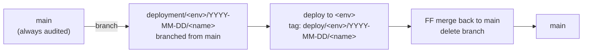

# Deployment Strategy

This document outlines the branching and deployment strategy for Solidity contracts in this repository.

## Overview

We use **per-environment deployment branches**. Each deploy to an environment gets its own `deployment/<env>/YYYY-MM-DD/<name>` branch, branched from `main`, used to run the deploy and capture artifacts, then fast-forward merged back. Every testnet and mainnet deploy is tagged as a self-contained snapshot. Testnet is staging, not development — see principle #4.



A release typically flows through environments in sequence — local/scratch for development, then testnet, then mainnet — but each environment uses its own independent branch cut from `main`. There is no single long-lived branch cascading from testnet to mainnet; the audited `main` is the only shared substrate.

For hotfixes, branch from the tag in production instead of from `main`:

```
deploy/mainnet/YYYY-MM-DD/<name> ──branch──► deployment/mainnet/YYYY-MM-DD/<name>-hotfix
                                                    │
                                                    ├─► fix + audit
                                                    ├─► deploy ──► tag: deploy/mainnet/YYYY-MM-DD/<name>-hotfix
                                                    └──PR──► merge back to main
```

## Key Principles

1. **Work in feat branches.** Development happens in `feat/*` branches, merged to `main` when complete.

2. **`main` is always audited.** PRs modifying production Solidity require the `audited` label to merge to `main`.

3. **Deployment branches are per-environment.** Each deploy creates a `deployment/<env>/YYYY-MM-DD/<name>` branch (e.g. `deployment/testnet/2026-04-19/rewards-manager-and-subgraph-service`), branched from `main`. For testnet and mainnet the branch is short-lived (hours to days) and carries only artifacts and script tweaks — no contract changes. For scratch it may persist longer and host Solidity iteration, with any changes reaching `main` only via a `feat/*` PR.

4. **Testnet is staging, not development.** Testnet is a pre-production mirror of mainnet, not a place to iterate on contract design. Redeploying updated contracts to testnet pollutes its historical state and can force custom off-chain handling (e.g. subgraph code for events that were later removed pre-mainnet) that then has to be maintained indefinitely. Iterate on the local network or scratch deployments instead (see [Pre-deployment Testing](#pre-deployment-testing)); graduate to testnet only with high confidence that the same contracts will reach mainnet.

5. **Hotfix branches are branched from the tag they patch.** A hotfix branches from the `deploy/mainnet/YYYY-MM-DD/<name>` tag currently in production, not from `main`. Keeps the hotfix diff minimal and avoids shipping accumulated but undeployed work on `main`.

6. **Tag every testnet and mainnet deploy.** Each deploy to testnet or mainnet creates an immutable `deploy/<env>/YYYY-MM-DD/<name>` tag reproducing the full state at that moment: source, scripts, and artifacts. The tag is the release record. Tagging in other environments (e.g. scratch) is optional and used at the operator's discretion — useful when a scratch state is worth pinning, unnecessary for throwaway iteration.

7. **Prefer rebase and FF merge for testnet and mainnet.** Testnet and mainnet branches should FF back to `main` to preserve the audit-hash → deployed-bytes link. If `main` advances during the deploy window, rebase before merging.

## Branches

| Branch                               | Purpose                                     | Lifetime                                                                   |
| ------------------------------------ | ------------------------------------------- | -------------------------------------------------------------------------- |
| `feat/*`                             | Active development                          | Until merged to `main`                                                     |
| `main`                               | Audited, deployment-ready code              | Permanent                                                                  |
| `deployment/<env>/YYYY-MM-DD/<name>` | Workspace for one deploy to one environment | Hours to days for testnet/mainnet; may persist for scratch while iterating |

Environments in active use today are `testnet` (Arbitrum Sepolia) and `mainnet` (Arbitrum One). The scheme accommodates additional environments (e.g. a dedicated pre-release staging chain) by adding further `<env>` tokens — no change to the mechanics.

## Tags

Testnet and mainnet deploys are always tagged with an immutable annotated tag. Other environments may be tagged at operator discretion using the same format.

- `deploy/testnet/YYYY-MM-DD/<name>` — testnet deployment snapshot (Arbitrum Sepolia)
- `deploy/mainnet/YYYY-MM-DD/<name>` — mainnet deployment snapshot (Arbitrum One)

Including a descriptive `<name>` is recommended. A short hyphenated identifier (e.g. `rewards-manager-and-subgraph-service`, `fix-activation`) makes tags self-describing, gives operators something meaningful to search on, and naturally prevents collisions when multiple deploys happen on the same day. The date segment ensures chronological sort regardless.

Each tag is self-contained: its tree includes the deployed `.sol` sources, the deployment scripts used, and the resulting artifacts (`addresses.json`, etc.). The annotated tag body additionally records deployer identity and the list of changed contracts. Reproducing a past deploy is `git checkout <tag>` and nothing else.

### Finding and working with deployed code

Check out what's currently on mainnet:

```bash
git checkout "$(git tag -l 'deploy/mainnet/*' | sort | tail -1)"
```

Check out what's currently on testnet:

```bash
git checkout "$(git tag -l 'deploy/testnet/*' | sort | tail -1)"
```

List all deployment tags:

```bash
git tag -l "deploy/*"
```

Diff between last mainnet deploy and current main:

```bash
git diff "$(git tag -l 'deploy/mainnet/*' | sort | tail -1)"..main
```

List active deployment branches (per environment):

```bash
git branch -a --list 'deployment/testnet/*'
git branch -a --list 'deployment/mainnet/*'
```

## Workflows

### Pre-deployment Testing

Iteration on contract design happens on environments that don't pollute the canonical testnet state:

- **Local network**: a self-contained network run locally as docker containers, bundling chain node, contracts, and off-chain services. The default for development and integration testing.
- **Scratch deployments**: a fresh, separate protocol instance on Arbitrum Sepolia — same chain as the canonical testnet, but distinct protocol instance. A `deployment/scratch/...` branch may persist across multiple iterations and carry contract changes as development progresses; anything worth keeping lands on `main` via a `feat/*` PR, and the scratch branch can be discarded.

The deployment scripts are written to be network- and instance-agnostic, so the same code path runs against local, scratch, testnet, and mainnet. A release only graduates to testnet once local and scratch testing give high confidence that no further contract changes are needed.

Terminology: "testnet" always refers to the canonical Graph Protocol testnet instance on Arbitrum Sepolia. A scratch deployment on Sepolia is not "testnet" — same chain, different protocol instance.

### Testnet and Mainnet Deployment

Testnet deploys happen against a release already expected to reach mainnet unchanged (principle #4). Mainnet follows with the same contract source; typical differences between the two deploys are artifact files and operational parameters that vary by environment.

The two deploys use the same procedure, each on its own branch cut from the current `main` (the mainnet branch is cut after the testnet merge-back, so it already includes testnet artifacts):

1. **Branch.** From current `main`, create `deployment/<env>/YYYY-MM-DD/<name>` and push it. Open a tracking PR back to `main`.
2. **Deploy.** Run the deployment scripts against the target network. Commit artifacts, push.
3. **Tag.** Run `tag-deployment.sh --network <network> --name <name> ...` to create `deploy/<env>/YYYY-MM-DD/<name>`. Push the tag.
4. **Merge.** Fast-forward merge the PR back into `main`. Delete the branch. If `main` advanced during the window, rebase before merging.

Network mapping: testnet → `arbitrumSepolia`, mainnet → `arbitrumOne`.

### Emergency Hotfix

For critical mainnet issues:

1. Branch `deployment/mainnet/YYYY-MM-DD/<name>-hotfix` from the current `deploy/mainnet/YYYY-MM-DD/<name>` tag and push it.
2. Apply the fix. If it touches contract source, it must be audited before deploy. Commit and push; open a PR back to `main` at this point — it stays open for the duration of the hotfix as the review/tracking thread and becomes the merge-back PR.
3. Run the deployment scripts against mainnet. If the fix warrants pre-mainnet verification, run it against the local network or a scratch deployment first (per [Pre-deployment Testing](#pre-deployment-testing)) rather than cutting a separate testnet deploy, which would otherwise race the mainnet hotfix. Commit artifacts and push.
4. Run `tag-deployment.sh --network arbitrumOne --name <name>-hotfix ...` to create the `deploy/mainnet/YYYY-MM-DD/<name>-hotfix` tag. Push the tag.
5. Review and merge the open PR back into `main`. The `audited` label applies to any contract changes in this PR.
6. Delete the hotfix branch.
7. If other deployment branches are active at hotfix time, incorporate the hotfix into them (rebase or cherry-pick) before their deploys.

## Audit Integrity

Audits certify that specific files have specific content. The operational question is always:

> For every file in the audit scope, do its current bytes match the audited version's bytes?

Principles #2, #3, and #7 preserve this for testnet and mainnet by construction: audited bytes reach `main` via `feat/*` PRs, their deployment branches carry no contract changes, and FF merges keep the audit-hash → deployed-bytes link intact. Scratch branches may hold in-progress contract work, but none of it reaches testnet or mainnet without first landing on audited `main`.

The audit scope is a transitive closure — a reviewed contract's imports are implicitly in scope even if the PR didn't touch them — and the audit reference is a pinned commit SHA, not a PR number or label. A CI check can back up this cultural preference with a mechanical one: diff the audited paths between the last audit tag and `HEAD`, and require either an empty diff or a fresh audit. See [Appendix A: Audit Integrity CI Check](#appendix-a-audit-integrity-ci-check).

## Automation

### Tagging

Tag creation is a **scripted operator step**, run after the deploy. The script captures context a CI workflow couldn't — which deploy script ran, with what flags, by whom, which contracts changed — baked into an annotated tag body, optionally signed.

Implementation: [`packages/deployment/scripts/tag-deployment.sh`](packages/deployment/scripts/tag-deployment.sh). It takes `--deployer`, `--network`, `--name` (recommended), and `--base`; diffs each address book (`packages/horizon/addresses.json`, `packages/subgraph-service/addresses.json`, `packages/issuance/addresses.json`) against the base ref to enumerate new / updated / removed contracts; and creates the annotated tag in the `deploy/<env>/YYYY-MM-DD/<name>` format defined above (or the bare-date fallback when no name is given).

Typical invocation after the artifact commit is pushed:

```bash
packages/deployment/scripts/tag-deployment.sh \
  --deployer "packages/deployment --tags RewardsManager,SubgraphService" \
  --network arbitrumSepolia \
  --name rewards-manager-and-subgraph-service
```

The script prints a preview (tag name, commit, annotation body), asks for confirmation, and creates a signed annotated tag. Run `tag-deployment.sh --help` for the full option list (`--dry-run`, `--yes`, `--no-sign`, `--base`, …).

Then push:

```bash
git push origin <tag>
```

The diff against `--base` is what populates the tag body's "contracts" section. The default of the previous deploy tag for the same environment is normally correct. For an initial deploy on an environment (no prior tag exists), pass `--base` explicitly.

### Audit Label Requirement

PRs to `main` modifying Solidity contract files require an `audited` label before merging (`.github/workflows/require-audit-label.yml`).

- **Applies to:** `.sol` files outside of test directories
- **Excludes:** Files in `/test/`, `/tests/`, or ending in `.t.sol`
- **Label:** `audited`

This enforces principle #2: code in `main` must be audited.

## Appendix A: Audit Integrity CI Check

A future workflow to enforce the byte-equality property at CI level rather than relying on the cultural FF-preference. Sketched here; design decisions still to make before implementation.

### Approach

1. **Audit tags.** Each completed audit produces an annotated tag of the form `audit/YYYY-MM-DD/<scope-name>` pointing at the commit the auditors signed off on. The tag body records the auditor, the scope (which files/paths), and a link to the audit report.
2. **Scope definition.** The "audit scope" is the set of file paths the auditors reviewed, together with the transitive closure of their Solidity imports. Stored as a path list (or glob) in the audit tag's annotation body so it can be parsed programmatically.
3. **CI check.** On every PR to `main` (or every push to `deployment/*`), resolve the most recent `audit/*` tag that covers each in-scope file and compute `git diff <audit-tag> HEAD -- <scoped-paths>`. If non-empty for any in-scope file, require either:
   - The PR to carry the `audited` label (operator asserts the diff has been re-reviewed), or
   - A new `audit/*` tag to land that covers the current `HEAD` for those paths.
4. **Empty diff ⇒ automatic pass.** When the audited bytes on `HEAD` match the audit tag's bytes exactly for all in-scope files, no human intervention is needed — the CI proves trivially that `HEAD` still matches what was audited.

### Open design decisions

- **Where does "audit scope" live?** Most robust: in the `audit/*` tag body as a path list. Alternative: a checked-in `audits/manifest.json`. The tag-body approach keeps the scope immutable alongside the reference commit; the file approach is easier to edit when scopes overlap or evolve.
- **Multi-audit composition.** Different contracts may be covered by different audits. The CI needs a deterministic "most recent audit covering file X" lookup. Overlapping scopes require conflict resolution (most specific wins? most recent?).
- **Transitive closure computation.** For `.sol` files, the importer graph is machine-derivable. A pre-commit or CI step should expand a human-declared scope (e.g. "the `IssuanceAllocator` contract") into the full transitive closure, so scope drift (an import added after audit) is caught automatically.
- **Path inclusion/exclusion rules.** The current `require-audit-label.yml` excludes `/test/`, `/tests/`, and `*.t.sol`, but there are other helper, mock, and internal-only contracts that aren't audit targets (migration scaffolding, local fixtures, temporary scripts). A robust check needs either an explicit in-scope list or a clearer directory convention.

### Prerequisite: reorganize non-production Solidity

The current tree mixes production contracts with helpers, mocks, and internal tooling in the same directories. Before the CI check is meaningful:

- Move non-production Solidity into clearly-named directories outside any plausible audit scope (e.g. `mocks/`, `helpers/`, `scripts/`, a top-level `non-audit/` tree per package).
- Make audit scope a directory-level property wherever possible ("everything under `packages/<pkg>/contracts/` is audit scope; nothing else is") so that inclusion is inferrable from path rather than requiring a bespoke filter.
- Update `require-audit-label.yml`'s filter in the same pass so its exclusions match the new layout.

Until this reorganization lands, an audit-integrity CI check is possible but would rely on hand-maintained path lists — fragile and easy to drift from reality. The reorganization is low-risk refactoring but should be done in its own PR (itself audited for scope equivalence), separately from adopting this deployment proposal.
