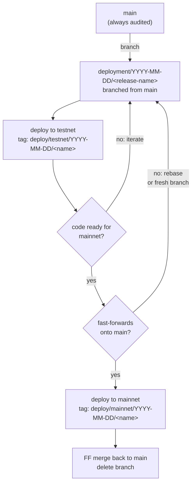

# Deployment Strategy

This document outlines the branching and deployment strategy for Solidity contracts in this repository.

## Overview

We use a **per-release deployment branch** model. Each release under preparation has a `deployment/YYYY-MM-DD/<release-name>` branch: testnet deploys iterate on it, it rebases onto `main` when ready, deploys to mainnet, and merges back. Tags capture each deploy as a self-contained snapshot; a branch may accumulate several testnet tags before reaching mainnet.

Only one deployment branch should be active at a time. During release preparation, earlier iterations may be abandoned and replaced by fresh branches.



For hotfixes, branch from the tag in production instead of from `main`:

```
deploy/mainnet/YYYY-MM-DD/<name> ──branch──► deployment/YYYY-MM-DD/<name>-hotfix
                                                    │
                                                    ├─► fix + audit
                                                    ├─► deploy ──► tag: deploy/mainnet/YYYY-MM-DD/<name>-hotfix
                                                    └──PR──► merge back to main
```

## Key Principles

1. **Work in feature branches.** All development happens in `feature/*` branches. Merge to `main` only when the work is complete.

2. **`main` is always audited; mainnet is the audit-complete gate.** PRs modifying production Solidity require the `audited` label to merge to `main`. A deployment branch may carry interim, not-yet-audited contract edits and non-contract changes (artifacts, deployment script tweaks) while testnet iteration is ongoing — that's expected. Mainnet deploys happen only from a deployment branch rebased onto audited `main`, which means every contract change reaching mainnet has passed through the `main` audit gate.

3. **Deployment branches are dated and named by release.** Each release has a `deployment/YYYY-MM-DD/<release-name>` branch (e.g. `deployment/2026-04-19/reward-manager-and-subgraph-service`) branched from `main` at start. It may iterate for weeks, rebasing onto an advancing `main`, until it reaches mainnet (merged back, deleted) or is abandoned (deleted).

4. **Only one active deployment branch at a time, plus any hotfix in parallel.** A superseded branch is deleted before (or as) its replacement starts; its testnet tags remain as historical record.

5. **Hotfix branches are branched from the tag they patch.** A hotfix branches from the `deploy/mainnet/YYYY-MM-DD/<name>` tag currently in production, not from `main`. This keeps the hotfix diff minimal (against running code only) and avoids shipping accumulated but undeployed work on `main`.

6. **Tag every deployment.** Each deploy (testnet or mainnet) creates an immutable `deploy/<env>/YYYY-MM-DD/<name>` tag, reproducing the full state at that moment: source code, deployment scripts, and artifacts. A branch typically accumulates several testnet tags across iterations; the mainnet tag is the release.

7. **Prefer rebase and FF merge to keep deployment branches linear on `main`.** When `main` advances during a release's iteration (other merges, audit sign-offs, etc.), rebase the deployment branch onto current `main` rather than merging main into it. This preserves the "audited bytes flow in unchanged" property and keeps the eventual merge-back a fast-forward. Non-FF merges create tree states nobody read before they existed and weaken the link between audit-hash and what actually deploys.

## Branches

| Branch                            | Purpose                                              | Lifetime                                                                                 |
| --------------------------------- | ---------------------------------------------------- | ---------------------------------------------------------------------------------------- |
| `feature/*`                       | Active development                                   | Until merged to `main`                                                                   |
| `main`                            | Audited, deployment-ready code                       | Permanent                                                                                |
| `deployment/YYYY-MM-DD/<release>` | Workspace for one release's iteration and deployment | Until mainnet (then merged back and deleted) or abandoned (deleted; testnet tags remain) |

## Tags

For each deployment create an immutable annotated tag:

- `deploy/testnet/YYYY-MM-DD/<name>` — testnet deployment snapshot (Arbitrum Sepolia)
- `deploy/mainnet/YYYY-MM-DD/<name>` — mainnet deployment snapshot (Arbitrum One)

Including a descriptive `<name>` is recommended. A short hyphenated identifier (e.g. `reward-manager-and-subgraph-service`, `fix-activation`, `retry-subgraph-service`) makes tags self-describing, gives operators something meaningful to search on, and naturally prevents collisions when multiple deploys happen on the same day. The date segment ensures chronological sort regardless.

Each tag is self-contained: its tree includes the deployed `.sol` sources, the deployment scripts used, and the resulting artifacts (`addresses.json`, etc.). The annotated tag body additionally records deployer identity and the list of changed contracts. Reproducing a past deploy is `git checkout <tag>` and nothing else.

### Finding and working with deployed code

Check out what's currently on mainnet:

```bash
git checkout "$(git tag -l 'deploy/mainnet/*' | sort | tail -1)"
```

Check out what's currently on testnet:

```bash
git checkout "$(git tag -l 'deploy/testnet/*' | sort | tail -1)"
```

List all deployment tags:

```bash
git tag -l "deploy/*"
```

Diff between last mainnet deploy and current main:

```bash
git diff "$(git tag -l 'deploy/mainnet/*' | sort | tail -1)"..main
```

Check whether a deployment branch is active:

```bash
git branch -a --list 'deployment/*'
```

## Workflows

### Feature Development

Features are developed in feature branches and merged to `main` when complete. PRs modifying Solidity contracts require the `audited` label.

```
feature/new-stuff ──PR (audited)──► main
```

### Release Deployment

A release typically goes through several testnet iterations before reaching mainnet. The flow:

1. **Branch.** Branch `deployment/YYYY-MM-DD/<release-name>` from current `main` and push it.
2. **Iterate on testnet.** Deploy to testnet from the branch, commit artifacts, push. Tag each deploy with `tag-deployment.sh --network arbitrumSepolia --name <name> ...` (see [Tagging](#tagging)). Open a tracking PR from the branch to `main` after the first commit lands. Take audit feedback, amend code, redeploy, tag again. There can be multiple testnet deploy tags on a release branch.
3. **Keep up with `main`.** If `main` advances during iteration, rebase the deployment branch onto current `main` prior to mainnet deployment. This keeps the branch a linear extension of the audited base rather than accumulating divergent history.
4. **Deploy to mainnet.** Once the code is ready and has been rebased onto `main`, deploy to mainnet. Commit artifacts, push, and tag with `tag-deployment.sh --network arbitrumOne --name <name> ...`.
5. **Merge to `main`.** Fast-forward merge the PR back into `main`. Delete the branch. Tags remain as the permanent record.

A release may be superseded or abandoned at any point before mainnet. Delete the branch; its testnet tags remain as historical record of what was tried. A fresh `deployment/YYYY-MM-DD/<new-release-name>` can then be started from current `main`.

### Emergency Hotfix

For critical mainnet issues:

1. Branch `deployment/YYYY-MM-DD/<name>-hotfix` from the current `deploy/mainnet/YYYY-MM-DD/<name>` tag and push it.
2. Apply the fix. If it touches contract source, it must be audited before deploy. Commit and push; open a PR back to `main` at this point — it stays open for the duration of the hotfix as the review/tracking thread and becomes the merge-back PR.
3. Run the deployment scripts against mainnet (ideally testnet first as a dry run). Commit artifacts and push.
4. Run `tag-deployment.sh --network arbitrumOne --name <name> ...` to create the `deploy/mainnet/YYYY-MM-DD/<name>` tag. Push the tag.
5. Review and merge the open PR back into `main`. The `audited` label applies to any contract changes in this PR.
6. Delete the hotfix branch.
7. If another deployment branch is active at hotfix time, incorporate the hotfix into that branch (rebase or cherry-pick) before mainnet deployment.

## Audit Integrity

Audits certify that specific files have specific content. The operational question is always:

> For every file in the audit scope, do its current bytes match the audited version's bytes?

This scheme preserves that property by construction. Deployment branches are branched from `main` (or from a deploy tag for hotfixes) and only move forward; audited bytes on `main` flow into the deployment branch unchanged unless a release-specific fix modifies them — in which case the fix passes through the `main` audit gate when it lands there (directly or via merge-back).

The audit scope is a transitive closure — a reviewed contract's imports are implicitly in scope even if the PR didn't touch them — and the audit reference is a pinned commit SHA, not a PR number or label. A CI check can be added to provide a mechanical floor under the cultural FF-preference: diff the audited paths between the last audit tag and `HEAD`, and either require the diff to be empty or require a fresh audit. See [Appendix A: Audit Integrity CI Check](#appendix-a-audit-integrity-ci-check) for the sketch and the design decisions it depends on.

## Automation

### Tagging

Tag creation is a **scripted operator step**, run after the deploy. The script captures context a CI workflow couldn't — which deploy script ran, with what flags, by whom, which contracts changed — baked into an annotated tag body, optionally signed. Deployments are infrequent enough that full automation wouldn't pay off anyway.

Implementation: [`packages/deployment/scripts/tag-deployment.sh`](packages/deployment/scripts/tag-deployment.sh). It takes `--deployer`, `--network`, `--name` (recommended), and `--base`; diffs each address book (`packages/horizon/addresses.json`, `packages/subgraph-service/addresses.json`, `packages/issuance/addresses.json`) against the base ref to enumerate new / updated / removed contracts; and creates the annotated tag in the `deploy/<env>/YYYY-MM-DD/<name>` format defined above (or the bare-date fallback when no name is given). Network names map `arbitrumOne` → `mainnet` and `arbitrumSepolia` → `testnet`.

Typical invocation after the artifact commit is pushed, first create tag:

```bash
packages/deployment/scripts/tag-deployment.sh \
  --deployer "packages/deployment --tags RewardsManager,SubgraphService" \
  --network arbitrumSepolia \
  --name reward-manager-and-subgraph-service
```

The script prints a preview (tag name, commit, annotation body), asks for confirmation, and creates a signed annotated tag. Run `tag-deployment.sh --help` for the full option list (`--dry-run`, `--yes`, `--no-sign`, `--base`, …).

Then push:

```bash
git push origin <tag>
```

The diff against `--base` is what populates the tag body's "contracts" section. The default of the previous deploy tag for the same environment is normally be correct. For an initial deploy on an environment (no prior tag exists), pass `--base` explicitly.

### Audit Label Requirement

PRs to `main` modifying Solidity contract files require an `audited` label before merging (`.github/workflows/require-audit-label.yml`).

- **Applies to:** `.sol` files outside of test directories
- **Excludes:** Files in `/test/`, `/tests/`, or ending in `.t.sol`
- **Label:** `audited`

This enforces principle #2: code in `main` must be audited.

## Appendix A: Audit Integrity CI Check

A future workflow to enforce the byte-equality property at CI level rather than relying on the cultural FF-preference. Sketched here; design decisions still to make before implementation.

### Approach

1. **Audit tags.** Each completed audit produces an annotated tag of the form `audit/YYYY-MM-DD/<scope-name>` pointing at the commit the auditors signed off on. The tag body records the auditor, the scope (which files/paths), and a link to the audit report.
2. **Scope definition.** The "audit scope" is the set of file paths the auditors reviewed, together with the transitive closure of their Solidity imports. Stored as a path list (or glob) in the audit tag's annotation body so it can be parsed programmatically.
3. **CI check.** On every PR to `main` (or every push to `deployment/*`), resolve the most recent `audit/*` tag that covers each in-scope file and compute `git diff <audit-tag> HEAD -- <scoped-paths>`. If non-empty for any in-scope file, require either:
   - The PR to carry the `audited` label (operator asserts the diff has been re-reviewed), or
   - A new `audit/*` tag to land that covers the current `HEAD` for those paths.
4. **Empty diff ⇒ automatic pass.** When the audited bytes on `HEAD` match the audit tag's bytes exactly for all in-scope files, no human intervention is needed — the CI proves trivially that `HEAD` still matches what was audited.

### Open design decisions

- **Where does "audit scope" live?** Most robust: in the `audit/*` tag body as a path list. Alternative: a checked-in `audits/manifest.json`. The tag-body approach keeps the scope immutable alongside the reference commit; the file approach is easier to edit when scopes overlap or evolve.
- **Multi-audit composition.** Different contracts may be covered by different audits. The CI needs a deterministic "most recent audit covering file X" lookup. Overlapping scopes require conflict resolution (most specific wins? most recent?).
- **Transitive closure computation.** For `.sol` files, the importer graph is machine-derivable. A pre-commit or CI step should expand a human-declared scope (e.g. "the `IssuanceAllocator` contract") into the full transitive closure, so scope drift (an import added after audit) is caught automatically.
- **Path inclusion/exclusion rules.** The current `require-audit-label.yml` excludes `/test/`, `/tests/`, and `*.t.sol`, but there are other helper, mock, and internal-only contracts that aren't audit targets (migration scaffolding, local fixtures, temporary scripts). A robust check needs either an explicit in-scope list or a clearer directory convention.

### Prerequisite: reorganize non-production Solidity

The current tree mixes production contracts with helpers, mocks, and internal tooling in the same directories. Before the CI check is meaningful:

- Move non-production Solidity into clearly-named directories outside any plausible audit scope (e.g. `mocks/`, `helpers/`, `scripts/`, a top-level `non-audit/` tree per package).
- Make audit scope a directory-level property wherever possible ("everything under `packages/<pkg>/contracts/` is audit scope; nothing else is") so that inclusion is inferrable from path rather than requiring a bespoke filter.
- Update `require-audit-label.yml`'s filter in the same pass so its exclusions match the new layout.

Until this reorganization lands, an audit-integrity CI check is possible but would rely on hand-maintained path lists — fragile and easy to drift from reality. The reorganization is low-risk refactoring but should be done in its own PR (itself audited for scope equivalence), separately from adopting this deployment proposal.
