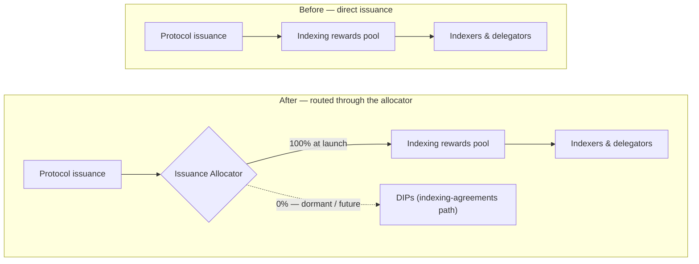
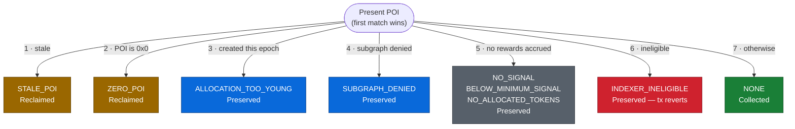

# Indexer Guide: What's Changing With the REO + Issuance Upgrade

## What is NOT changing

- The allocation lifecycle: open → present POIs → close.
- How and when POIs are presented, and the POI cadence.
- The staleness model (allocations still go stale if you stop presenting POIs).
- Delegation, provisions, and stake mechanics.
- **Rewards rate at launch** — issuance to indexing rewards is the same as before the upgrade.

---

## What IS changing

### 1. Issuance routing



Issuance now flows through a central allocator that can split rewards across multiple destinations.
At launch the effective flow is **identical** to today — 100% still reaches the indexing rewards pool. The allocator only adds the _ability_ to split issuance later; it doesn't divert anything on day one.

**What to watch:** when Indexer Agreements are activated later, expect a communicated change to the indexing rewards rate at that time.

### 2. Rewards Eligibility Oracle

The protocol can now consult an **eligibility oracle** to decide whether an indexer is eligible for rewards at claim time:

- The oracle will be enabled at launch with a very low threshold to qualify for eligibility.
- If the oracle stops receiving updates, it treats everyone as eligible again, so a stalled oracle can't block rewards.

Useful links

- <https://hub.thegraph.foundation/reo>
- <https://github.com/graphprotocol/rewards-eligibility-oracle/blob/main/ELIGIBILITY_CRITERIA.md>

### 3. Reward conditions and reclaiming

Today, when rewards can't be paid to an indexer (stale POI, denied subgraph, etc.), those tokens are **silently dropped**, they are never minted to anyone. After this upgrade, those same rewards become **reclaimed**: minted to a protocol reclaim address instead of being dropped.

**Important:** reclaiming does **not** take indexing rewards that were previously earned by indexers, only rewards that were already being forfeited are now captured.

| Condition              | Trigger                                                 | Scope      | Rewards outcome            | Notes                                                                 |
| ---------------------- | ------------------------------------------------------- | ---------- | -------------------------- | --------------------------------------------------------------------- |
| `NONE`                 | Valid POI on a non-denied subgraph, eligible allocation | Allocation | **Collected**              |                                                                       |
| `NO_SIGNAL`            | Zero total curation signal globally                     | Global     | **Reclaimed**              |                                                                       |
| `SUBGRAPH_DENIED`      | Subgraph is on the denylist                             | Subgraph   | **Preserved**              | Claimable if the subgraph is undenied (and allocation was not closed) |
| `BELOW_MINIMUM_SIGNAL` | Subgraph signal below `minimumSubgraphSignal`           | Subgraph   | **Reclaimed**              |                                                                       |
| `NO_ALLOCATED_TOKENS`  | Subgraph has signal but zero allocated tokens           | Subgraph   | **Reclaimed**              |                                                                       |
| `STALE_POI`            | POI presented after staleness deadline                  | Allocation | **Reclaimed**              |                                                                       |
| `ZERO_POI`             | POI is `bytes32(0)`                                     | Allocation | **Reclaimed**              |                                                                       |
| `ALLOCATION_TOO_YOUNG` | Allocation created in the current epoch                 | Allocation | **Preserved**              | Claimable next epoch (assuming allocation was not closed)             |
| `CLOSE_ALLOCATION`     | Allocation being closed with uncollected rewards        | Allocation | **Reclaimed**              |                                                                       |
| `INDEXER_INELIGIBLE`   | Indexer fails eligibility oracle check at claim time    | Indexer    | **Preserved** — tx reverts | Claimable if you regain eligibility before staleness                  |

**Note**: Remember that by default the indexer agent combines "present POI" with "close allocation" when closing allocations.

### 4. POI Observability

Every POI presentation now records the **reward condition** that applied. If a POI didn't pay what you expected, the condition tells you exactly why instead of being invisible. This is surfaced through the network subgraph:

```graphql
{
  allocations {
    id
    latestPoiCondition
  }
}
```

```json
{
  "data": {
    "allocations": [
      {
        "id": "0x001a42df17784fe5efcd14dcb138b91df116aa62",
        "latestPoiCondition": "StalePoi"
      },
      {
        "id": "0x01d1522d4646b6119a2623d9b784cb9f1dfb924b",
        "latestPoiCondition": "StalePoi"
      },
      {
        "id": "0x0869e64ed4dbc73d961c3920e34ee7a3adf82fca",
        "latestPoiCondition": "StalePoi"
      },
      {
        "id": "0x13d53c7ddffbd00565f8ff7a0f2df0f19099075a",
        "latestPoiCondition": "StalePoi"
      },
      {
        "id": "0x144fb38b1c1418e1e0ba3d9f39e956e7e142ae37",
        "latestPoiCondition": "StalePoi"
      }
    ]
  }
}
```

### 5. Eligibility enforcement revert

If your indexer is marked **ineligible** by the REO and you present a **normal, reward-bearing POI**, the presentation **reverts** (the transaction fails) instead of paying out.

Key points:

- **Your rewards are not burned.** They stay pending and remain claimable if you become eligible again **before the allocation goes stale**.
- **The revert only affects reward-bearing POIs** (a valid, non-zero POI, on an old-enough allocation, on a non-denied subgraph). It does **not** block you from operating the allocation in other ways.
- **You are never locked into an allocation.** While ineligible you can still:
  - **Present a zero POI** — succeeds, resets the staleness clock (keeps the allocation alive), but forfeits that period's rewards.
  - **Close the allocation** — succeeds; any uncollected rewards are reclaimed (forfeited), and you exit cleanly.

---

## Apendix: Reward criteria decision tree

The protocol evaluates these criteria in order when you present a POI, the first match wins:


