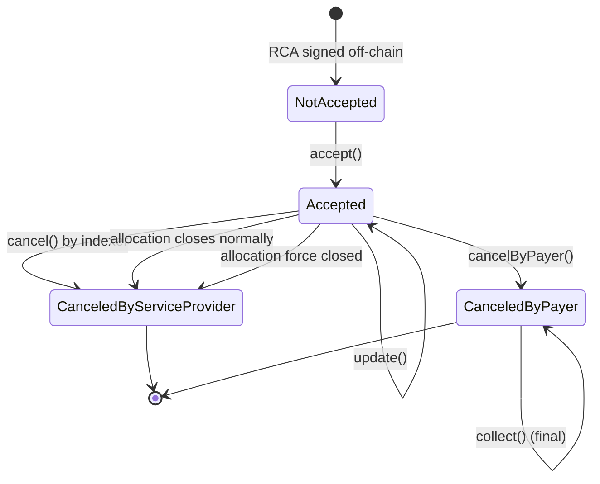
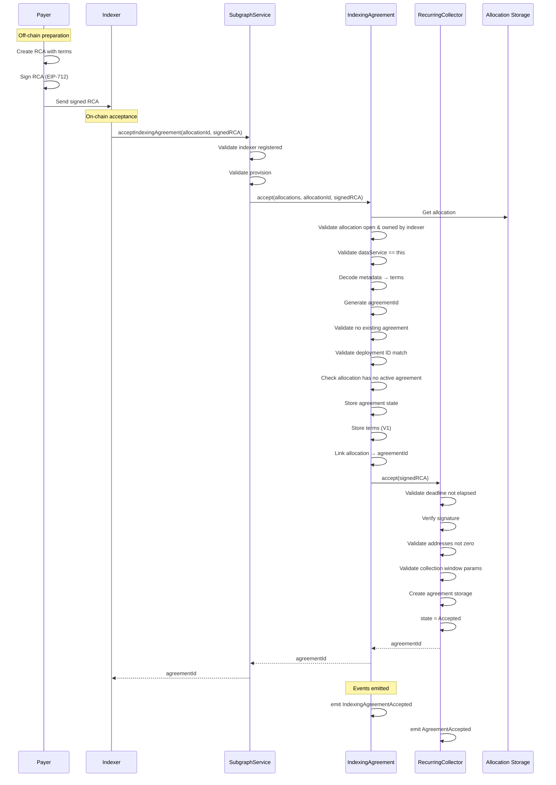
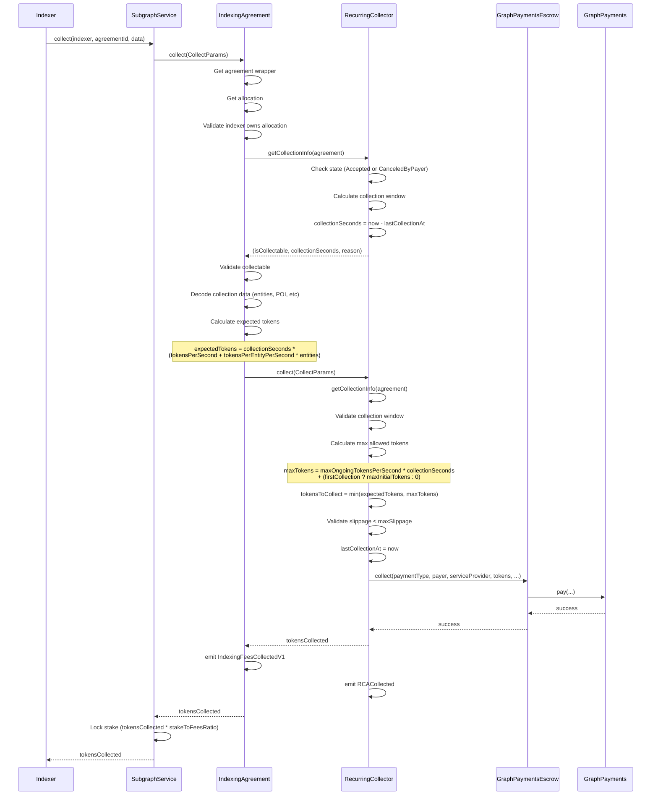
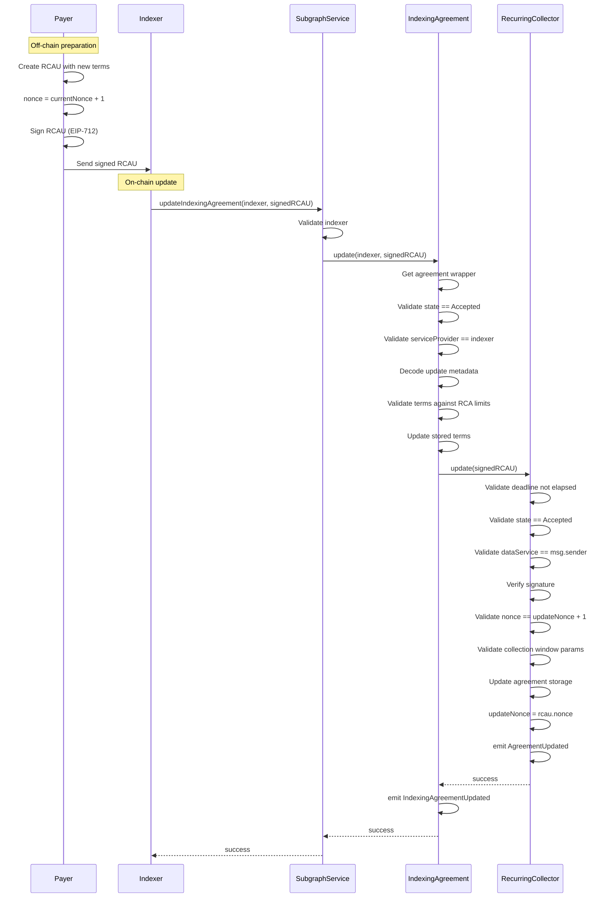
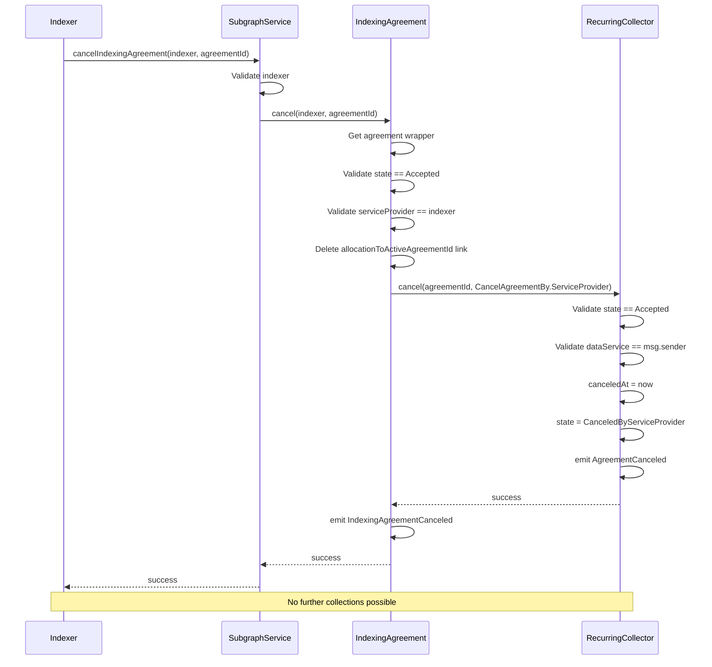
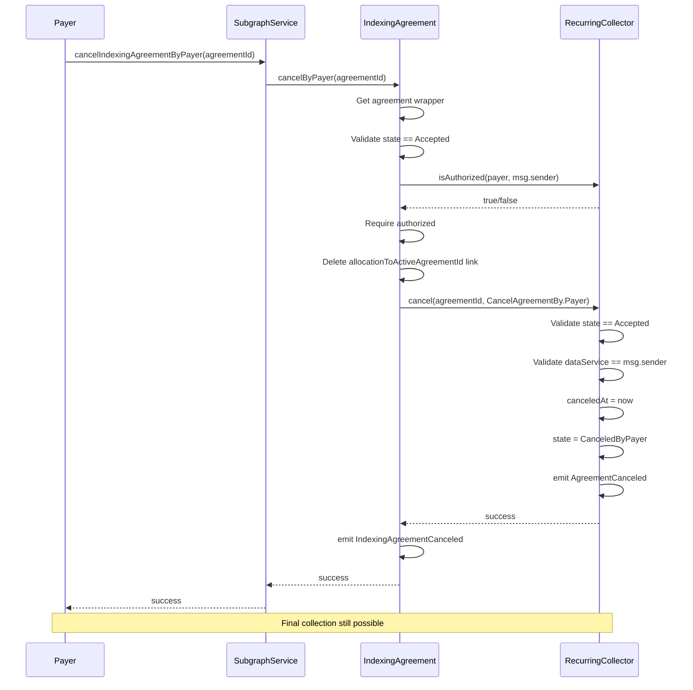
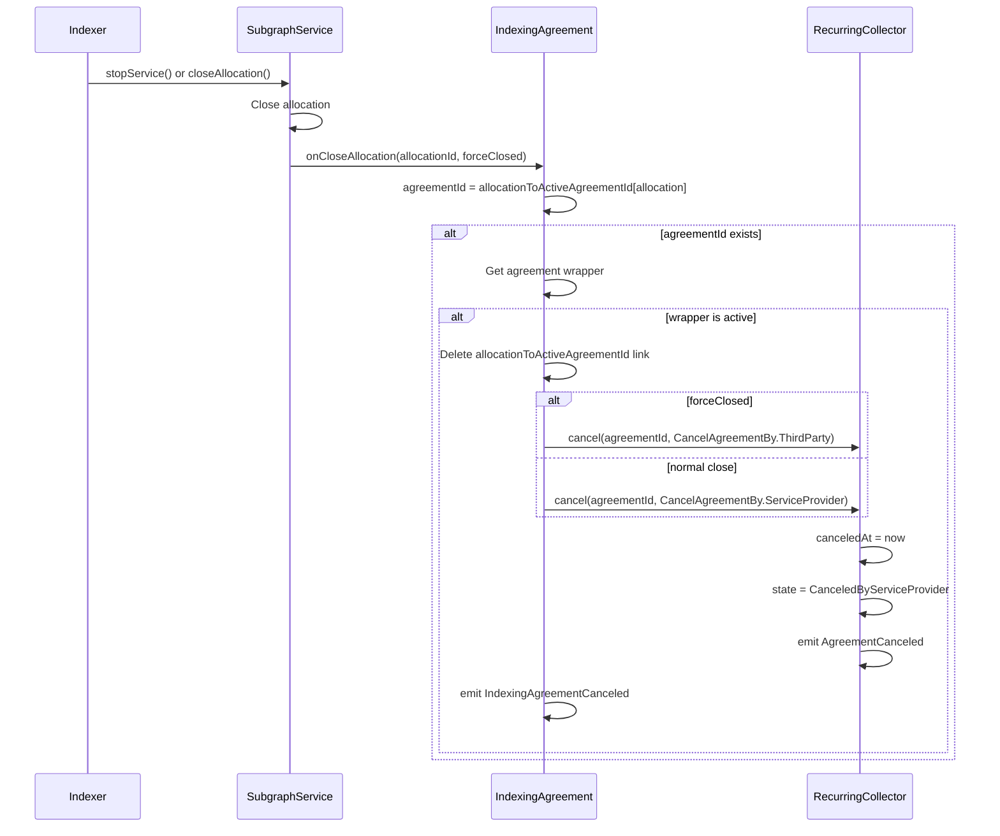

# Agreement Lifecycle

This document describes the complete lifecycle of an indexing agreement, from creation through cancellation.

## State Machine

### State Descriptions

| State                       | Description                                 | Collectable |
| --------------------------- | ------------------------------------------- | ----------- |
| `NotAccepted`               | RCA signed but not yet accepted on-chain    | No          |
| `Accepted`                  | Active agreement, normal operation          | Yes         |
| `CanceledByServiceProvider` | Indexer canceled, no further collections    | No          |
| `CanceledByPayer`           | Payer canceled, allows one final collection | Yes         |

## 1. Agreement Creation and Acceptance

### Sequence Diagram

### Acceptance Requirements

**Allocation Requirements**:

- Must exist and be open (`createdAtEpoch != 0 && closedAtEpoch == 0`)
- Must be owned by the indexer in the RCA
- `subgraphDeploymentId` must match RCA metadata
- Cannot have another active agreement

**RCA Requirements**:

- `deadline ≥ block.timestamp`
- `dataService` must be SubgraphService address
- `payer`, `dataService`, `serviceProvider` must be non-zero
- Valid payer signature (or authorized signer)
- `endsAt > block.timestamp`
- `maxSecondsPerCollection - minSecondsPerCollection ≥ 600`
- `endsAt - block.timestamp ≥ minSecondsPerCollection + 600`

**Terms Requirements**:

- `tokensPerSecond ≤ maxOngoingTokensPerSecond`

## 2. Payment Collection

### Sequence Diagram

### Collection Requirements

**Timing Requirements**:

- Agreement in `Accepted` or `CanceledByPayer` state
- `collectionSeconds ≥ minSecondsPerCollection` (unless canceled/expired)
- `collectionSeconds ≤ maxSecondsPerCollection`

**Validation Requirements**:

- Indexer must own the allocation
- Allocation must be open
- Indexer must have active provision with SubgraphService
- `tokensAvailable > 0` for indexer with data service

**Data Requirements**:

- Valid entities count (uint256)
- Valid POI (bytes32)
- Valid POI block number (uint256)
- Optional metadata (bytes)
- Max slippage tolerance (uint256)

### Payment Calculation

See [Payment Calculation](./PaymentCalculation.md) for detailed formulas.

## 3. Agreement Update

### Sequence Diagram

### Update Requirements

- Agreement must be in `Accepted` state
- Indexer must be the service provider
- Valid payer signature (or authorized signer)
- Nonce must be exactly `currentNonce + 1`
- New terms must satisfy all RCA constraints
- Updated pricing applies immediately to next collection

### Important Note

**Updated terms apply retroactively** to the period since `lastCollectionAt`. This means the next collection will use the new rates for the entire duration since the last collection.

## 4. Agreement Cancellation

### By Indexer

### By Payer

### Automatic Cancellation on Allocation Close

### Cancellation Effects

| Canceled By               | Resulting State             | Further Collections | Allocation Link |
| ------------------------- | --------------------------- | ------------------- | --------------- |
| Service Provider          | `CanceledByServiceProvider` | No                  | Removed         |
| Payer                     | `CanceledByPayer`           | Yes (one final)     | Removed         |
| Allocation Close (normal) | `CanceledByServiceProvider` | No                  | Removed         |
| Allocation Close (forced) | `CanceledByServiceProvider` | No                  | Removed         |

## Edge Cases and Special Behaviors

### Collection After Payer Cancellation

When payer cancels (`CanceledByPayer` state), one final collection is allowed:

- `collectionSeconds` calculated up to `min(canceledAt, endsAt)`
- `minSecondsPerCollection` requirement waived
- `maxSecondsPerCollection` still enforced

### Collection After Agreement Expiry

When `block.timestamp > endsAt`:

- `collectionSeconds` calculated up to `endsAt`
- `minSecondsPerCollection` requirement waived
- `maxSecondsPerCollection` still enforced

### Zero-Token Collections

Collections with `entities = 0` and `poi = bytes32(0)` are allowed and result in zero tokens collected. This allows indexers to "checkpoint" the agreement without claiming payment.

### Over-Allocation

If allocation is resized down such that `tokens < existingCommitments`, the agreement is automatically canceled by the SubgraphService to prevent over-commitment.

## Related Documentation

- [Architecture](./Architecture.md) - System components and relationships
- [Payment Calculation](./PaymentCalculation.md) - Fee computation details
- [Integration Guide](./IntegrationGuide.md) - Implementation examples
