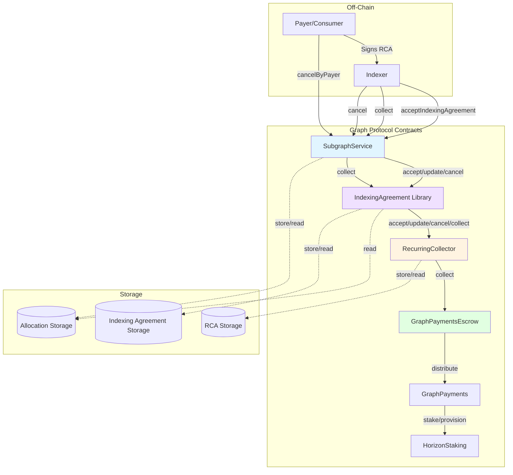
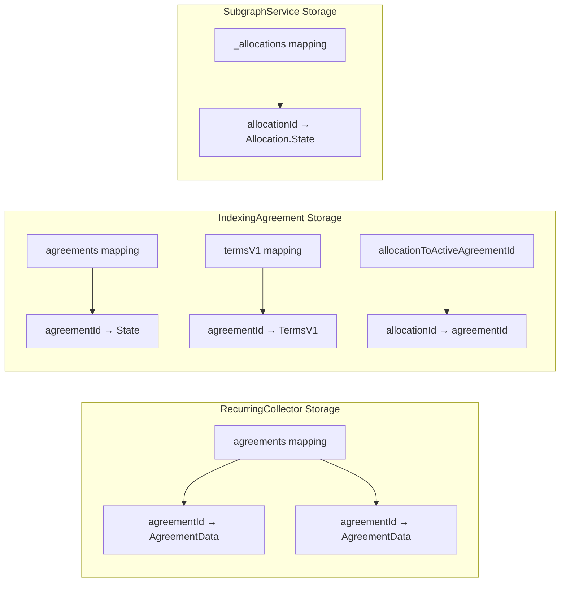

# Indexing Payments Architecture

This document describes the architecture of the indexing payments system, including component relationships and data flows.

## Component Diagram



## Contract Responsibilities

### SubgraphService

**Location**: `packages/subgraph-service/contracts/SubgraphService.sol`

**Responsibilities**:

- Entry point for all indexing agreement operations
- Validates indexer registration and provision status
- Orchestrates calls to IndexingAgreement library
- Locks stake proportional to fees collected
- Manages allocations

**Key Functions**:

- `acceptIndexingAgreement()` - Accept an RCA for an allocation
- `updateIndexingAgreement()` - Update agreement terms
- `cancelIndexingAgreement()` - Cancel by indexer
- `cancelIndexingAgreementByPayer()` - Cancel by payer
- `collect()` - Collect payments (via PaymentType.IndexingFee)

### IndexingAgreement (Library)

**Location**: `packages/subgraph-service/contracts/libraries/IndexingAgreement.sol`

**Responsibilities**:

- Links RCAs to specific allocations
- Validates agreement terms against allocation
- Calculates payment amounts based on entities indexed
- Ensures one agreement per allocation
- Manages agreement lifecycle hooks

**Storage**:

- `agreements` - Maps agreement ID to allocation and version
- `termsV1` - Maps agreement ID to V1 pricing terms
- `allocationToActiveAgreementId` - Maps allocation to active agreement

**Key Functions**:

- `accept()` - Validate and link RCA to allocation
- `update()` - Update agreement terms
- `cancel()` - Cancel agreement
- `collect()` - Calculate and collect payment
- `onCloseAllocation()` - Cancel agreement when allocation closes

### RecurringCollector

**Location**: `packages/horizon/contracts/payments/collectors/RecurringCollector.sol`

**Responsibilities**:

- Manages RCA lifecycle and state
- Validates EIP-712 signatures
- Enforces rate limits and collection windows
- Tracks collection history
- Handles replay protection for updates

**Storage**:

- `agreements` - Maps agreement ID to AgreementData

**Agreement States**:

- `NotAccepted` - Initial state
- `Accepted` - Active and collectable
- `CanceledByServiceProvider` - Canceled by indexer
- `CanceledByPayer` - Canceled by payer (allows final collection)

**Key Functions**:

- `accept()` - Validate signature and create agreement
- `update()` - Update terms with nonce validation
- `cancel()` - Mark agreement as canceled
- `collect()` - Enforce limits and trigger payment
- `getCollectionInfo()` - Calculate valid collection window

## Data Structures

### Recurring Collection Agreement (RCA)

```solidity
struct RecurringCollectionAgreement {
  uint64 deadline; // Accept deadline
  uint64 endsAt; // Agreement end time
  address payer; // Payment source
  address dataService; // SubgraphService address
  address serviceProvider; // Indexer address
  uint256 maxInitialTokens; // First collection bonus
  uint256 maxOngoingTokensPerSecond; // Rate limit
  uint32 minSecondsPerCollection; // Min collection interval
  uint32 maxSecondsPerCollection; // Max collection interval
  uint256 nonce; // Collision prevention
  bytes metadata; // Indexing-specific terms
}
```

### Indexing Agreement Terms V1

Encoded in `metadata` field of RCA:

```solidity
struct IndexingAgreementTermsV1 {
  uint256 tokensPerSecond; // Base rate
  uint256 tokensPerEntityPerSecond; // Per-entity rate
}
```

### Agreement Data (On-Chain State)

```solidity
struct AgreementData {
  address dataService;
  address payer;
  address serviceProvider;
  uint64 acceptedAt; // When accepted
  uint64 lastCollectionAt; // Last collection timestamp
  uint64 endsAt; // Expiration
  uint256 maxInitialTokens;
  uint256 maxOngoingTokensPerSecond;
  uint32 minSecondsPerCollection;
  uint32 maxSecondsPerCollection;
  uint32 updateNonce; // Replay protection
  uint64 canceledAt; // When canceled
  AgreementState state;
}
```

## Agreement ID Generation

Agreement IDs are deterministically generated to prevent collisions:

```solidity
agreementId = bytes16(keccak256(
    payer,
    dataService,
    serviceProvider,
    deadline,
    nonce
))
```

This ensures the same parameters always produce the same ID, preventing duplicate agreements.

## Storage Layout



## Integration Points

### With Horizon Staking

- **Provision validation**: Ensures indexer has active provision
- **Stake locking**: Locks stake proportional to fees collected (`stakeToFeesRatio`)
- **Economic security**: Locked stake acts as collateral for disputes

### With GraphPayments

- **Payment distribution**: Fees distributed to indexer and delegators
- **Payment types**: Uses `PaymentTypes.IndexingFee`
- **Escrow management**: Tokens held in GraphPaymentsEscrow

### With DisputeManager

- **Dispute period**: Stake locked for dispute period after collection
- **POI validation**: Proof of indexing can be challenged
- **Slashing**: Invalid POI can result in stake slashing

## Security Considerations

### Signature Validation

RCAs and RCAUs use EIP-712 typed signatures:

```solidity
EIP712_RCA_TYPEHASH = keccak256(
    "RecurringCollectionAgreement(...)"
)

digest = keccak256(
    "\x19\x01",
    DOMAIN_SEPARATOR,
    structHash
)

signer = ecrecover(digest, v, r, s)
```

### Rate Limiting

The `maxOngoingTokensPerSecond` parameter acts as a safety cap:

```solidity
maxTokens = maxOngoingTokensPerSecond * collectionSeconds
actualTokens = min(requestedTokens, maxTokens)
```

If `actualTokens < requestedTokens`, the difference is "slippage" which must be within `maxSlippage` tolerance.

### Collection Windows

Prevents griefing attacks:

- **Minimum window**: `maxSecondsPerCollection - minSecondsPerCollection ≥ 600 seconds`
- **Too soon**: Cannot collect before `minSecondsPerCollection`
- **Too late**: Cannot collect after `maxSecondsPerCollection` (unless canceled/expired)

### One Agreement Per Allocation

The `allocationToActiveAgreementId` mapping enforces this constraint to prevent:

- Multiple payers draining indexer capacity
- Race conditions in collection
- Accounting complexity

## State Transitions

See [Agreement Lifecycle](./AgreementLifecycle.md) for detailed state machine diagrams.

## Related Documentation

- [Agreement Lifecycle](./AgreementLifecycle.md) - State transitions and flows
- [Payment Calculation](./PaymentCalculation.md) - Fee computation details
- [Integration Guide](./IntegrationGuide.md) - Implementation examples
