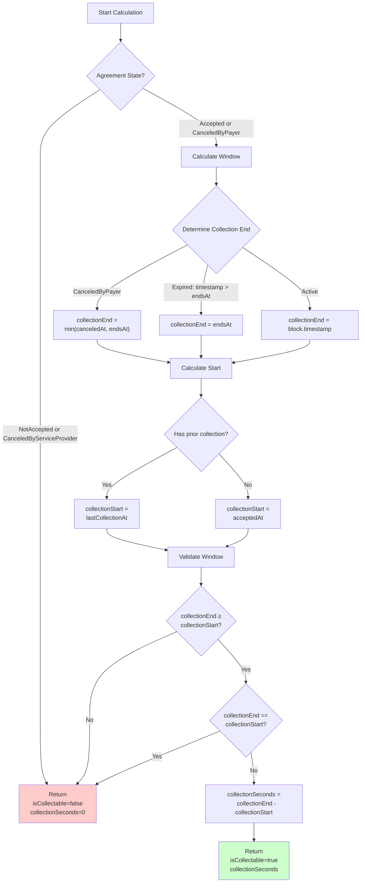

# Payment Calculation

This document explains how indexing fees are calculated, including rate limiting, collection windows, and slippage protection.

## Overview

Indexing payments use a two-tier pricing model:

1. **Base rate**: Tokens per second, regardless of entities indexed
2. **Entity rate**: Additional tokens per entity per second

These rates are constrained by RCA-level rate limits to prevent excessive extraction.

## Formula

### Expected Tokens (Indexing Agreement)

The indexing agreement calculates the theoretical amount based on work performed:

```
expectedTokens = collectionSeconds × (tokensPerSecond + tokensPerEntityPerSecond × entities)
```

Where:

- `collectionSeconds` = valid collection duration (see Collection Window)
- `tokensPerSecond` = base rate from IndexingAgreementTermsV1
- `tokensPerEntityPerSecond` = per-entity rate from IndexingAgreementTermsV1
- `entities` = number of entities indexed during the period

### Maximum Allowed Tokens (Recurring Collector)

The recurring collector enforces rate limits from the RCA:

```
maxTokens = (maxOngoingTokensPerSecond × collectionSeconds) + firstCollectionBonus

where:
firstCollectionBonus = {
    maxInitialTokens  if lastCollectionAt == 0
    0                 otherwise
}
```

### Actual Tokens Collected

The final amount is the minimum of expected and maximum:

```
tokensCollected = min(expectedTokens, maxTokens)
```

If `tokensCollected < expectedTokens`, the difference is "slippage" due to rate limiting.

## Collection Window Calculation



### Collection Start

```
collectionStart = {
    lastCollectionAt  if lastCollectionAt > 0
    acceptedAt        otherwise
}
```

### Collection End

```
collectionEnd = {
    min(canceledAt, endsAt)  if state == CanceledByPayer
    endsAt                   if block.timestamp > endsAt
    block.timestamp          otherwise (active agreement)
}
```

### Collection Seconds

```
collectionSeconds = collectionEnd - collectionStart
```

## Rate Limiting Examples

### Example 1: No Rate Limiting

**Agreement Terms**:

- `tokensPerSecond = 100`
- `tokensPerEntityPerSecond = 10`
- `maxOngoingTokensPerSecond = 10000` (very high)

**Collection Parameters**:

- `collectionSeconds = 3600` (1 hour)
- `entities = 50`

**Calculation**:

```
expectedTokens = 3600 × (100 + 10 × 50)
               = 3600 × 600
               = 2,160,000 tokens

maxTokens = 10000 × 3600
          = 36,000,000 tokens

tokensCollected = min(2,160,000, 36,000,000)
                = 2,160,000 tokens ✓ (no slippage)
```

### Example 2: Rate Limited

**Agreement Terms**:

- `tokensPerSecond = 100`
- `tokensPerEntityPerSecond = 10`
- `maxOngoingTokensPerSecond = 500` (limiting)

**Collection Parameters**:

- `collectionSeconds = 3600` (1 hour)
- `entities = 50`

**Calculation**:

```
expectedTokens = 3600 × (100 + 10 × 50)
               = 3600 × 600
               = 2,160,000 tokens

maxTokens = 500 × 3600
          = 1,800,000 tokens

tokensCollected = min(2,160,000, 1,800,000)
                = 1,800,000 tokens

slippage = 2,160,000 - 1,800,000
         = 360,000 tokens (16.7% slippage)
```

### Example 3: First Collection Bonus

**Agreement Terms**:

- `maxOngoingTokensPerSecond = 100`
- `maxInitialTokens = 100,000`

**First Collection**:

```
collectionSeconds = 600 (10 minutes)

maxTokens = (100 × 600) + 100,000
          = 60,000 + 100,000
          = 160,000 tokens
```

**Second Collection**:

```
collectionSeconds = 600

maxTokens = (100 × 600) + 0
          = 60,000 tokens (no bonus)
```

## Slippage Protection

Indexers can specify `maxSlippage` to prevent unexpected rate limiting:

```solidity
slippage = expectedTokens - tokensCollected

require(slippage ≤ maxSlippage, "Excessive slippage")
```

### Recommended Slippage Values

| Use Case                  | Recommended `maxSlippage`     |
| ------------------------- | ----------------------------- |
| No rate limiting expected | `0`                           |
| Low entity variance       | `expectedTokens × 0.05` (5%)  |
| High entity variance      | `expectedTokens × 0.10` (10%) |
| Fallback / don't care     | `type(uint256).max`           |

### Slippage Calculation Example

```typescript
const expectedTokens = calculateExpectedTokens(collectionSeconds, tokensPerSecond, tokensPerEntityPerSecond, entities)

const maxAllowedSlippage = expectedTokens * 0.05 // 5%

const collectParams = {
  agreementId,
  collectionId,
  tokens: expectedTokens,
  dataServiceCut,
  receiverDestination,
  maxSlippage: maxAllowedSlippage,
}
```

## Collection Window Constraints

### Minimum Collection Window

The difference between `maxSecondsPerCollection` and `minSecondsPerCollection` must be at least 600 seconds:

```
maxSecondsPerCollection - minSecondsPerCollection ≥ 600
```

This prevents griefing where payer sets an impossibly narrow collection window.

### Collection Timing Requirements

**Active Agreement**:

- `collectionSeconds ≥ minSecondsPerCollection` ✓
- `collectionSeconds ≤ maxSecondsPerCollection` ✓

**Canceled or Expired Agreement**:

- `collectionSeconds ≥ minSecondsPerCollection` ✗ (waived)
- `collectionSeconds ≤ maxSecondsPerCollection` ✓ (still enforced)

### Collection Window Examples

**Example 1: Valid Timing**

```
minSecondsPerCollection = 3000 (50 minutes)
maxSecondsPerCollection = 4200 (70 minutes)
lastCollectionAt = 1000000000
block.timestamp = 1000003600 (60 minutes later)

collectionSeconds = 3600
Validation: 3000 ≤ 3600 ≤ 4200 ✓
```

**Example 2: Too Soon**

```
minSecondsPerCollection = 3600 (60 minutes)
lastCollectionAt = 1000000000
block.timestamp = 1000001800 (30 minutes later)

collectionSeconds = 1800
Validation: 1800 < 3600 ✗ ERROR
```

**Example 3: Too Late**

```
maxSecondsPerCollection = 7200 (2 hours)
lastCollectionAt = 1000000000
block.timestamp = 1000010000 (2.78 hours later)

collectionSeconds = 10000
Validation: 10000 > 7200 ✗ ERROR
```

**Example 4: Canceled (minSeconds Waived)**

```
minSecondsPerCollection = 3600
maxSecondsPerCollection = 7200
state = CanceledByPayer
canceledAt = 1000001800 (30 minutes after last collection)
lastCollectionAt = 1000000000

collectionSeconds = 1800
Validation: minSeconds waived, 1800 ≤ 7200 ✓
```

## Payment Distribution

After collection, tokens are distributed:

1. **Data Service Cut**: `tokensCollected × indexingFeesCut / 1,000,000` (PPM)
2. **Remaining**: Distributed to indexer and delegators via GraphPayments

### Example Distribution

```
tokensCollected = 1,000,000
indexingFeesCut = 50,000 (5% in PPM)

dataServiceAmount = 1,000,000 × 50,000 / 1,000,000
                  = 50,000 tokens (5%)

indexerAmount = 1,000,000 - 50,000
              = 950,000 tokens (95%)
```

The indexer's portion is further split with delegators according to delegation parameters.

## Stake Locking

After collection, stake is locked proportional to fees:

```
stakeToLock = tokensCollected × stakeToFeesRatio
lockUntil = block.timestamp + disputePeriod
```

This locked stake acts as economic security for the POI dispute period.

### Example Stake Lock

```
tokensCollected = 1,000,000
stakeToFeesRatio = 5 (configurable)
disputePeriod = 604800 (7 days)

stakeToLock = 1,000,000 × 5
            = 5,000,000 tokens locked

lockUntil = current time + 7 days
```

## Zero-Token Collections

Collections can be made with zero tokens to "checkpoint" the agreement:

```
entities = 0
poi = bytes32(0)

expectedTokens = collectionSeconds × (tokensPerSecond + 0)
               = collectionSeconds × tokensPerSecond

If expectedTokens == 0:
    tokensCollected = 0
    No payment made
    lastCollectionAt updated
```

This allows resetting the collection window without claiming payment.

## Related Documentation

- [Architecture](./Architecture.md) - System components and relationships
- [Agreement Lifecycle](./AgreementLifecycle.md) - State transitions and flows
- [Integration Guide](./IntegrationGuide.md) - Implementation examples
