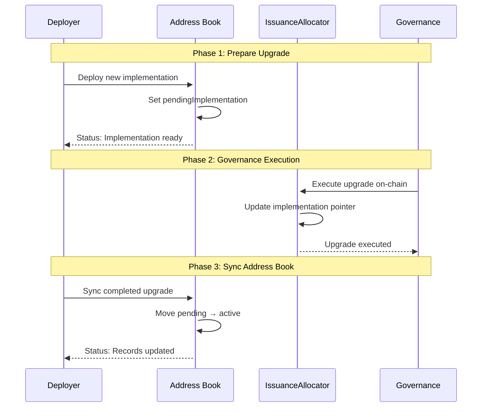
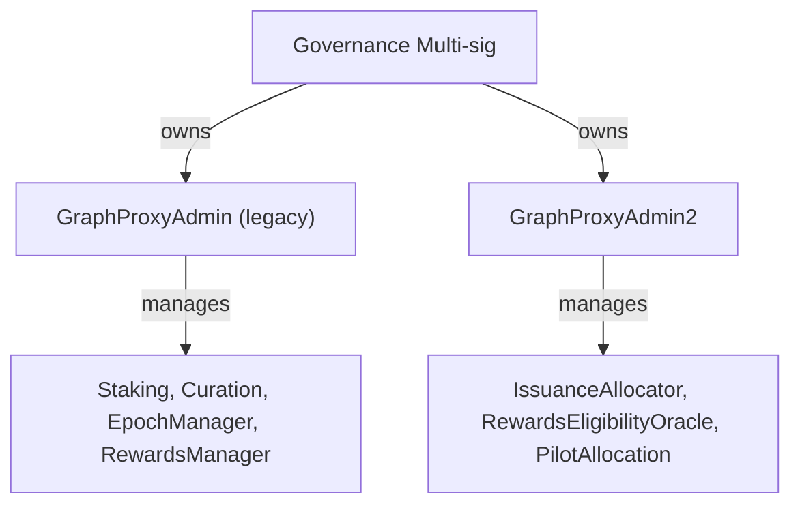
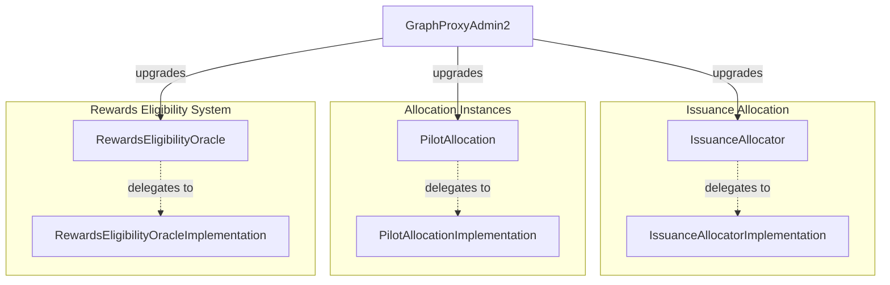
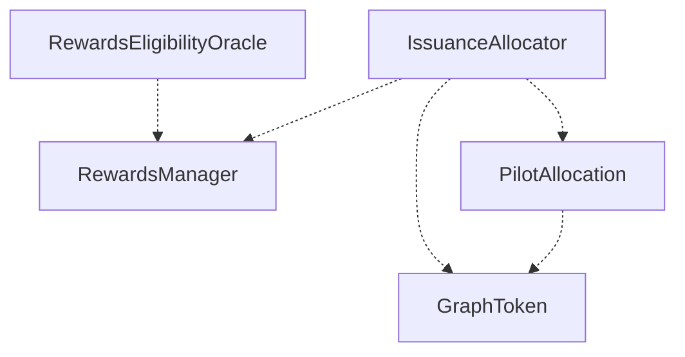
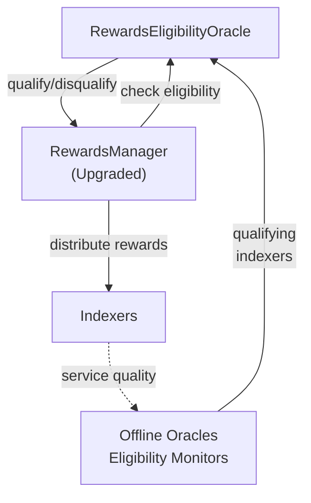
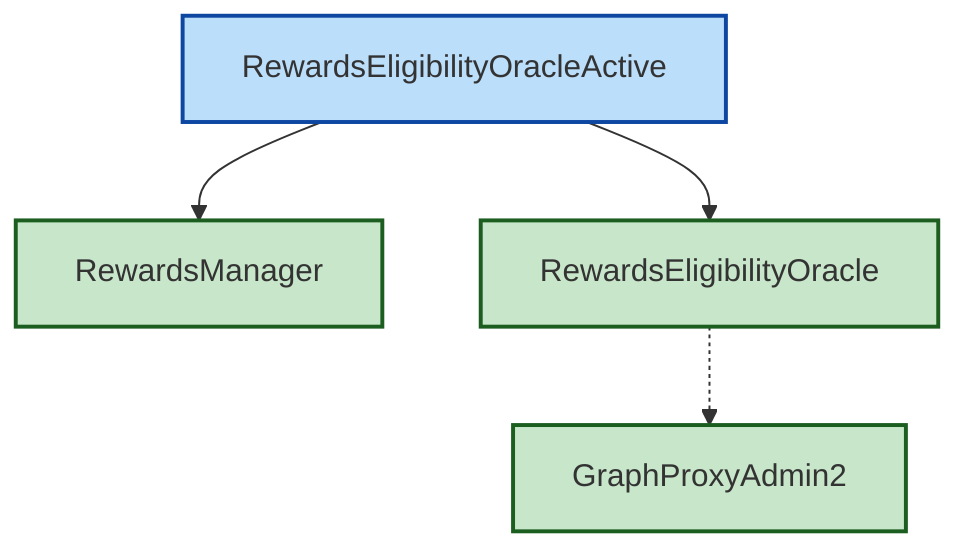
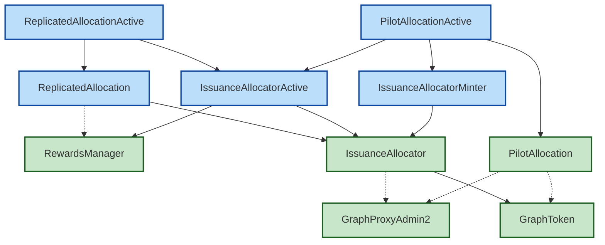
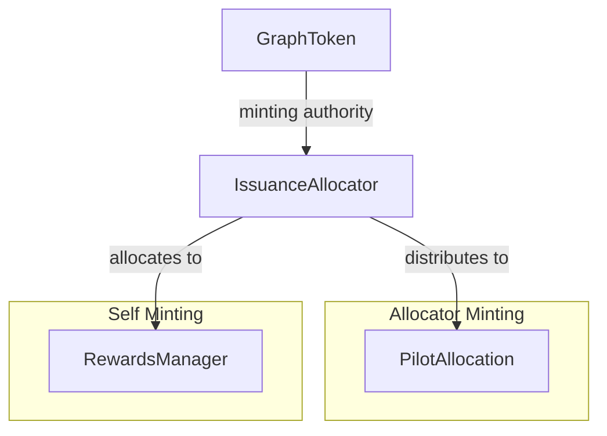
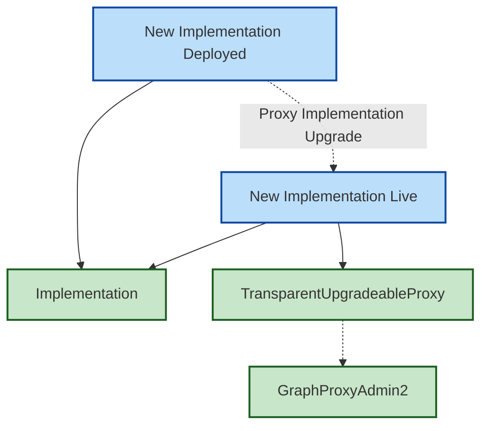
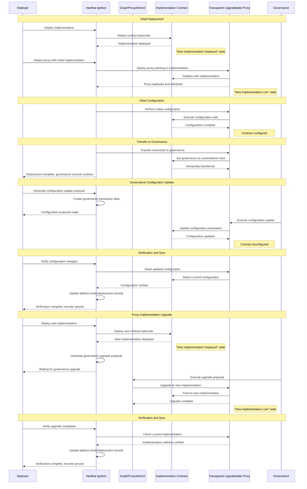

# Deploy Package Design

This document describes the design for the cross-package orchestration system in `packages/deploy/`.

**Status:** This document contains both current implementation and aspirational design. TODOs mark features not yet implemented.

**Note:** For component deployment (REO, IA, PilotAllocation), see `packages/issuance/deploy/`. For detailed deployment guides, see that package's `docs/` directory.

## Goals

- Clean, target-based, idempotent deployments using Hardhat Ignition
- Separation of concerns:
  - Issuance deployment package (packages/issuance/deploy): deploy issuance components (no cross‑package wiring)
  - Contracts deployment package (packages/contracts/deploy): core contract modules, mainly for RewardsManager (no cross‑package wiring)
  - Orchestration package (packages/deploy): perform cross‑package integrations that require governance
- Minimal, parameterized CLI (network/parameters/target)
- Governance checkpoints encoded as assertion calls that revert until the governance transaction is executed
- Address book tracks active and pending implementations

### Components

**Deployed by issuance package** (`packages/issuance/deploy/`):

- IssuanceAllocator (Upgradeable proxy + implementation, uses GraphToken)
- RewardsEligibilityOracle (Upgradeable proxy + implementation)
- PilotAllocation (Upgradeable proxy + implementation using DirectAllocation.sol contract)
- GraphProxyAdmin2 (ProxyAdmin for issuance proxies; governance‑owned)

**Referenced by this package** (already deployed elsewhere):

- RewardsManager (From `@graphprotocol/contracts` or `@graphprotocol/horizon`)
- GraphToken (From `@graphprotocol/contracts`)
- GraphProxyAdmin (From `@graphprotocol/contracts` or `@graphprotocol/horizon`)

### Targets model

**Component targets** (in `packages/issuance/deploy/`):

- rewards-eligibility-oracle (REO deployment)
- issuance-allocator (IA deployment)
- direct-allocation (DA implementation deployment)

**Integration/checkpoint targets** (in this package - `packages/deploy/`):

- rewards-eligibility-oracle-active: Verifies `RewardsManager.setRewardsEligibilityOracle(REO)` executed
- issuance-allocator-active: Verifies `RewardsManager.setIssuanceAllocator(IA)` executed
- issuance-allocator-minter: Verifies `GraphToken.addMinter(IA)` executed

**TODO:** The following targets mentioned in this design are not yet implemented:

- pilot-allocation component deployment
- issuance-allocator-reallocation checkpoint

Notes:

- "Active" targets assert equality (e.g., `RewardsManager.rewardsEligibilityOracle() == REO`). They are intentionally not in issuance package when they depend on external packages.

### Configuration state definitions

**Rewards Eligibility Oracle states:**

- Rewards Eligibility Oracle: deployed and ready to provide eligibility assessments
- Rewards Eligibility Oracle Active: integrated via `RewardsManager.setRewardsEligibilityOracle()`

**Issuance Allocator states:**

- Issuance Allocator Active: RewardsManager uses IssuanceAllocator for issuance distribution
- Issuance Allocator Minter: IssuanceAllocator has GraphToken minting authority via `GraphToken.addMinter(IA)`

**TODO:** The following states mentioned in this design are not yet implemented:

- Replicated Allocation: IssuanceAllocator replicates current issuance per block with 100% allocated to RewardsManager
- Replicated Allocation Active: integrated via `RewardsManager.setIssuanceAllocator()` with 100% allocation to RewardsManager
- Pilot Allocation Active: 99% to RewardsManager and 1% to a PilotAllocation (for testing only; not proposed for production)

### Governance workflow

Three phases per upgrade:

1. Prepare (permissionless): deploy new implementations, parameters, and helper/contracts as needed
2. Execute (governance): execute Safe batch to perform the state transition
3. Verify/Sync: assertion modules/scripts succeed; address book syncs pending → active

We use a small, stateless `IssuanceStateVerifier` helper with view functions that revert until state is correct:

- `assertRewardsEligibilityOracleSet(rewardsManager, expectedREO)`
- `assertIssuanceAllocatorSet(rewardsManager, expectedIA)`
- `assertMinterRole(graphToken, expectedMinter)`
- `assertTargetAllocated(issuanceAllocator, target)`

### Governance transactions

All "Active" states are reached via governance transactions:

- RewardsManager Upgrade: `GraphProxyAdmin.upgrade()` for RewardsManager proxy implementation (to include REO/IA integration methods)
- Integration Configuration: `RewardsManager.setRewardsEligibilityOracle(REO)`, `RewardsManager.setIssuanceAllocator(IA)`
- Minting Authority: `GraphToken.addMinter(IA)`

**TODO:** The following governance transactions are not yet implemented in this package:

- Issuance Contract Upgrades: `GraphProxyAdmin2.upgrade()` for IssuanceAllocator implementations
- Allocation Configuration: configure IssuanceAllocator allocation percentages via `setTargetAllocation()`
- PilotAllocation deployment and configuration

### Address book and pending implementations

- Address entries for proxies include implementation and optional pendingImplementation metadata
- setPendingImplementation(...) records deployed-but-not-active implementation
- activatePendingImplementation(...) moves pending → implementation after governance executes

#### Upgrade Workflow with Pending Implementation



#### Address Book States

##### Before Upgrade Prep

```json
{
  "IssuanceAllocator": {
    "address": "0x9fE46...",
    "proxy": true,
    "implementation": {
      "address": "0xe7f17..." // Current active
    }
  }
}
```

##### After Upgrade Prep (Interim State)

```json
{
  "IssuanceAllocator": {
    "address": "0x9fE46...",
    "proxy": true,
    "implementation": {
      "address": "0xe7f17..." // Still active
    },
    "pendingImplementation": {
      "address": "0x5FbDB...", // Ready for upgrade
      "deployedAt": "2024-01-15T10:30:00Z",
      "readyForUpgrade": true
    }
  }
}
```

##### After Governance Upgrade (Complete)

```json
{
  "IssuanceAllocator": {
    "address": "0x9fE46...",
    "proxy": true,
    "implementation": {
      "address": "0x5FbDB..." // Now active
    }
    // pendingImplementation removed
  }
}
```

### Parameters and CLI

**TODO:** This package does not yet have its own CLI. It uses Hardhat tasks:

- `issuance:build-rewards-eligibility-upgrade` - Generate Safe TX batch for REO/IA integration

For component deployment CLI, see `packages/issuance/deploy/`.

### API correctness

**RewardsEligibilityOracle:**

- `setEligibilityValidation(bool)` - Enable/disable eligibility validation
- `setEligibilityPeriod(uint256)` - Set how long eligibility lasts
- See `packages/issuance/deploy/docs/APICorrectness.md` for complete REO API

**IssuanceAllocator:**

- `setTargetAllocation(target, allocatorMintingPPM, selfMintingPPM, evenIfDistributionPending)`
- RewardsManager reads issuance via `issuanceAllocator.getTargetIssuancePerBlock(address(this)).selfIssuancePerBlock`

### Conventions

- TypeScript throughout (.ts) for modules and scripts
- TitleCase for docs

### What lives where

- `packages/issuance/deploy/`: Component deployments for issuance system, IssuanceStateVerifier helper for governance checks
- `packages/contracts/`: Core contracts source code (GraphToken, GraphProxyAdmin, RewardsManager)
- `packages/deploy/` (this package): Integration/checkpoint modules and cross‑package governance orchestration (Safe TX batches)

**TODO:** `packages/contracts/deploy/` is mentioned in this design but doesn't currently exist. RewardsManager deployment may be handled by `packages/horizon/` instead.

### Ignition-based deployment approach

What Ignition handles (idempotent by design):

- Contract deployment (skips when identical result already exists)
- Proxy deployment (TransparentUpgradeableProxy)
- Idempotent m.call() operations (by call ID)
- Dependency resolution across modules
- Deployment state tracking in ignition/deployments/

What scripts handle (governance coordination):

- Governance proposal generation (transaction data for Safe)
- Go‑live verification (assertions over live state)

Key benefits:

1. Ignition provides idempotency and deterministic addresses
2. Clear separation between deployment and governance
3. Safe re‑runs with persisted state and dependency tracking

### Safety considerations

Built-in safety checks:

- Network configuration validation
- Contract bytecode verification
- State consistency checks
- Governance proposal validation

Testing strategy:

- Comprehensive testnet deployment testing
- Mainnet fork testing
- Governance proposal simulation
- End-to-end integration testing

### Testing/verification

- Use Ignition to run targets idempotently; “Active” targets should fail until governance is executed
- Add small verification scripts that read on-chain state and print expected vs actual; exit non‑zero on mismatch

### Appendix: Canonical target list

(This list is not complete and needs review.)

- Issuance (packages/issuance/deploy):
  - rewards-eligibility-oracle
  - issuance-allocator
  - pilot-allocation
- Contracts (packages/contracts):
  - graph-token
  - graph-proxy-admin
  - rewards-manager
- Orchestration (packages/deploy):
  - rewards-eligibility-oracle-active
  - issuance-allocator-active
  - issuance-allocator-minter
  - issuance-allocator-reallocation

Note: Integration (“Active”) targets now live in packages/deploy. See that package’s README for the list.

## Proxy administration

### Governance proxy administration



### Component administration



## Contract dependencies (state-free)



## Rewards Eligibility Oracle

### Rewards Eligibility Flow



### Rewards Eligibility Oracle targets



## Issuance Allocator targets



## Issuance distribution



## Proxy deployment pattern



## Proxy deployment and upgrade sequence


