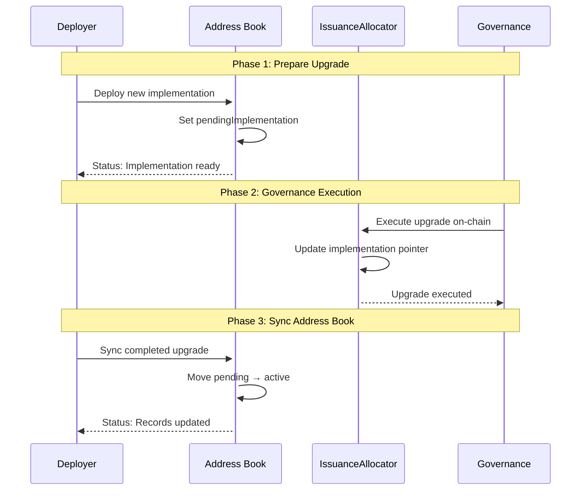
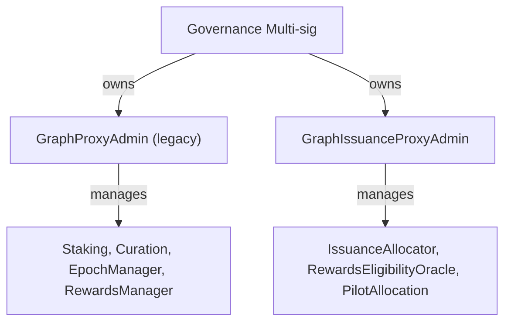
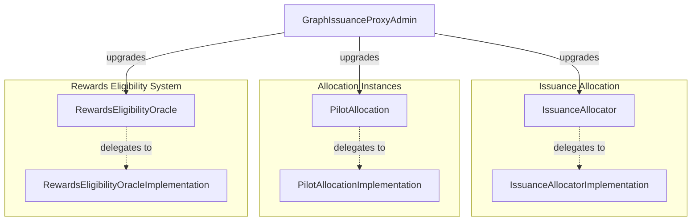
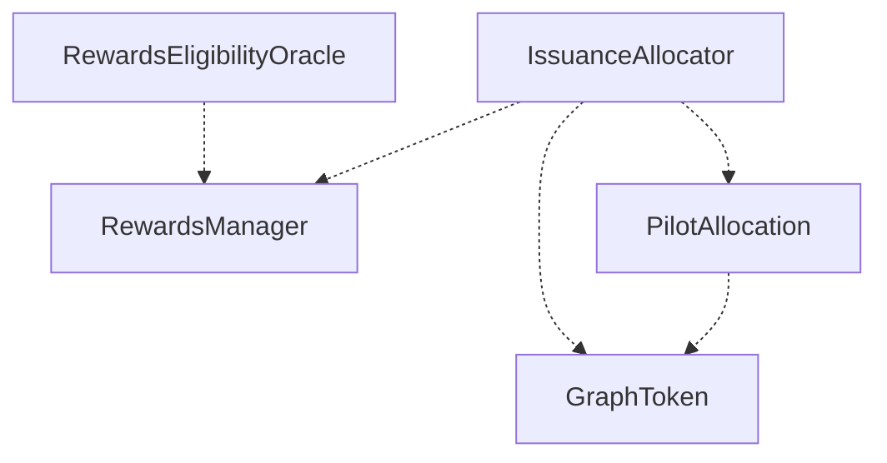
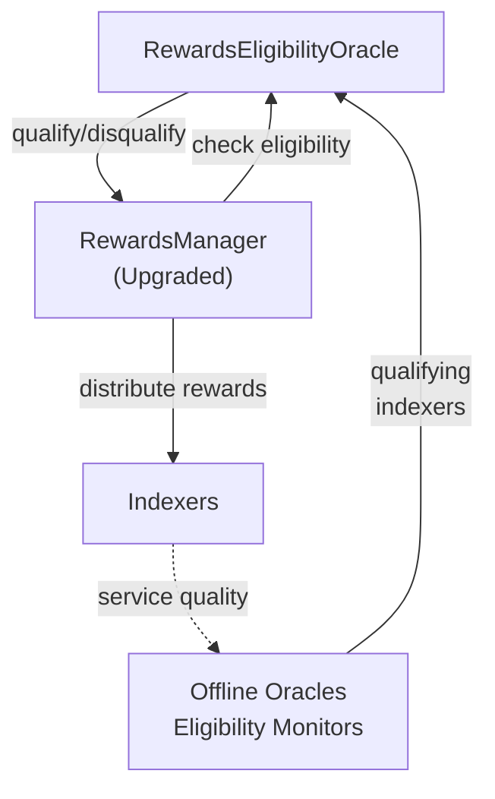
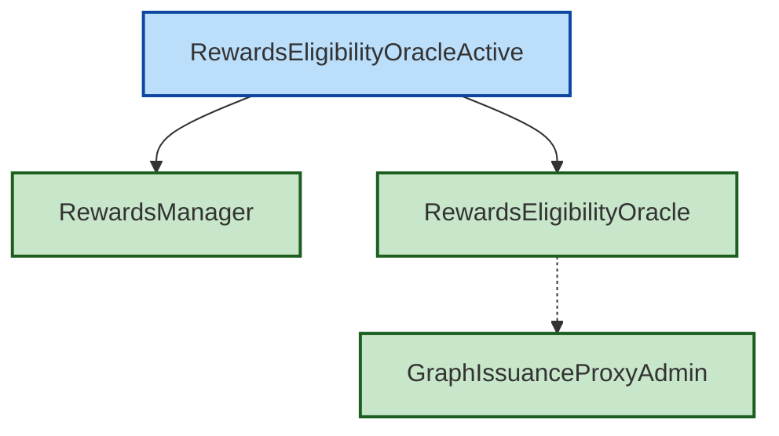
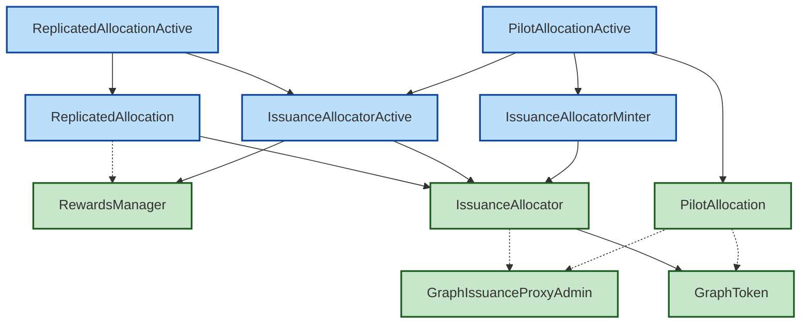
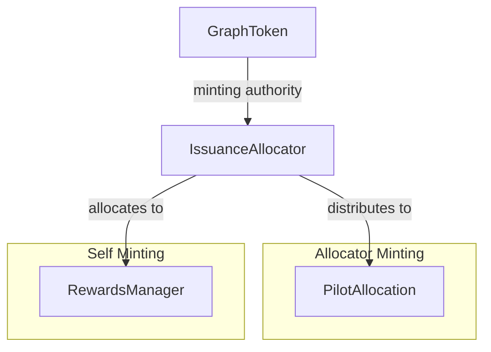
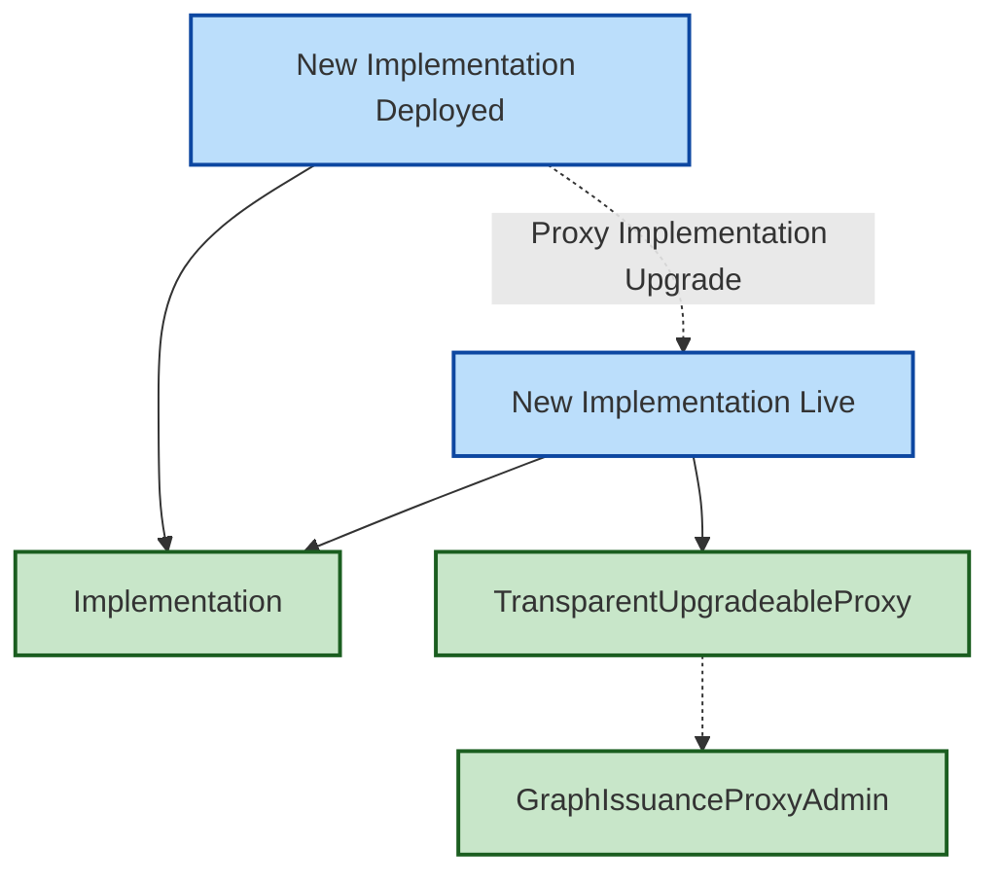
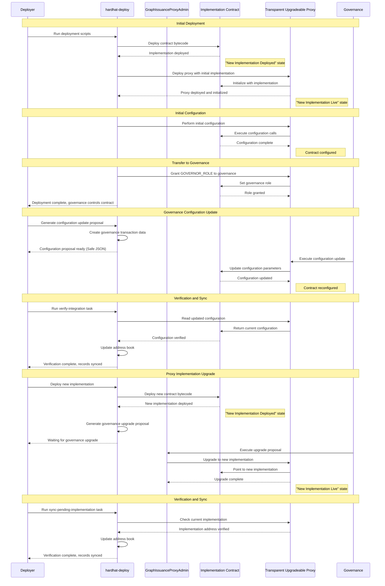

# Deploy Package Design

This document describes the design for the cross-package orchestration system in `packages/deploy/`.

**Status:** This document contains both current implementation and aspirational design. TODOs mark features not yet implemented.

**Note:** For component deployment (REO, IA, PilotAllocation), see `packages/issuance/deploy/`. For detailed deployment guides, see that package's `docs/` directory.

## Goals

- Cross-package governance integration and verification
- Separation of concerns:
  - Issuance deployment package (packages/issuance/deploy): deploy issuance components using hardhat-deploy (no cross‑package wiring)
  - Horizon deployment package (packages/horizon): deploy core protocol contracts (GraphToken, RewardsManager, GraphProxyAdmin)
  - Orchestration package (packages/deploy): perform cross‑package integrations that require governance
- Task-based verification of governance integration
- Address book tracks active and pending implementations

### Components

**Deployed by issuance package** (`packages/issuance/deploy/`):

- IssuanceAllocator (Upgradeable proxy + implementation, uses GraphToken)
- RewardsEligibilityOracle (Upgradeable proxy + implementation)
- PilotAllocation (Upgradeable proxy + implementation using DirectAllocation.sol contract)
- GraphIssuanceProxyAdmin (ProxyAdmin for issuance proxies; governance‑owned)

**Referenced by this package** (already deployed elsewhere):

- RewardsManager (From `@graphprotocol/contracts` or `@graphprotocol/horizon`)
- GraphToken (From `@graphprotocol/contracts`)
- GraphProxyAdmin (From `@graphprotocol/contracts` or `@graphprotocol/horizon`)

### Integration Verification

**Component deployment** (in `packages/issuance/deploy/`):

- Deploys IssuanceAllocator, RewardsEligibilityOracle, PilotAllocation
- Uses hardhat-deploy numbered scripts with tags and dependencies
- Each deployment is idempotent and resumable

**Integration verification** (in this package - `packages/deploy/`):

The `issuance:verify-integration` task verifies governance has executed integration:

- `--check reo`: Verifies `RewardsManager.setRewardsEligibilityOracle(REO)` executed
- `--check ia`: Verifies `RewardsManager.setIssuanceAllocator(IA)` executed
- `--check ia-minter`: Verifies `GraphToken.addMinter(IA)` executed

**TODO:** The following checks are not yet implemented:

- Allocation configuration verification (IssuanceAllocator.setTargetAllocation)

**Note:** pilot-allocation component deployment is handled in `packages/issuance/deploy/`.

Notes:

- Integration checks assert equality (e.g., `RewardsManager.rewardsEligibilityOracle() == REO`). They are intentionally in the orchestration package since they depend on cross-package state.

### Configuration state definitions

**Rewards Eligibility Oracle states:**

- Rewards Eligibility Oracle: deployed and ready to provide eligibility assessments
- Rewards Eligibility Oracle Active: integrated via `RewardsManager.setRewardsEligibilityOracle()`

**Issuance Allocator states:**

- Issuance Allocator Active: RewardsManager uses IssuanceAllocator for issuance distribution
- Issuance Allocator Minter: IssuanceAllocator has GraphToken minting authority via `GraphToken.addMinter(IA)`

**TODO:** The following states mentioned in this design are not yet implemented:

- Replicated Allocation: IssuanceAllocator replicates current issuance per block with 100% allocated to RewardsManager
- Replicated Allocation Active: integrated via `RewardsManager.setIssuanceAllocator()` with 100% allocation to RewardsManager

**Note:** Pilot Allocation Active checkpoint is now implemented. It verifies that PilotAllocation is configured as an allocation target in IssuanceAllocator (for testing only; not proposed for production).

### Governance workflow

Three phases per upgrade:

1. Prepare (permissionless): deploy new implementations, parameters, and helper contracts as needed
2. Execute (governance): execute Safe batch to perform the state transition
3. Verify/Sync: verification tasks check integration; address book syncs pending → active

The `issuance:verify-integration` task checks on-chain state to confirm governance execution:

- `RewardsManager.rewardsEligibilityOracle()` == deployed REO address
- `RewardsManager.issuanceAllocator()` == deployed IA address
- `GraphToken.hasRole(MINTER_ROLE, IA)` == true
- Additional checks for allocation configuration (TODO)

### Governance transactions

All "Active" states are reached via governance transactions:

- RewardsManager Upgrade: `GraphProxyAdmin.upgrade()` for RewardsManager proxy implementation (to include REO/IA integration methods)
- Integration Configuration: `RewardsManager.setRewardsEligibilityOracle(REO)`, `RewardsManager.setIssuanceAllocator(IA)`
- Minting Authority: `GraphToken.addMinter(IA)`

**TODO:** The following governance transactions are not yet implemented in this package:

- Issuance Contract Upgrades: `GraphIssuanceProxyAdmin.upgrade()` for IssuanceAllocator implementations
- Allocation Configuration: configure IssuanceAllocator allocation percentages via `setTargetAllocation()`
- PilotAllocation deployment and configuration

### Address book and pending implementations

- Address entries for proxies include implementation and optional pendingImplementation metadata
- setPendingImplementation(...) records deployed-but-not-active implementation
- activatePendingImplementation(...) moves pending → implementation after governance executes

#### Upgrade Workflow with Pending Implementation



#### Address Book States

##### Before Upgrade Prep

```json
{
  "IssuanceAllocator": {
    "address": "0x9fE46...",
    "proxy": true,
    "implementation": {
      "address": "0xe7f17..." // Current active
    }
  }
}
```

##### After Upgrade Prep (Interim State)

```json
{
  "IssuanceAllocator": {
    "address": "0x9fE46...",
    "proxy": true,
    "implementation": {
      "address": "0xe7f17..." // Still active
    },
    "pendingImplementation": {
      "address": "0x5FbDB...", // Ready for upgrade
      "deployedAt": "2024-01-15T10:30:00Z",
      "readyForUpgrade": true
    }
  }
}
```

##### After Governance Upgrade (Complete)

```json
{
  "IssuanceAllocator": {
    "address": "0x9fE46...",
    "proxy": true,
    "implementation": {
      "address": "0x5FbDB..." // Now active
    }
    // pendingImplementation removed
  }
}
```

### Tasks and CLI

This package uses Hardhat tasks for orchestration:

- `issuance:build-rewards-eligibility-upgrade` - Generate Safe TX batch for REO/IA integration
- `issuance:verify-integration` - Verify governance integration has been executed
- `issuance:deployment-status` - Show deployment status across packages
- `issuance:list-pending-implementations` - List pending implementations
- `issuance:sync-pending-implementation` - Sync address book after governance

For component deployment, see `packages/issuance/deploy/`.

### API correctness

**RewardsEligibilityOracle:**

- `setEligibilityValidation(bool)` - Enable/disable eligibility validation
- `setEligibilityPeriod(uint256)` - Set how long eligibility lasts
- See `packages/issuance/deploy/docs/APICorrectness.md` for complete REO API

**IssuanceAllocator:**

- `setTargetAllocation(target, allocatorMintingPPM, selfMintingPPM, evenIfDistributionPending)`
- RewardsManager reads issuance via `issuanceAllocator.getTargetIssuancePerBlock(address(this)).selfIssuancePerBlock`

### Conventions

- TypeScript throughout (.ts) for modules and scripts
- TitleCase for docs

### What lives where

- `packages/issuance/deploy/`: Component deployments for issuance system, IssuanceStateVerifier helper for governance checks
- `packages/contracts/`: Core contracts source code (GraphToken, GraphProxyAdmin, RewardsManager)
- `packages/deploy/` (this package): Integration/checkpoint modules and cross‑package governance orchestration (Safe TX batches)

**TODO:** `packages/contracts/deploy/` is mentioned in this design but doesn't currently exist. RewardsManager deployment may be handled by `packages/horizon/` instead.

### Deployment and verification approach

**Component deployment** (in `packages/issuance/deploy/`):

- Uses hardhat-deploy for idempotent, resumable deployments
- Numbered deployment scripts (00*, 01*, etc.) run in order
- Tags and dependencies control deployment flow
- Deployment state tracked in deployments/ directory

**Orchestration tasks** (in this package):

- Governance proposal generation (Safe transaction batches)
- Integration verification (on-chain state checks)
- Address book management (pending → active syncing)

Key benefits:

1. hardhat-deploy provides idempotency and deployment tracking
2. Clear separation between component deployment and governance integration
3. Task-based verification ensures governance executed correctly

### Safety considerations

Built-in safety checks:

- Network configuration validation
- Contract bytecode verification
- State consistency checks
- Governance proposal validation

Testing strategy:

- Comprehensive testnet deployment testing
- Mainnet fork testing
- Governance proposal simulation
- End-to-end integration testing

### Testing/verification

- Component deployment tests in `packages/issuance/deploy/test/` verify deployment succeeds
- Integration verification via `issuance:verify-integration` task checks on-chain state
- Task exits with code 0 if integrated, code 1 if not yet integrated
- Can be used in CI/CD pipelines or governance verification workflows

### Appendix: Component and integration list

**Components** (deployed by `packages/issuance/deploy/`):

- IssuanceAllocator (proxy + implementation)
- RewardsEligibilityOracle (proxy + implementation)
- PilotAllocation (proxy + implementation)
- GraphIssuanceProxyAdmin (shared proxy admin)

**Referenced contracts** (from other packages):

- GraphToken (from packages/contracts or packages/horizon)
- RewardsManager (from packages/contracts or packages/horizon)
- GraphProxyAdmin (from packages/contracts or packages/horizon)

**Integration checks** (verified by this package):

- REO integration: `RewardsManager.rewardsEligibilityOracle()` == REO address
- IA integration: `RewardsManager.issuanceAllocator()` == IA address
- IA minter role: `GraphToken.hasRole(MINTER_ROLE, IA)` == true

## Proxy administration

### Governance proxy administration



### Component administration



## Contract dependencies (state-free)



## Rewards Eligibility Oracle

### Rewards Eligibility Flow



### Rewards Eligibility Oracle targets



## Issuance Allocator targets



## Issuance distribution



## Proxy deployment pattern



## Proxy deployment and upgrade sequence


