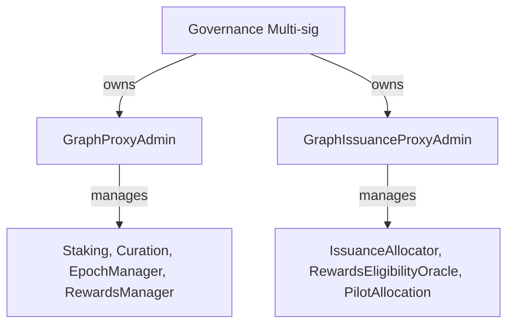
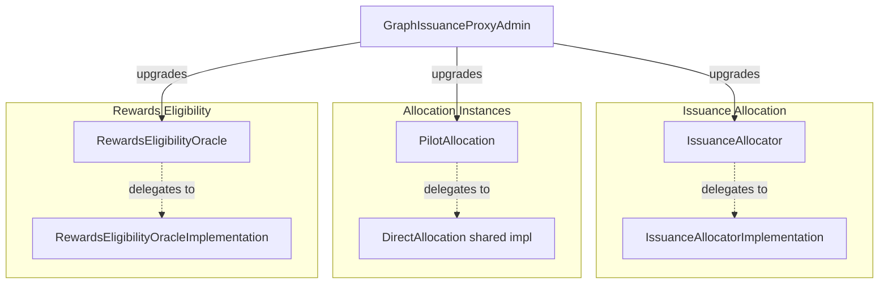
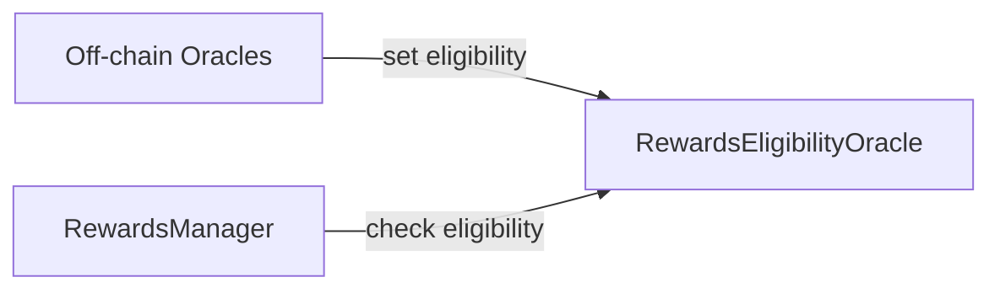
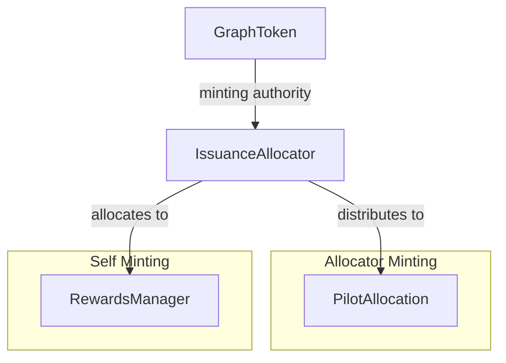
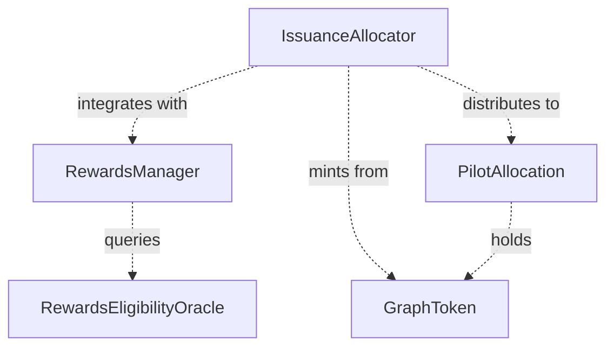
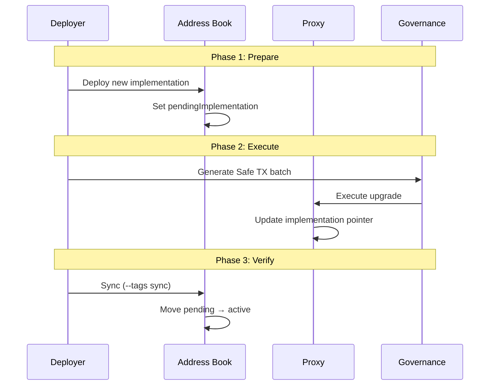
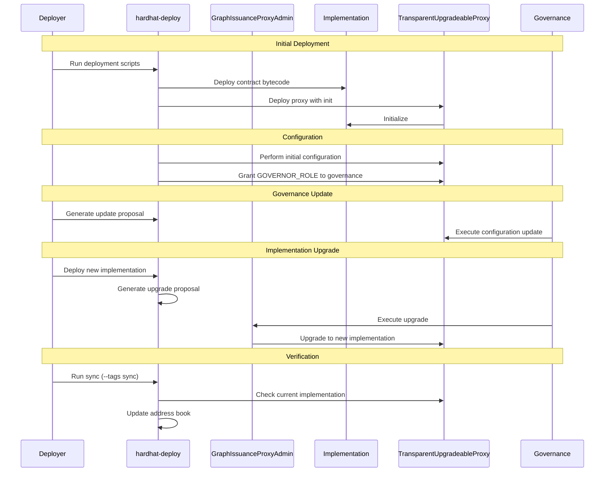

# Deployment Package Design

High-level architecture for the unified deployment system.

**See also:**

- [Architecture.md](./Architecture.md) - Package structure and organization
- [../deploy/ImplementationPrinciples.md](../deploy/ImplementationPrinciples.md) - Deploy script patterns and conventions

## Components

**Deployed by this package:**

- IssuanceAllocator - Upgradeable proxy managing issuance distribution
- RewardsEligibilityOracle - Upgradeable proxy for eligibility verification
- PilotAllocation - Upgradeable proxy for allocation testing
- GraphIssuanceProxyAdmin - Shared proxy admin for issuance contracts

**Referenced contracts** (already deployed):

- RewardsManager (from @graphprotocol/contracts or @graphprotocol/horizon)
- GraphToken (from @graphprotocol/contracts)
- GraphProxyAdmin (from @graphprotocol/contracts or @graphprotocol/horizon)

## Directory Structure

```
packages/deployment/
├── deploy/               # Numbered deployment scripts
│   ├── admin/           # GraphIssuanceProxyAdmin
│   ├── allocate/        # IssuanceAllocator, PilotAllocation
│   ├── common/          # Validation, external imports
│   ├── rewards/         # RewardsManager, RewardsEligibilityOracle
│   ├── service/         # SubgraphService
│   └── ImplementationPrinciples.md  # Script patterns
├── lib/                 # Shared utilities, Safe TX builder
├── tasks/               # Hardhat tasks
└── docs/                # Architecture documentation
```

## Governance Model

### Three-Phase Workflow

1. **Prepare** (permissionless) - Deploy new implementations, generate TX batches
2. **Execute** (governance) - Execute Safe TX batch for state transitions
3. **Verify** (permissionless) - Verify integration, sync address books

### Proxy Administration



**Key principle:** Separate proxy admins for legacy vs new issuance contracts, both governance-owned.

### Component Administration



## Contract Integration

### RewardsEligibilityOracle Integration



**Integration:** `RewardsManager.setRewardsEligibilityOracle(REO)` via governance

### IssuanceAllocator Integration



**Integration:**

- `RewardsManager.setIssuanceAllocator(IA)` via governance
- `GraphToken.addMinter(IA)` via governance

### Contract Dependencies



## Address Book Management

### Pending Implementation Pattern

Deployment tracks both active and pending implementations:

```json
{
  "IssuanceAllocator": {
    "address": "0x9fE46...",
    "implementation": {
      "address": "0xe7f17..."
    },
    "pendingImplementation": {
      "address": "0x5FbDB...",
      "readyForUpgrade": true
    }
  }
}
```

### Upgrade Workflow



## Deployment Workflow

### Proxy Deployment and Upgrade



## Conventions

- TypeScript throughout (.ts)
- TitleCase for documentation
- Deploy script patterns: [ImplementationPrinciples.md](../deploy/ImplementationPrinciples.md)
- All 01_deploy.ts scripts MUST depend on SpecialTags.SYNC
