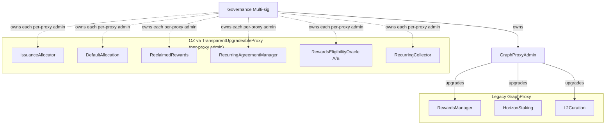
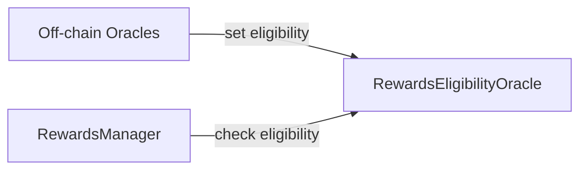
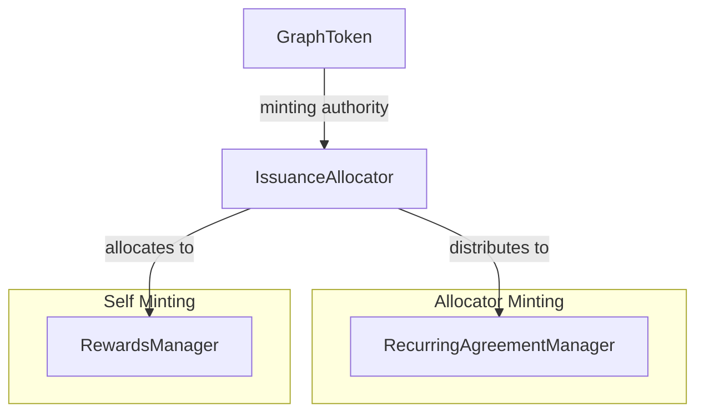
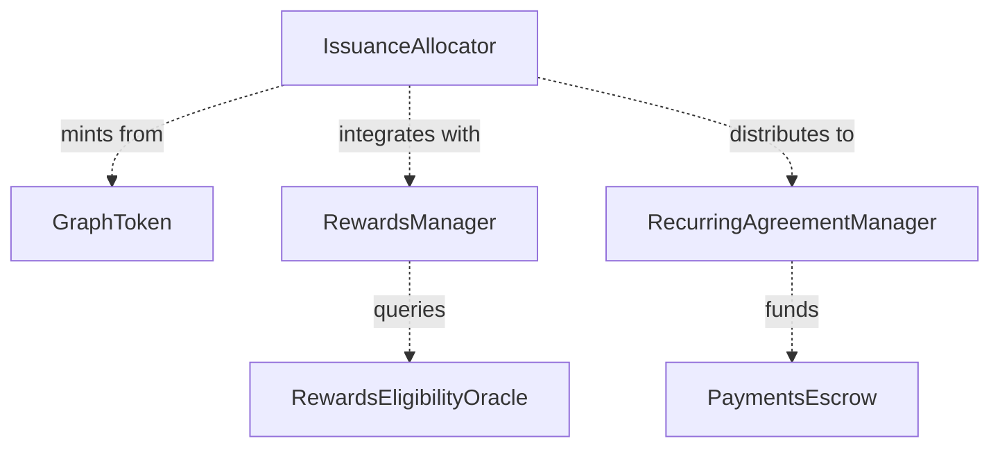
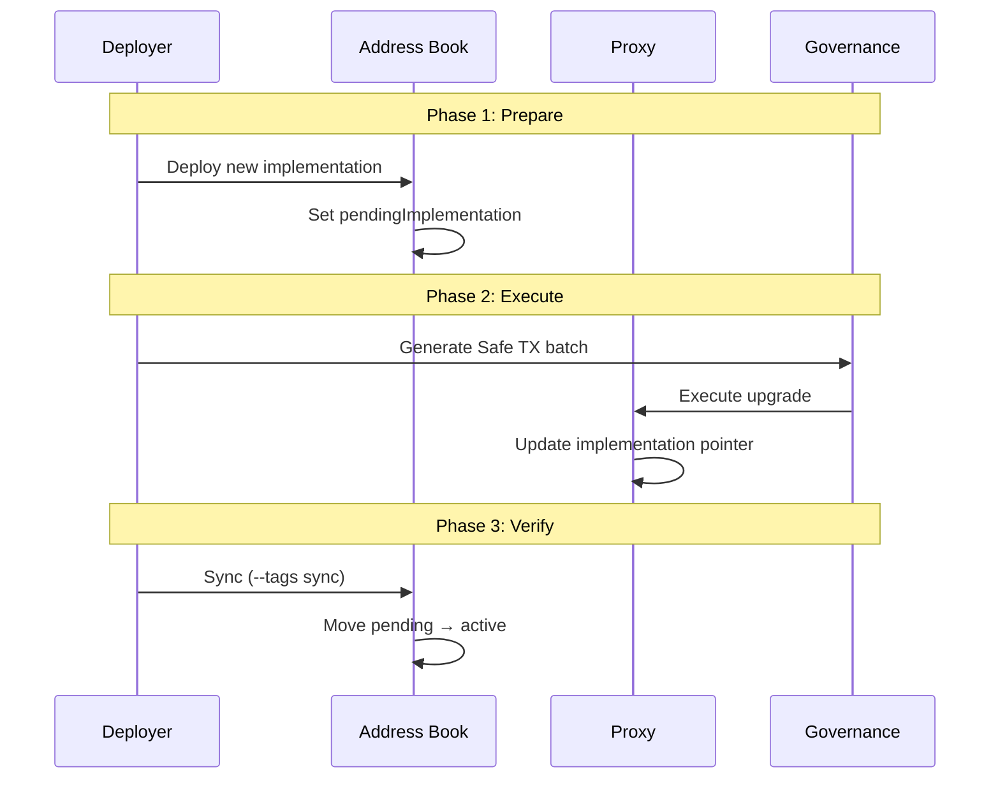
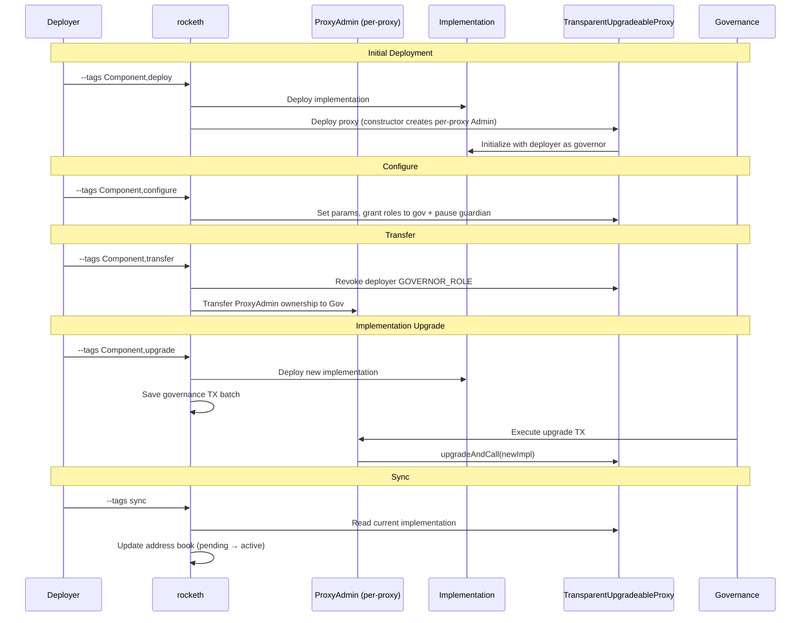

# Deployment Package Design

High-level architecture for the unified deployment system.

**See also:**

- [Architecture.md](./Architecture.md) - Package structure and organization
- [deploy/ImplementationPrinciples.md](./deploy/ImplementationPrinciples.md) - Deploy script patterns and conventions

## Components

**Deployed by this package:**

- IssuanceAllocator - Upgradeable proxy managing issuance distribution
- RewardsEligibilityOracle - Upgradeable proxy for eligibility verification
- ReclaimedRewards (DirectAllocation) - Upgradeable proxy for default reclaim address
- RecurringAgreementManager - Upgradeable proxy for agreement-based payments

**Referenced contracts** (already deployed):

- RewardsManager (from @graphprotocol/contracts or @graphprotocol/horizon)
- GraphToken (from @graphprotocol/contracts)
- GraphProxyAdmin (from @graphprotocol/contracts or @graphprotocol/horizon)

## Directory Structure

```
packages/deployment/
├── deploy/               # Numbered deployment scripts (rocketh + hardhat-deploy)
│   ├── common/          # 00_sync.ts
│   ├── horizon/         # RewardsManager, HorizonStaking, PaymentsEscrow, L2Curation, RecurringCollector
│   ├── service/         # SubgraphService, DisputeManager
│   ├── allocate/        # IssuanceAllocator, DefaultAllocation, DirectAllocation impl
│   ├── agreement/       # RecurringAgreementManager
│   ├── rewards/         # RewardsEligibilityOracle (A/B/mock), Reclaim
│   └── gip/0088/        # GIP-0088 goal orchestration
├── lib/                 # Shared utilities (preconditions, registry, tags, ABIs, governance)
├── tasks/               # Hardhat tasks (deploy:*)
├── docs/                # Architecture and operational documentation
│   └── deploy/          # Deploy-script principles and per-component design notes
└── test/                # Unit tests
```

## Governance Model

### Three-Phase Workflow

1. **Prepare** (permissionless) - Deploy new implementations, generate TX batches
2. **Execute** (governance) - Execute Safe TX batch for state transitions
3. **Verify** (permissionless) - Verify integration, sync address books

### Proxy Administration

Two distinct proxy patterns coexist:

- **Legacy `GraphProxy`** (custom Graph Protocol pattern) — used by RewardsManager, HorizonStaking, L2Curation, EpochManager. A single shared `GraphProxyAdmin` (owned by governance) controls upgrades for all of them.
- **OZ v5 `TransparentUpgradeableProxy`** — used by every new contract this package deploys (IssuanceAllocator, DefaultAllocation, ReclaimedRewards, RecurringAgreementManager, RewardsEligibilityOracle A/B, RecurringCollector, SubgraphService, DisputeManager, PaymentsEscrow). Each proxy gets its own per-proxy `ProxyAdmin` created by the proxy constructor; ownership is transferred to governance in the transfer step.


```mermaid
graph TB
    Gov[Governance Multi-sig]
    GraphAdmin[GraphProxyAdmin]

    subgraph "Legacy GraphProxy"
        RM[RewardsManager]
        HS[HorizonStaking]
        L2C[L2Curation]
    end

    subgraph "OZ v5 TransparentUpgradeableProxy<br/>(per-proxy admin)"
        IA[IssuanceAllocator]
        DA[DefaultAllocation]
        Reclaim[ReclaimedRewards]
        RAM[RecurringAgreementManager]
        REO[RewardsEligibilityOracle A/B]
        RC[RecurringCollector]
    end

    Gov -->|owns| GraphAdmin
    GraphAdmin -->|upgrades| RM
    GraphAdmin -->|upgrades| HS
    GraphAdmin -->|upgrades| L2C

    Gov -.->|owns each per-proxy admin| IA
    Gov -.->|owns each per-proxy admin| DA
    Gov -.->|owns each per-proxy admin| Reclaim
    Gov -.->|owns each per-proxy admin| RAM
    Gov -.->|owns each per-proxy admin| REO
    Gov -.->|owns each per-proxy admin| RC
```

**Key principle:** Every proxy admin is governance-owned. Legacy contracts share a single `GraphProxyAdmin`; new contracts each have their own per-proxy admin created at construction.

## Contract Integration

### RewardsEligibilityOracle Integration


```mermaid
graph LR
    REO[RewardsEligibilityOracle]
    RM[RewardsManager]
    Oracles[Off-chain Oracles]

    Oracles -->|set eligibility| REO
    RM -->|check eligibility| REO
```

**Integration:** `RewardsManager.setProviderEligibilityOracle(REO)` via governance

### IssuanceAllocator Integration


```mermaid
graph TB
    GT[GraphToken]
    IA[IssuanceAllocator]

    subgraph "Allocator Minting"
        RAM[RecurringAgreementManager]
    end

    subgraph "Self Minting"
        RM[RewardsManager]
    end

    GT -->|minting authority| IA
    IA -->|distributes to| RAM
    IA -->|allocates to| RM
```

**Integration:**

- `RewardsManager.setIssuanceAllocator(IA)` via governance
- `GraphToken.addMinter(IA)` via governance

### Contract Dependencies


```mermaid
graph TD
    GraphToken[GraphToken]
    RewardsManager[RewardsManager]

    RewardsEligibilityOracle[RewardsEligibilityOracle]
    IssuanceAllocator[IssuanceAllocator]
    RecurringAgreementManager[RecurringAgreementManager]

    RewardsManager -.->|queries| RewardsEligibilityOracle
    IssuanceAllocator -.->|integrates with| RewardsManager
    IssuanceAllocator -.->|mints from| GraphToken
    IssuanceAllocator -.->|distributes to| RecurringAgreementManager
    RecurringAgreementManager -.->|funds| PaymentsEscrow
```

## Address Book Management

### Pending Implementation Pattern

Deployment tracks both active and pending implementations:

```json
{
  "IssuanceAllocator": {
    "address": "0x9fE46...",
    "implementation": {
      "address": "0xe7f17..."
    },
    "pendingImplementation": {
      "address": "0x5FbDB...",
      "readyForUpgrade": true
    }
  }
}
```

### Upgrade Workflow


```mermaid
sequenceDiagram
    participant Deployer
    participant AB as Address Book
    participant Proxy
    participant Gov as Governance

    Note over Deployer,Gov: Phase 1: Prepare
    Deployer->>AB: Deploy new implementation
    AB->>AB: Set pendingImplementation

    Note over Deployer,Gov: Phase 2: Execute
    Deployer->>Gov: Generate Safe TX batch
    Gov->>Proxy: Execute upgrade
    Proxy->>Proxy: Update implementation pointer

    Note over Deployer,Gov: Phase 3: Verify
    Deployer->>AB: Sync (--tags sync)
    AB->>AB: Move pending → active
```

## Deployment Workflow

### Proxy Deployment and Upgrade


```mermaid
sequenceDiagram
    participant Deployer
    participant Deploy as rocketh
    participant Admin as ProxyAdmin (per-proxy)
    participant Impl as Implementation
    participant Proxy as TransparentUpgradeableProxy
    participant Gov as Governance

    Note over Deployer,Gov: Initial Deployment
    Deployer->>Deploy: --tags Component,deploy
    Deploy->>Impl: Deploy implementation
    Deploy->>Proxy: Deploy proxy (constructor creates per-proxy Admin)
    Proxy->>Impl: Initialize with deployer as governor

    Note over Deployer,Gov: Configure
    Deployer->>Deploy: --tags Component,configure
    Deploy->>Proxy: Set params, grant roles to gov + pause guardian

    Note over Deployer,Gov: Transfer
    Deployer->>Deploy: --tags Component,transfer
    Deploy->>Proxy: Revoke deployer GOVERNOR_ROLE
    Deploy->>Admin: Transfer ProxyAdmin ownership to Gov

    Note over Deployer,Gov: Implementation Upgrade
    Deployer->>Deploy: --tags Component,upgrade
    Deploy->>Impl: Deploy new implementation
    Deploy->>Deploy: Save governance TX batch
    Gov->>Admin: Execute upgrade TX
    Admin->>Proxy: upgradeAndCall(newImpl)

    Note over Deployer,Gov: Sync
    Deployer->>Deploy: --tags sync
    Deploy->>Proxy: Read current implementation
    Deploy->>Deploy: Update address book (pending → active)
```

## Conventions

- TypeScript throughout (.ts)
- TitleCase for documentation
- Deploy script patterns: [ImplementationPrinciples.md](./deploy/ImplementationPrinciples.md)
- Deploy scripts sync the contracts they touch immediately before/after their action via `syncComponentFromRegistry`/`syncComponentsFromRegistry`. The full
  global sync is opt-in via `npx hardhat deploy:sync` and is no longer an automatic dependency of every component script.
