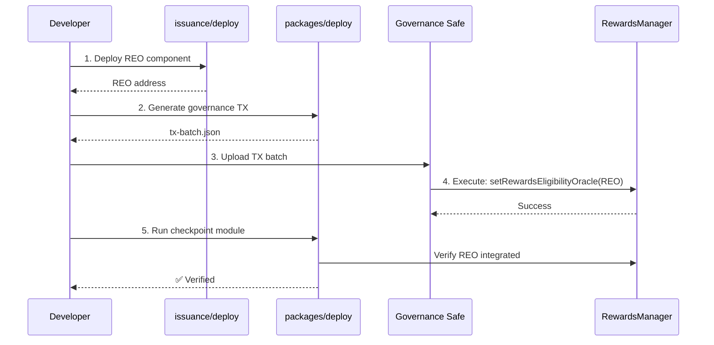

# Issuance Package Deployment Guide

Comprehensive deployment guide for Graph Issuance contracts.

## Overview

The issuance package provides the contracts and deployment infrastructure for the Graph Protocol issuance system, which includes:

- **RewardsEligibilityOracle (REO)** - Determines which indexers are eligible for rewards
- **IssuanceAllocator (IA)** - Allocates newly minted GRT to multiple targets
- **DirectAllocation** - Receives allocated GRT and distributes it

## Two-Package Deployment Architecture

Deployment is split across two packages:

### 1. Component Deployment (`packages/issuance/deploy/`)

**Purpose:** Deploy issuance contract implementations and proxies

**What it does:**
- Deploy REO, IA, DirectAllocation contracts
- Deploy TransparentUpgradeableProxy for each contract
- Initialize contracts with safe defaults
- Pure component deployment - no governance integration

**Location:** `packages/issuance/deploy/`

**See:** [issuance/deploy/README.md](./deploy/README.md)

### 2. Cross-Package Orchestration (`packages/deploy/`)

**Purpose:** Coordinate governance integration across Horizon and Issuance packages

**What it does:**
- Generate Safe transaction batches for governance
- Integrate REO/IA with RewardsManager
- Grant minter role to IssuanceAllocator
- Verify governance execution with checkpoint modules

**Location:** `packages/deploy/` (sibling to issuance package)

**See:** `packages/deploy/README.md`

---

## Quick Start

### Step 1: Deploy Components

Deploy issuance contracts:

```bash
cd packages/issuance/deploy

# Deploy to testnet
npx hardhat ignition deploy ignition/modules/contracts/RewardsEligibilityOracle.ts \
  --network arbitrum-sepolia \
  --parameters ignition/configs/issuance.arbitrumSepolia.json5

# Result: REO deployed at 0xREO_ADDRESS
```

### Step 2: Generate Governance TX

Generate Safe transaction batch for governance:

```bash
cd packages/deploy

npx hardhat deploy:build-reo-upgrade \
  --rewards-manager-impl 0xRM_IMPL \
  --reo-address 0xREO_ADDRESS \
  --network arbitrum-sepolia

# Output: tx-batch-421614-reo-upgrade.json
```

### Step 3: Execute via Governance

1. Upload `tx-batch-*.json` to Safe UI
2. Review transactions
3. Execute via governance multi-sig

### Step 4: Verify Integration

Verify governance executed correctly:

```bash
cd packages/deploy

npx hardhat ignition deploy ignition/modules/issuance/RewardsEligibilityOracleActive.ts \
  --parameters configs/arbitrum-sepolia.json \
  --network arbitrum-sepolia

# Success = integration verified ✅
# Revert = governance not yet executed ❌
```

---

## Deployment Workflow

### Complete REO Deployment



---

## Package Structure

### Component Deployment Package

```
packages/issuance/deploy/
├── contracts/
│   ├── IssuanceStateVerifier.sol      # Governance verification helper
│   └── mocks/                          # Test mocks
├── ignition/modules/
│   ├── contracts/                      # Component deployment modules
│   │   ├── RewardsEligibilityOracle.ts
│   │   ├── IssuanceAllocator.ts
│   │   └── DirectAllocation.ts
│   └── proxy/                          # Proxy utilities
└── docs/                               # Deployment documentation
```

### Orchestration Package

```
packages/deploy/
├── governance/                         # Safe TX builders
├── tasks/                              # Hardhat orchestration tasks
├── ignition/modules/
│   ├── horizon/                        # Horizon contract references
│   └── issuance/                       # Checkpoint modules
│       ├── RewardsEligibilityOracleActive.ts
│       ├── IssuanceAllocatorActive.ts
│       └── IssuanceAllocatorMinter.ts
└── test/                               # Fork-based integration tests
```

---

## Deployment Targets

### RewardsEligibilityOracle (REO)

**Priority:** Immediate

**Component deployment:**
```bash
cd packages/issuance/deploy
npx hardhat ignition deploy ignition/modules/contracts/RewardsEligibilityOracle.ts
```

**Governance integration:**
- Upgrade RewardsManager implementation
- Set REO address on RewardsManager
- Verification via checkpoint module

**Documentation:** [deploy/docs/REODeploymentSequence.md](./deploy/docs/REODeploymentSequence.md)

### IssuanceAllocator (IA)

**Priority:** Future (structure ready, not immediate deployment)

**Component deployment:**
```bash
cd packages/issuance/deploy
npx hardhat ignition deploy ignition/modules/contracts/IssuanceAllocator.ts
```

**Governance integration:**
- 3-stage gradual migration (deploy → activate → adjust)
- Grant minter role on GraphToken
- Configure allocation targets

**Documentation:** [deploy/docs/IADeploymentGuide.md](./deploy/docs/IADeploymentGuide.md)

### DirectAllocation

**Deployment:** Via IA deployment process

**Purpose:** Additional allocation target for IA

---

## Configuration

### Network Configurations

Located in `packages/issuance/deploy/ignition/configs/`:

- `issuance.arbitrumSepolia.json5` - Testnet configuration
- `issuance.arbitrumOne.json5` - Mainnet configuration

### Required Parameters

```json5
{
  $global: {
    graphTokenAddress: '0x...',  // GraphToken address
  }
}
```

---

## Testing

### Component Tests

```bash
cd packages/issuance
pnpm test
```

### Integration Tests (Fork-Based)

```bash
cd packages/deploy
pnpm test:fork
```

---

## Documentation

### Component Deployment

- [deploy/README.md](./deploy/README.md) - Component deployment guide
- [deploy/docs/](./deploy/docs/) - Comprehensive deployment documentation

### Orchestration

- `packages/deploy/README.md` - Orchestration guide
- `packages/deploy/governance/README.md` - TX builder guide

### Convergence Planning

- [deploy/legacy/ConvergencePlan.md](./deploy/legacy/ConvergencePlan.md) - Implementation plan
- [deploy/legacy/ConvergenceStrategy.md](./deploy/legacy/ConvergenceStrategy.md) - Convergence strategy

---

## Network Support

### Supported Networks

- **Arbitrum Sepolia** (testnet) - chainId: 421614
- **Arbitrum One** (mainnet) - chainId: 42161

### Network Configuration

Configure RPC URLs via Hardhat vars:

```bash
npx hardhat vars set ARBITRUM_SEPOLIA_RPC_URL
npx hardhat vars set ARBITRUM_ONE_RPC_URL
npx hardhat vars set ARBISCAN_API_KEY  # For verification
```

---

## Verification

### Contract Verification

```bash
npx hardhat ignition verify deployment-id
```

### Governance Verification

Checkpoint modules verify governance execution:

- **RewardsEligibilityOracleActive** - Verifies REO integrated
- **IssuanceAllocatorActive** - Verifies IA integrated
- **IssuanceAllocatorMinter** - Verifies minter role granted

These modules **revert until governance executes**, providing programmatic verification.

---

## Status

### Component Deployment (issuance/deploy/)
- ✅ REO deployment module ready
- ✅ IA deployment module ready
- ✅ DirectAllocation deployment module ready
- ✅ IssuanceStateVerifier contract added
- ✅ Mock contracts for testing
- ✅ Production documentation complete

### Orchestration (packages/deploy/)
- ✅ Orchestration package created
- ✅ Governance TX builder ready
- ✅ Checkpoint modules created
- ✅ Hardhat tasks ready
- ⏳ Fork-based tests (planned)

### Convergence
- ✅ Legacy analysis complete
- ✅ Convergence strategy defined
- ✅ Phase 1 (foundation merge) complete
- ⏳ Phase 2 (REO testing) - next
- ⏳ Phase 3 (IA structure) - future
- ⏳ Phase 4 (cleanup) - future

---

## Next Steps

1. **Complete Phase 2** - REO fork-based testing
2. **Testnet deployment** - Deploy REO on Arbitrum Sepolia
3. **Governance dry-run** - Test complete workflow on fork
4. **Complete Phase 3** - Finalize IA deployment patterns
5. **Mainnet deployment** - REO on Arbitrum One

---

## Support

For questions or issues:

1. Check documentation in `deploy/docs/`
2. Review convergence plan in `deploy/legacy/`
3. Consult orchestration guide in `packages/deploy/`

---

**Package Status:** Production-ready for REO deployment
