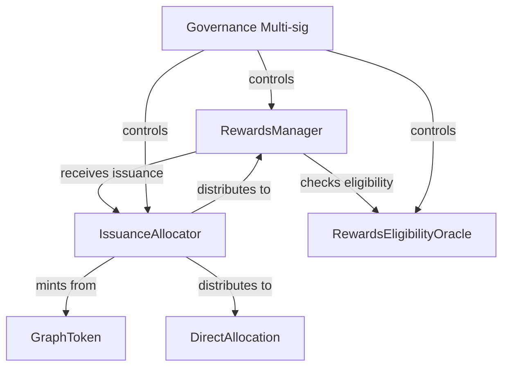
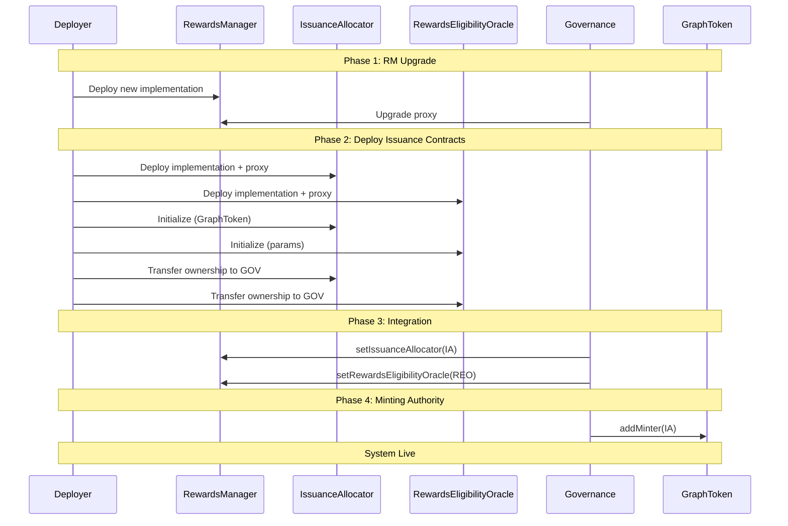
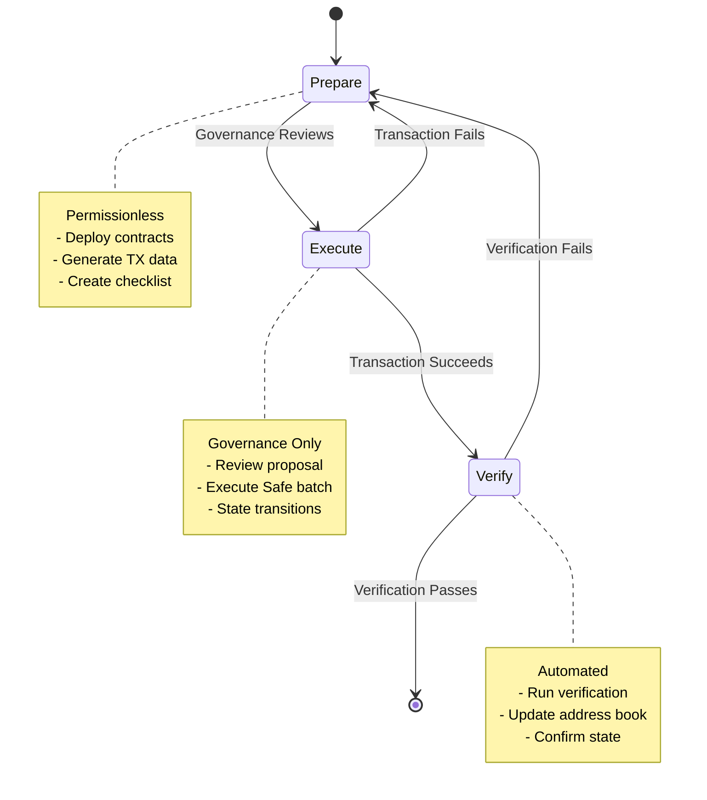
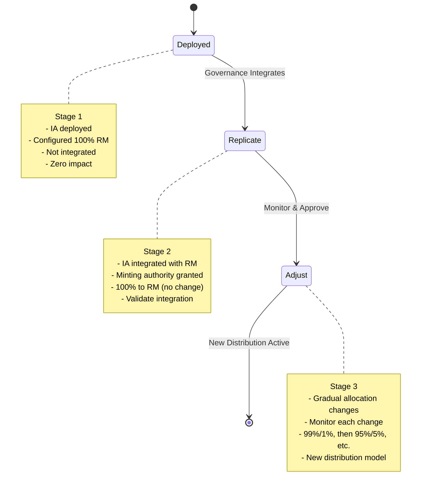
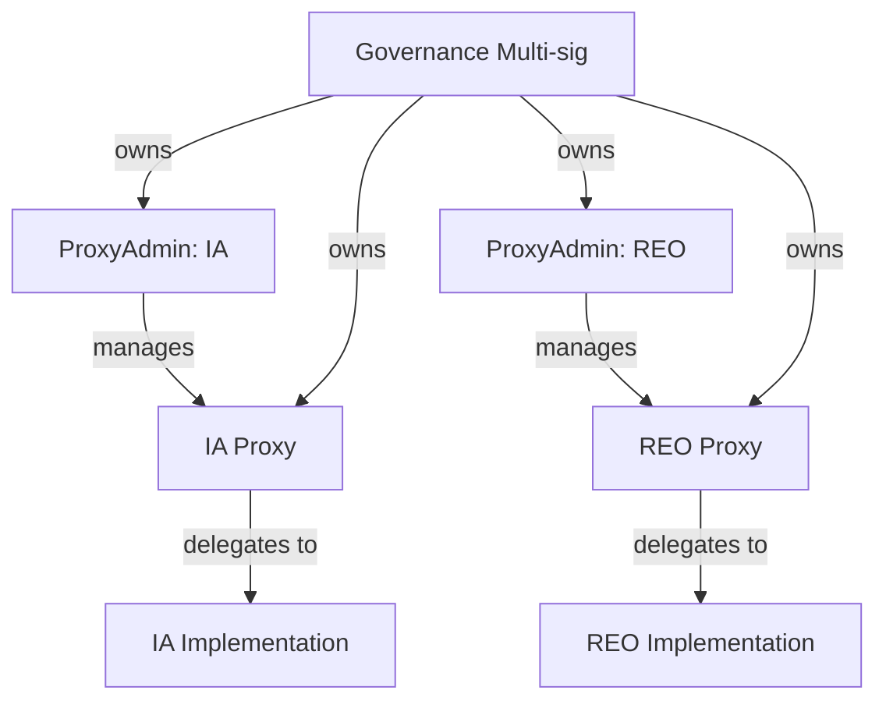

# Next Phase Recommendations: Production-Ready Issuance Deployment

**Date:** 2025-11-19
**Purpose:** Detailed plan for integrating valuable patterns from earlier deployment work into current Ignition spike

---

## Overview

Based on gap analysis and conflict resolution, this document provides a detailed, actionable plan for making the current Ignition spike production-ready. The focus is on **governance coordination, risk mitigation, and operational safety** while preserving the excellent technical implementation already achieved.

---

## Phase 1: Documentation Integration & Critical Planning

**Goal:** Extract and adapt essential documentation from earlier work without code changes
**Timeline:** Complete before any testnet deployment
**Risk:** Low (documentation only)

### 1.1: Extract Deployment Sequencing

**Source:** `analysis/DeploymentGuide.md` Phase 1-4

**Action:** Create new document `packages/issuance/deploy/docs/DeploymentSequence.md`

**Content to extract and adapt:**

1. **Dependency Graph** - Update for current contracts:
   ```
   RewardsManager V6 upgrade
       ↓
   IssuanceAllocator ──→ RewardsEligibilityOracle (parallel)
       ↓                      ↓
   Integration (governance) ←─┘
       ↓
   Minting Authority (governance)
   ```

2. **Deployment Phases:**
   - **Phase 1:** RewardsManager Upgrade
     - Prerequisite: Deploy new RM implementation with `setIssuanceAllocator()` and `setRewardsEligibilityOracle()` methods
     - Governance: Upgrade RM proxy to new implementation
     - Verification: New methods exist and callable

   - **Phase 2:** Issuance Contracts Deployment
     - Deploy: IssuanceAllocator, RewardsEligibilityOracle, DirectAllocation (if needed)
     - Configure: Set parameters, roles
     - Verification: Contracts deployed, initialized, owned by governance
     - **State:** Deployed but not integrated (zero production impact)

   - **Phase 3:** Integration (Governance)
     - Integrate REO with RewardsManager
     - Integrate IA with RewardsManager
     - **State:** Integrated but IA not minting yet

   - **Phase 4:** Minting Authority (Governance)
     - Grant IA minting authority on GraphToken
     - **State:** Fully live

3. **Sequencing Constraints:**
   - RewardsManager MUST be upgraded before issuance deployment (provides integration methods)
   - Issuance contracts can be deployed independently (no production impact)
   - Integration MUST happen before minting authority
   - Each phase requires governance verification before proceeding

**Adaptation needed:**
- Remove ServiceQualityOracle references → RewardsEligibilityOracle
- Remove GraphProxyAdmin2 (using standard pattern)
- Update for current contract architecture
- Simplify 8-stage rollout to align with current approach

**Output:** New file documenting phase-by-phase deployment sequence

**Acceptance criteria:**
- Clear phase definitions
- Explicit dependencies documented
- Success criteria for each phase
- Verification steps for each phase

---

### 1.2: Document Gradual Migration Strategy

**Source:** `analysis/DeploymentGuide.md` Stage 4.1-4.3

**Action:** Create section in `DeploymentSequence.md` or separate `MigrationStrategy.md`

**Content to extract and adapt:**

**CRITICAL: 3-Stage IssuanceAllocator Migration**

**Stage 1 - Deploy with Zero Impact:**
- Deploy IssuanceAllocator configured to exactly replicate existing RewardsManager behavior
- Configuration: 100% allocation to RewardsManager, 0% to other targets
- Verification:
  - IA deployed and initialized
  - IA configured: `getTargetAllocation(rewardsManager)` returns 100%
  - IA NOT integrated (RM does not use IA yet)
  - No production impact whatsoever
- **State:** Deployed but inactive

**Stage 2 - Activate with No Distribution Change:**
- Governance integrates IA with RewardsManager: `rewardsManager.setIssuanceAllocator(ia)`
- Grant IA minting authority: `graphToken.addMinter(ia)`
- Verification:
  - RM.issuanceAllocator() == IA address
  - IA can mint tokens
  - Distribution still 100% to RM (no change to existing rewards)
  - Monitor: Rewards continue flowing to indexers exactly as before
- **State:** Live but replicating existing distribution

**Stage 3 - Gradual Allocation Adjustments:**
- Deploy DirectAllocation target contracts as needed
- Governance adjusts allocations gradually:
  - Example: 99% RM / 1% DirectAllocation (pilot)
  - Monitor for 1-2 weeks
  - Then: 95% RM / 5% DirectAllocation
  - Monitor for 1-2 weeks
  - Adjust based on monitoring and governance decisions
- Verification:
  - Each allocation change verified on-chain
  - Distribution amounts match expected percentages
  - No disruption to RM rewards
  - New targets receiving expected amounts
- **State:** New distribution model active

**Risk Mitigation:**
- Stage 1: Zero risk (not active)
- Stage 2: Validated integration before economic changes
- Stage 3: Gradual changes with monitoring, easy rollback
- Each stage independently verifiable
- Clear rollback: Governance can revert RM.issuanceAllocator() to zero address

**Adaptation needed:**
- Update contract names and methods
- Document verification commands for each stage
- Create governance TX builders for each stage transition

**Output:** Documented migration strategy with clear stages

**Acceptance criteria:**
- Three stages clearly defined
- Zero-impact deployment documented
- Replication strategy explicit (100% to RM)
- Gradual adjustment process documented
- Rollback procedures documented

---

### 1.3: Extract Governance Workflow

**Source:** `analysis/Design.md` "Three-Phase Governance Workflow"

**Action:** Create `packages/issuance/deploy/docs/GovernanceWorkflow.md`

**Content to extract and adapt:**

**Three-Phase Governance Pattern:**

**Phase 1 - Prepare (Permissionless):**
- Anyone can deploy new implementations or contracts
- Generate governance proposal data
- Document expected state transitions
- Create verification checklist
- **No production impact**
- Outputs:
  - Deployed contract addresses
  - Safe transaction JSON
  - Verification checklist
  - Expected state documentation

**Phase 2 - Execute (Governance):**
- Governance multi-sig reviews proposal
- Independent verification of contracts and proposal
- Execute Safe batch transaction
- State transitions occur on-chain
- **Production impact happens here**
- Outputs:
  - Transaction hash
  - On-chain state changed
  - Verification that governance executed correctly

**Phase 3 - Verify/Sync (Automated):**
- Run verification scripts
- Update address book
- Confirm expected state
- Document actual state vs expected
- **Validation of governance execution**
- Outputs:
  - Verification results (pass/fail)
  - Updated address book
  - State documentation

**Governance Transaction Patterns:**

Document each type of governance transaction:

1. **Proxy Upgrade:**
   ```typescript
   proxyAdmin.upgrade(proxyAddress, newImplementation)
   ```

2. **Integration:**
   ```typescript
   rewardsManager.setIssuanceAllocator(iaAddress)
   rewardsManager.setRewardsEligibilityOracle(reoAddress)
   ```

3. **Minting Authority:**
   ```typescript
   graphToken.addMinter(iaAddress)
   ```

4. **Allocation Changes:**
   ```typescript
   issuanceAllocator.setTargetAllocation(
     targetAddress,
     allocatorMintingPPM,
     selfMintingPPM,
     evenIfDistributionPending
   )
   ```

5. **Role Management:**
   ```typescript
   reo.grantRole(OPERATOR_ROLE, operatorAddress)
   reo.grantRole(ORACLE_ROLE, oracleAddress)
   ```

**Safe Batch Transaction Format:**

Document how to construct Safe batches for each scenario:
- JSON format
- Transaction ordering
- Value and data encoding
- Gas estimation

**Adaptation needed:**
- Update for current governance multi-sig address
- Update contract names and addresses
- Create example Safe JSON for each scenario
- Document verification for each transaction type

**Output:** Complete governance workflow documentation

**Acceptance criteria:**
- Three phases clearly defined
- Governance transaction patterns documented
- Safe batch format documented
- Example transactions provided
- Verification procedures for each transaction type

---

### 1.4: Create Comprehensive Checklists

**Source:** `analysis/DeploymentGuide.md` verification checklists throughout

**Action:** Create `packages/issuance/deploy/docs/Checklists.md`

**Content to extract and adapt:**

**Pre-Deployment Checklist:**
- [ ] Contract code reviewed and audited
- [ ] Unit tests passing
- [ ] Integration tests passing
- [ ] Parameter values validated
- [ ] Network configuration correct (RPC URLs, chain ID, etc.)
- [ ] Deployer account has sufficient funds
- [ ] Governor account identified and ready
- [ ] GraphToken address confirmed for network
- [ ] RewardsManager address confirmed for network
- [ ] Safe multi-sig address confirmed

**Deployment Checklist (per phase):**

**Phase 1: RewardsManager Upgrade:**
- [ ] New RM implementation deployed
- [ ] Implementation has `setIssuanceAllocator()` method
- [ ] Implementation has `setRewardsEligibilityOracle()` method
- [ ] Governance proposal created
- [ ] Governance executes upgrade
- [ ] Verification: New methods callable
- [ ] Verification: Existing RM functionality unchanged

**Phase 2: Issuance Contracts Deployment:**
- [ ] IssuanceAllocator implementation deployed
- [ ] IssuanceAllocator proxy deployed
- [ ] IA initialized with correct GraphToken address
- [ ] IA owned by governance
- [ ] RewardsEligibilityOracle implementation deployed
- [ ] REO proxy deployed
- [ ] REO initialized with correct parameters
- [ ] REO owned by governance
- [ ] DirectAllocation deployed (if needed for Stage 1)
- [ ] All contracts verified on block explorer
- [ ] Address book updated

**Phase 3: Integration (Stage 2 of Migration):**
- [ ] IA configured to replicate RM (100% allocation)
- [ ] Governance proposal created (integrate IA + REO)
- [ ] Independent verification of proposal
- [ ] Governance executes integration
- [ ] Verification: `RM.issuanceAllocator() == IA address`
- [ ] Verification: `RM.rewardsEligibilityOracle() == REO address`
- [ ] Verification: Distribution to RM unchanged
- [ ] Monitoring: Rewards flowing correctly

**Phase 4: Minting Authority:**
- [ ] Governance proposal created (grant minting)
- [ ] Independent verification of proposal
- [ ] Governance executes minting grant
- [ ] Verification: `GraphToken.isMinter(IA) == true`
- [ ] Verification: IA can mint tokens
- [ ] Monitoring: Issuance amounts correct

**Post-Deployment Checklist:**
- [ ] All contracts verified on block explorer
- [ ] Address book updated and committed
- [ ] Documentation updated
- [ ] Monitoring set up
- [ ] Team notified of successful deployment
- [ ] Post-deployment monitoring period begun

**Verification Checklist (per contract):**

**IssuanceAllocator:**
- [ ] Contract deployed at expected address
- [ ] Proxy points to correct implementation
- [ ] ProxyAdmin owned by governance
- [ ] Contract initialized (cannot reinitialize)
- [ ] Owner is governance multi-sig
- [ ] GraphToken address is correct
- [ ] Initial issuancePerBlock is expected value
- [ ] Target allocations are correct
- [ ] Can call all public view functions
- [ ] Events emitted correctly

**RewardsEligibilityOracle:**
- [ ] Contract deployed at expected address
- [ ] Proxy points to correct implementation
- [ ] ProxyAdmin owned by governance
- [ ] Contract initialized (cannot reinitialize)
- [ ] Owner is governance multi-sig
- [ ] RewardsManager address is correct
- [ ] Eligibility period is correct
- [ ] Oracle update timeout is correct
- [ ] Validation enabled/disabled as expected
- [ ] Roles configured correctly (OPERATOR, ORACLE)
- [ ] Can call all public view functions

**Monitoring Checklist:**

**Ongoing Monitoring (first 24 hours):**
- [ ] Monitor IA issuance amounts (hourly)
- [ ] Monitor distribution to targets (hourly)
- [ ] Monitor RM rewards (hourly) - should be unchanged in Stage 2
- [ ] Monitor for unexpected events
- [ ] Monitor for reverts or errors
- [ ] Check block explorer for all transactions

**Ongoing Monitoring (first week):**
- [ ] Daily check of issuance amounts
- [ ] Daily check of distribution percentages
- [ ] Daily check for governance proposals
- [ ] Weekly review with team

**Ongoing Monitoring (first month):**
- [ ] Weekly issuance review
- [ ] Weekly distribution review
- [ ] Monitor for needed adjustments
- [ ] Prepare for Stage 3 allocation changes (if applicable)

**Adaptation needed:**
- Update contract names
- Update parameter names
- Add current network addresses
- Customize monitoring requirements

**Output:** Comprehensive checklists for all phases

**Acceptance criteria:**
- Checklists for each deployment phase
- Verification checklists for each contract
- Monitoring checklists with timeframes
- Actionable checkbox format

---

### 1.5: Create Mermaid Diagrams

**Source:** `analysis/Design.md` diagrams

**Action:** Create diagrams in `packages/issuance/deploy/docs/Architecture.md`

**Diagrams to create:**

1. **Contract Architecture:**


2. **Deployment Sequence:**


3. **Governance Workflow:**


4. **Gradual Migration Flow:**


5. **Proxy Administration:**


**Adaptation needed:**
- Update contract names for current implementation
- Remove GraphProxyAdmin2 references
- Add current deployment modules

**Output:** Visual architecture documentation

**Acceptance criteria:**
- Clear visual representation of architecture
- Deployment sequence diagram
- Governance workflow diagram
- Migration flow diagram
- Proxy administration diagram

---

### 1.6: Document API Correctness

**Source:** `analysis/README.md` API correctness section

**Action:** Add section to `packages/issuance/deploy/docs/Integration.md`

**Content to extract and adapt:**

**Critical API Reference - Prevent Implementation Errors**

**IssuanceAllocator:**

```solidity
// CORRECT: Set target allocation
function setTargetAllocation(
    address target,
    uint256 allocatorMintingPPM,  // Percentage in PPM (1,000,000 = 100%)
    uint256 selfMintingPPM,        // Percentage in PPM
    bool evenIfDistributionPending
) external;

// Example: 100% to RewardsManager
issuanceAllocator.setTargetAllocation(
    rewardsManager,
    1_000_000,  // 100% allocator minting
    0,           // 0% self minting
    false        // Don't set if distribution pending
);

// Example: 95% RM, 5% DirectAllocation
issuanceAllocator.setTargetAllocation(rewardsManager, 950_000, 0, false);
issuanceAllocator.setTargetAllocation(directAllocation, 50_000, 0, false);
```

```solidity
// CORRECT: Get target issuance
function getTargetIssuancePerBlock(address target)
    external view returns (TargetIssuance memory);

struct TargetIssuance {
    uint256 selfIssuancePerBlock;     // Use this for RewardsManager integration
    uint256 allocatorIssuancePerBlock;
}

// Example: Reading for RewardsManager integration
TargetIssuance memory ti = ia.getTargetIssuancePerBlock(rewardsManager);
uint256 rmIssuance = ti.selfIssuancePerBlock;  // CORRECT field name
```

**RewardsEligibilityOracle:**

```solidity
// CORRECT: Enable/disable quality checking
function setEligibilityValidationEnabled(bool enabled) external;

// NOT: setCheckingActive (common mistake)
// NOT: setQualityChecking

// Example: Enable validation
reo.setEligibilityValidationEnabled(true);
```

```solidity
// CORRECT: Update oracle data
function updateOracleData(
    address[] calldata indexers,
    bool[] calldata eligible,
    uint256 eligibilityPeriodEnd
) external onlyRole(ORACLE_ROLE);

// Example: Mark indexers as eligible
address[] memory indexers = new address[](2);
indexers[0] = indexer1;
indexers[1] = indexer2;

bool[] memory eligible = new bool[](2);
eligible[0] = true;
eligible[1] = false;

uint256 periodEnd = block.timestamp + 14 days;

reo.updateOracleData(indexers, eligible, periodEnd);
```

**RewardsManager Integration:**

```solidity
// CORRECT: Set IssuanceAllocator on RewardsManager
function setIssuanceAllocator(address allocator) external onlyGovernor;

// Example:
rewardsManager.setIssuanceAllocator(issuanceAllocatorAddress);
```

```solidity
// CORRECT: Set RewardsEligibilityOracle on RewardsManager
function setRewardsEligibilityOracle(address oracle) external onlyGovernor;

// Example:
rewardsManager.setRewardsEligibilityOracle(reoAddress);
```

**GraphToken:**

```solidity
// CORRECT: Grant minting authority
function addMinter(address minter) external onlyGovernor;

// Example:
graphToken.addMinter(issuanceAllocatorAddress);
```

**Common Mistakes to Avoid:**

1. **Wrong allocation percentages:**
   - ❌ Using 100 for 100% (should be 1,000,000)
   - ❌ Using decimals (should be integers)
   - ✅ 1,000,000 = 100%, 500,000 = 50%, 10,000 = 1%

2. **Wrong struct field:**
   - ❌ `getTargetIssuancePerBlock().issuancePerBlock`
   - ✅ `getTargetIssuancePerBlock().selfIssuancePerBlock`

3. **Wrong method name:**
   - ❌ `setCheckingActive()`
   - ✅ `setEligibilityValidationEnabled()`

4. **Forgetting to grant roles:**
   - ❌ Calling `updateOracleData()` without ORACLE_ROLE
   - ✅ Grant role first: `reo.grantRole(ORACLE_ROLE, oracle)`

**Adaptation needed:**
- Verify all method signatures match current contracts
- Add code examples for current implementation
- Document all integration points

**Output:** API reference preventing common errors

**Acceptance criteria:**
- All integration methods documented
- Correct method signatures
- Common mistakes identified
- Code examples provided

---

## Phase 2: Critical Implementation

**Goal:** Implement essential governance coordination and verification patterns
**Timeline:** Before testnet deployment
**Risk:** Medium (new code, but well-defined patterns)

### 2.1: Implement GovernanceAssertions Helper Contract

**Purpose:** Programmatic verification that governance has executed correctly

**Action:** Create `packages/issuance/contracts/governance/IssuanceGovernanceAssertions.sol`

**Implementation:**

```solidity
// SPDX-License-Identifier: GPL-3.0-or-later
pragma solidity ^0.8.24;

import { IRewardsManager } from "@graphprotocol/horizon/contracts/interfaces/IRewardsManager.sol";
import { IGraphToken } from "@graphprotocol/contracts/contracts/token/IGraphToken.sol";
import { IIssuanceAllocator } from "../interfaces/IIssuanceAllocator.sol";

/**
 * @title IssuanceGovernanceAssertions
 * @notice Stateless helper contract for verifying governance execution
 * @dev All functions revert with descriptive messages until expected state is reached
 *      This enables:
 *      - Programmatic verification in scripts
 *      - Idempotent Ignition targets that wait for governance
 *      - Clear error messages showing what's missing
 */
contract IssuanceGovernanceAssertions {
    /**
     * @notice Assert that RewardsManager has IssuanceAllocator set
     * @param rewardsManager The RewardsManager contract
     * @param expectedAllocator The expected IssuanceAllocator address
     */
    function assertIssuanceAllocatorSet(
        IRewardsManager rewardsManager,
        address expectedAllocator
    ) external view {
        address actual = rewardsManager.issuanceAllocator();
        require(
            actual == expectedAllocator,
            string(abi.encodePacked(
                "IssuanceAllocator not set. Expected: ",
                toAsciiString(expectedAllocator),
                ", Actual: ",
                toAsciiString(actual)
            ))
        );
    }

    /**
     * @notice Assert that RewardsManager has RewardsEligibilityOracle set
     * @param rewardsManager The RewardsManager contract
     * @param expectedOracle The expected oracle address
     */
    function assertRewardsEligibilityOracleSet(
        IRewardsManager rewardsManager,
        address expectedOracle
    ) external view {
        address actual = rewardsManager.rewardsEligibilityOracle();
        require(
            actual == expectedOracle,
            string(abi.encodePacked(
                "RewardsEligibilityOracle not set. Expected: ",
                toAsciiString(expectedOracle),
                ", Actual: ",
                toAsciiString(actual)
            ))
        );
    }

    /**
     * @notice Assert that IssuanceAllocator has minting authority on GraphToken
     * @param graphToken The GraphToken contract
     * @param allocator The IssuanceAllocator address
     */
    function assertMinter(
        IGraphToken graphToken,
        address allocator
    ) external view {
        require(
            graphToken.isMinter(allocator),
            string(abi.encodePacked(
                "IssuanceAllocator is not a minter. Address: ",
                toAsciiString(allocator)
            ))
        );
    }

    /**
     * @notice Assert that IssuanceAllocator replicates existing RewardsManager distribution
     * @param allocator The IssuanceAllocator contract
     * @param rewardsManager The RewardsManager address
     * @dev This verifies Stage 2 of migration: 100% allocation to RM
     */
    function assertReplicationAllocation(
        IIssuanceAllocator allocator,
        address rewardsManager
    ) external view {
        (uint256 allocatorPPM, uint256 selfPPM) = allocator.getTargetAllocation(rewardsManager);

        require(
            allocatorPPM == 1_000_000,
            string(abi.encodePacked(
                "RewardsManager allocation is not 100%. Allocator PPM: ",
                uintToString(allocatorPPM)
            ))
        );

        require(
            selfPPM == 0,
            string(abi.encodePacked(
                "RewardsManager self-minting is not 0%. Self PPM: ",
                uintToString(selfPPM)
            ))
        );
    }

    /**
     * @notice Assert complete integration (Stage 2 complete)
     * @dev Combines all checks for "Stage 2 complete" state
     */
    function assertStage2Complete(
        IRewardsManager rewardsManager,
        IGraphToken graphToken,
        IIssuanceAllocator allocator,
        address reoAddress
    ) external view {
        // Check RM integration
        this.assertIssuanceAllocatorSet(rewardsManager, address(allocator));
        this.assertRewardsEligibilityOracleSet(rewardsManager, reoAddress);

        // Check minting authority
        this.assertMinter(graphToken, address(allocator));

        // Check replication (100% to RM)
        this.assertReplicationAllocation(allocator, address(rewardsManager));
    }

    // Helper functions for error messages
    function toAsciiString(address x) internal pure returns (string memory) {
        bytes memory s = new bytes(42);
        s[0] = "0";
        s[1] = "x";
        for (uint256 i = 0; i < 20; i++) {
            bytes1 b = bytes1(uint8(uint256(uint160(x)) / (2 ** (8 * (19 - i)))));
            bytes1 hi = bytes1(uint8(b) / 16);
            bytes1 lo = bytes1(uint8(b) - 16 * uint8(hi));
            s[2 * i + 2] = char(hi);
            s[2 * i + 3] = char(lo);
        }
        return string(s);
    }

    function char(bytes1 b) internal pure returns (bytes1 c) {
        if (uint8(b) < 10) return bytes1(uint8(b) + 0x30);
        else return bytes1(uint8(b) + 0x57);
    }

    function uintToString(uint256 v) internal pure returns (string memory) {
        if (v == 0) return "0";
        uint256 digits;
        uint256 temp = v;
        while (temp != 0) {
            digits++;
            temp /= 10;
        }
        bytes memory buffer = new bytes(digits);
        while (v != 0) {
            digits -= 1;
            buffer[digits] = bytes1(uint8(48 + uint256(v % 10)));
            v /= 10;
        }
        return string(buffer);
    }
}
```

**Test:** Create `packages/issuance/test/governance/GovernanceAssertions.t.sol`

```solidity
// SPDX-License-Identifier: MIT
pragma solidity ^0.8.24;

import "forge-std/Test.sol";
import "../../contracts/governance/IssuanceGovernanceAssertions.sol";
// ... import mocks

contract GovernanceAssertionsTest is Test {
    IssuanceGovernanceAssertions assertions;

    function setUp() public {
        assertions = new IssuanceGovernanceAssertions();
    }

    function test_AssertIssuanceAllocatorSet_RevertsWhenNotSet() public {
        // Test that assertion reverts with clear message when not set
    }

    function test_AssertIssuanceAllocatorSet_SucceedsWhenSet() public {
        // Test that assertion succeeds when correctly set
    }

    // ... tests for all assertion functions
}
```

**Usage in verification script:**

```typescript
// packages/issuance/scripts/verify-stage2.ts
import { ethers } from "hardhat";

async function main() {
    const assertions = await ethers.getContractAt(
        "IssuanceGovernanceAssertions",
        ASSERTIONS_ADDRESS
    );

    const rm = await ethers.getContractAt("IRewardsManager", RM_ADDRESS);
    const gt = await ethers.getContractAt("IGraphToken", GT_ADDRESS);
    const ia = await ethers.getContractAt("IIssuanceAllocator", IA_ADDRESS);

    try {
        await assertions.assertStage2Complete(rm.address, gt.address, ia.address, REO_ADDRESS);
        console.log("✅ Stage 2 verification PASSED");
        process.exit(0);
    } catch (error) {
        console.error("❌ Stage 2 verification FAILED:", error.message);
        process.exit(1);
    }
}
```

**Acceptance criteria:**
- Contract compiles
- All assertion functions implemented
- Tests pass
- Can be used in verification scripts
- Clear error messages when assertions fail

---

### 2.2: Enhance Address Book with Pending Implementation Tracking

**Purpose:** Track deployment vs activation state for governance coordination

**Action:** Update `packages/issuance/scripts/sync-addresses.ts`

**Enhanced Address Book Format:**

```typescript
// packages/issuance/addresses.json
{
  "42161": {
    "IssuanceAllocator": {
      "address": "0x1111...",
      "proxy": "transparent",
      "proxyAdmin": "0x2222...",
      "implementation": "0x3333...",
      // Optional: Only present during upgrade workflow
      "pendingImplementation": {
        "address": "0x4444...",
        "deployedAt": "2024-11-15T10:30:00Z",
        "deployedBy": "0x5555...",
        "deploymentId": "chain-42161-1234567890",
        "readyForUpgrade": true,
        "notes": "Adds new feature XYZ"
      }
    }
  }
}
```

**Update sync-addresses.ts:**

```typescript
import fs from 'fs';
import path from 'path';

interface PendingImplementation {
  address: string;
  deployedAt: string;
  deployedBy: string;
  deploymentId: string;
  readyForUpgrade: boolean;
  notes?: string;
}

interface ContractEntry {
  address: string;
  proxy?: string;
  proxyAdmin?: string;
  implementation?: string;
  pendingImplementation?: PendingImplementation;
}

async function syncAddresses(deploymentId: string, chainId: string, mode: 'active' | 'pending' = 'active') {
  // Load Ignition deployment artifacts
  const deployedAddressesPath = path.join(
    __dirname,
    '../ignition/deployments',
    deploymentId,
    'deployed_addresses.json'
  );
  const deployedAddresses = JSON.parse(fs.readFileSync(deployedAddressesPath, 'utf8'));

  // Load current address book
  const addressBookPath = path.join(__dirname, '../addresses.json');
  const addressBook = JSON.parse(fs.readFileSync(addressBookPath, 'utf8'));

  if (!addressBook[chainId]) {
    addressBook[chainId] = {};
  }

  // Process each deployed contract
  for (const [contractName, address] of Object.entries(deployedAddresses)) {
    // ... existing logic ...

    if (mode === 'pending') {
      // Record as pending implementation
      if (!addressBook[chainId][contractName]) {
        throw new Error(`Cannot add pending implementation for ${contractName}: contract not in address book`);
      }

      addressBook[chainId][contractName].pendingImplementation = {
        address: implementationAddress,
        deployedAt: new Date().toISOString(),
        deployedBy: deployerAddress,
        deploymentId,
        readyForUpgrade: false, // Governance must set to true
        notes: process.env.PENDING_NOTES || ''
      };
    } else {
      // Record as active (default behavior)
      addressBook[chainId][contractName] = {
        address: proxyAddress,
        proxy: 'transparent',
        proxyAdmin: proxyAdminAddress,
        implementation: implementationAddress
      };
    }
  }

  // Write updated address book
  fs.writeFileSync(addressBookPath, JSON.stringify(addressBook, null, 2));

  console.log(`✅ Address book updated (mode: ${mode})`);
}

// CLI
const [deploymentId, chainId, mode] = process.argv.slice(2);
syncAddresses(deploymentId, chainId, (mode as 'active' | 'pending') || 'active');
```

**Usage:**

```bash
# Initial deployment (active)
npx ts-node scripts/sync-addresses.ts chain-42161-1234567890 42161

# Upgrade deployment (pending)
npx ts-node scripts/sync-addresses.ts chain-42161-9999999999 42161 pending

# After governance executes upgrade: activate pending
npx ts-node scripts/activate-pending.ts 42161 IssuanceAllocator
```

**Create activate-pending.ts:**

```typescript
async function activatePending(chainId: string, contractName: string) {
  const addressBookPath = path.join(__dirname, '../addresses.json');
  const addressBook = JSON.parse(fs.readFileSync(addressBookPath, 'utf8'));

  const contract = addressBook[chainId][contractName];
  if (!contract.pendingImplementation) {
    throw new Error(`No pending implementation for ${contractName}`);
  }

  // Move pending to active
  contract.implementation = contract.pendingImplementation.address;
  delete contract.pendingImplementation;

  fs.writeFileSync(addressBookPath, JSON.stringify(addressBook, null, 2));
  console.log(`✅ Activated pending implementation for ${contractName}`);
}
```

**Acceptance criteria:**
- sync-addresses.ts supports both active and pending modes
- activate-pending.ts moves pending → active
- Address book format documented
- Scripts handle errors gracefully

---

### 2.3: Create Verification Scripts

**Purpose:** Automated on-chain state validation

**Action:** Create `packages/issuance/scripts/verify/`

**verify-deployment.ts:**

```typescript
/**
 * Verify deployment state for a specific phase
 * Usage: npx ts-node scripts/verify/verify-deployment.ts <network> <phase>
 * Phases: phase1-rm-upgrade | phase2-deployment | phase3-integration | phase4-minting
 */

import { ethers } from "hardhat";
import { connectGraphIssuance } from "@graphprotocol/toolshed";
import addresses from "../../addresses.json";

async function verifyPhase1(chainId: number, provider: any) {
  console.log("\n🔍 Verifying Phase 1: RewardsManager Upgrade\n");

  const rmAddress = addresses[chainId].RewardsManager?.address;
  if (!rmAddress) throw new Error("RewardsManager address not found");

  const rm = await ethers.getContractAt("IRewardsManager", rmAddress);

  // Check that new methods exist
  try {
    await rm.issuanceAllocator();
    console.log("✅ RewardsManager.issuanceAllocator() method exists");
  } catch (e) {
    console.error("❌ RewardsManager.issuanceAllocator() method missing");
    return false;
  }

  try {
    await rm.rewardsEligibilityOracle();
    console.log("✅ RewardsManager.rewardsEligibilityOracle() method exists");
  } catch (e) {
    console.error("❌ RewardsManager.rewardsEligibilityOracle() method missing");
    return false;
  }

  console.log("\n✅ Phase 1 verification PASSED\n");
  return true;
}

async function verifyPhase2(chainId: number, provider: any) {
  console.log("\n🔍 Verifying Phase 2: Issuance Contracts Deployment\n");

  const contracts = connectGraphIssuance(chainId, provider);

  // Verify IssuanceAllocator
  console.log("Checking IssuanceAllocator...");
  const iaAddress = await contracts.IssuanceAllocator.getAddress();
  console.log(`  Address: ${iaAddress}`);

  const iaOwner = await contracts.IssuanceAllocator.owner();
  console.log(`  Owner: ${iaOwner}`);
  const expectedOwner = addresses[chainId].Governance?.address;
  if (iaOwner.toLowerCase() !== expectedOwner?.toLowerCase()) {
    console.error(`  ❌ Owner should be ${expectedOwner}`);
    return false;
  }
  console.log("  ✅ Owner is governance");

  const graphToken = await contracts.IssuanceAllocator.graphToken();
  console.log(`  GraphToken: ${graphToken}`);
  const expectedGT = addresses[chainId].GraphToken?.address;
  if (graphToken.toLowerCase() !== expectedGT?.toLowerCase()) {
    console.error(`  ❌ GraphToken should be ${expectedGT}`);
    return false;
  }
  console.log("  ✅ GraphToken correct");

  // Verify RewardsEligibilityOracle
  console.log("\nChecking RewardsEligibilityOracle...");
  const reoAddress = await contracts.RewardsEligibilityOracle.getAddress();
  console.log(`  Address: ${reoAddress}`);

  const reoOwner = await contracts.RewardsEligibilityOracle.owner();
  console.log(`  Owner: ${reoOwner}`);
  if (reoOwner.toLowerCase() !== expectedOwner?.toLowerCase()) {
    console.error(`  ❌ Owner should be ${expectedOwner}`);
    return false;
  }
  console.log("  ✅ Owner is governance");

  // Check not integrated yet
  const rmAddress = addresses[chainId].RewardsManager?.address;
  const rm = await ethers.getContractAt("IRewardsManager", rmAddress);

  const rmIA = await rm.issuanceAllocator();
  if (rmIA !== ethers.ZeroAddress) {
    console.warn("  ⚠️  IssuanceAllocator already set on RewardsManager (should be zero in Phase 2)");
  } else {
    console.log("  ✅ IssuanceAllocator not yet integrated (expected in Phase 2)");
  }

  console.log("\n✅ Phase 2 verification PASSED\n");
  return true;
}

async function verifyPhase3(chainId: number, provider: any) {
  console.log("\n🔍 Verifying Phase 3: Integration (Stage 2 of Migration)\n");

  const contracts = connectGraphIssuance(chainId, provider);
  const rmAddress = addresses[chainId].RewardsManager?.address;
  const rm = await ethers.getContractAt("IRewardsManager", rmAddress);
  const gt = await ethers.getContractAt("IGraphToken", addresses[chainId].GraphToken.address);

  // Use GovernanceAssertions helper
  const assertions = await ethers.getContractAt(
    "IssuanceGovernanceAssertions",
    addresses[chainId].IssuanceGovernanceAssertions.address
  );

  try {
    // This will revert with descriptive message if not correctly set
    await assertions.assertStage2Complete.staticCall(
      rmAddress,
      gt.address,
      contracts.IssuanceAllocator.address,
      contracts.RewardsEligibilityOracle.address
    );

    console.log("✅ RewardsManager integration verified");
    console.log("✅ Minting authority verified");
    console.log("✅ 100% allocation to RewardsManager verified");
    console.log("\n✅ Phase 3 verification PASSED\n");
    return true;
  } catch (error: any) {
    console.error("❌ Phase 3 verification FAILED:");
    console.error(error.message);
    return false;
  }
}

async function verifyPhase4(chainId: number, provider: any) {
  console.log("\n🔍 Verifying Phase 4: Minting Authority\n");

  const contracts = connectGraphIssuance(chainId, provider);
  const gt = await ethers.getContractAt("IGraphToken", addresses[chainId].GraphToken.address);

  const isMinter = await gt.isMinter(contracts.IssuanceAllocator.address);
  if (!isMinter) {
    console.error("❌ IssuanceAllocator is not a minter");
    return false;
  }
  console.log("✅ IssuanceAllocator has minting authority");

  console.log("\n✅ Phase 4 verification PASSED\n");
  return true;
}

async function main() {
  const [network, phase] = process.argv.slice(2);

  if (!network || !phase) {
    console.error("Usage: npx ts-node scripts/verify/verify-deployment.ts <network> <phase>");
    console.error("Phases: phase1-rm-upgrade | phase2-deployment | phase3-integration | phase4-minting");
    process.exit(1);
  }

  const provider = ethers.provider;
  const { chainId } = await provider.getNetwork();

  let result: boolean;
  switch (phase) {
    case 'phase1-rm-upgrade':
      result = await verifyPhase1(Number(chainId), provider);
      break;
    case 'phase2-deployment':
      result = await verifyPhase2(Number(chainId), provider);
      break;
    case 'phase3-integration':
      result = await verifyPhase3(Number(chainId), provider);
      break;
    case 'phase4-minting':
      result = await verifyPhase4(Number(chainId), provider);
      break;
    default:
      console.error(`Unknown phase: ${phase}`);
      process.exit(1);
  }

  process.exit(result ? 0 : 1);
}

main().catch((error) => {
  console.error(error);
  process.exit(1);
});
```

**Acceptance criteria:**
- Verification script for each deployment phase
- Uses GovernanceAssertions helper
- Clear pass/fail output
- Exit code 0 on success, 1 on failure (CI/CD compatible)
- Descriptive error messages

---

### 2.4: Expand Governance Transaction Builder

**Purpose:** Safe batch transactions for all governance scenarios

**Action:** Expand `packages/issuance/deploy/governance/tx-builder.ts`

**Current:** Only handles RewardsManager integration

**Add scenarios:**

1. **Phase 1: RewardsManager Upgrade**
2. **Phase 3: Integration (Stage 2)**
3. **Phase 4: Minting Authority**
4. **Stage 3: Allocation Adjustments**
5. **Proxy Upgrades**
6. **Role Management**

**Enhanced tx-builder.ts:**

```typescript
import { buildSafeTx, SafeTransaction } from './safe-utils';

export type GovernanceScenario =
  | 'phase1-rm-upgrade'
  | 'phase3-integration'
  | 'phase4-minting'
  | 'stage3-allocation'
  | 'proxy-upgrade'
  | 'role-management';

export async function buildGovernanceTx(
  scenario: GovernanceScenario,
  params: any
): Promise<SafeTransaction[]> {
  switch (scenario) {
    case 'phase1-rm-upgrade':
      return buildPhase1RewardsManagerUpgrade(params);
    case 'phase3-integration':
      return buildPhase3Integration(params);
    case 'phase4-minting':
      return buildPhase4Minting(params);
    case 'stage3-allocation':
      return buildStage3Allocation(params);
    case 'proxy-upgrade':
      return buildProxyUpgrade(params);
    case 'role-management':
      return buildRoleManagement(params);
    default:
      throw new Error(`Unknown scenario: ${scenario}`);
  }
}

async function buildPhase1RewardsManagerUpgrade(params: {
  proxyAdmin: string;
  rewardsManagerProxy: string;
  newImplementation: string;
}) {
  const proxyAdmin = await ethers.getContractAt('IProxyAdmin', params.proxyAdmin);

  return [
    await buildSafeTx({
      to: params.proxyAdmin,
      data: proxyAdmin.interface.encodeFunctionData('upgrade', [
        params.rewardsManagerProxy,
        params.newImplementation
      ]),
      value: '0',
      operation: 0,
      description: 'Upgrade RewardsManager to add issuance integration methods'
    })
  ];
}

async function buildPhase3Integration(params: {
  rewardsManager: string;
  issuanceAllocator: string;
  rewardsEligibilityOracle: string;
}) {
  const rm = await ethers.getContractAt('IRewardsManager', params.rewardsManager);

  return [
    await buildSafeTx({
      to: params.rewardsManager,
      data: rm.interface.encodeFunctionData('setIssuanceAllocator', [params.issuanceAllocator]),
      value: '0',
      operation: 0,
      description: 'Set IssuanceAllocator on RewardsManager'
    }),
    await buildSafeTx({
      to: params.rewardsManager,
      data: rm.interface.encodeFunctionData('setRewardsEligibilityOracle', [params.rewardsEligibilityOracle]),
      value: '0',
      operation: 0,
      description: 'Set RewardsEligibilityOracle on RewardsManager'
    })
  ];
}

async function buildPhase4Minting(params: {
  graphToken: string;
  issuanceAllocator: string;
}) {
  const gt = await ethers.getContractAt('IGraphToken', params.graphToken);

  return [
    await buildSafeTx({
      to: params.graphToken,
      data: gt.interface.encodeFunctionData('addMinter', [params.issuanceAllocator]),
      value: '0',
      operation: 0,
      description: 'Grant minting authority to IssuanceAllocator'
    })
  ];
}

async function buildStage3Allocation(params: {
  issuanceAllocator: string;
  allocations: Array<{
    target: string;
    allocatorPPM: number;
    selfPPM: number;
    evenIfPending: boolean;
  }>;
}) {
  const ia = await ethers.getContractAt('IIssuanceAllocator', params.issuanceAllocator);

  return params.allocations.map(async (alloc) =>
    buildSafeTx({
      to: params.issuanceAllocator,
      data: ia.interface.encodeFunctionData('setTargetAllocation', [
        alloc.target,
        alloc.allocatorPPM,
        alloc.selfPPM,
        alloc.evenIfPending
      ]),
      value: '0',
      operation: 0,
      description: `Set allocation: ${alloc.allocatorPPM / 10000}% to ${alloc.target}`
    })
  );
}

// ... other scenario builders
```

**Create Hardhat tasks:**

```typescript
// deploy/tasks/governance-tx.ts
task("issuance:build-governance-tx", "Build Safe batch transaction for governance scenario")
  .addParam("scenario", "Governance scenario")
  .addParam("params", "JSON file with parameters")
  .addParam("output", "Output file for Safe JSON", "./governance-tx.json")
  .setAction(async (args, hre) => {
    const params = JSON.parse(fs.readFileSync(args.params, 'utf8'));
    const txs = await buildGovernanceTx(args.scenario, params);

    const safeBatch = {
      version: "1.0",
      chainId: (await hre.ethers.provider.getNetwork()).chainId.toString(),
      transactions: txs
    };

    fs.writeFileSync(args.output, JSON.stringify(safeBatch, null, 2));
    console.log(`✅ Governance transaction written to ${args.output}`);
  });
```

**Acceptance criteria:**
- TX builder for all governance scenarios
- Hardhat task for each scenario
- Safe JSON output format
- Example parameter files for each scenario
- Documentation of usage

---

### 2.5: Add Deployment Tests

**Purpose:** Verify deployment flow works correctly

**Action:** Create tests in `packages/issuance/test/deployment/`

**Test categories:**

1. **Local network deployment test**
2. **Governance workflow simulation**
3. **Migration stages test**
4. **Verification script tests**

**Example: test-deployment.ts**

```typescript
import { expect } from "chai";
import { ethers, ignition } from "hardhat";
import IssuanceDeployModule from "../../deploy/ignition/modules/deploy";

describe("Issuance Deployment", function () {
  it("Should deploy all contracts successfully", async function () {
    const { issuanceAllocator, rewardsEligibilityOracle, directAllocation } =
      await ignition.deploy(IssuanceDeployModule);

    expect(await issuanceAllocator.getAddress()).to.be.properAddress;
    expect(await rewardsEligibilityOracle.getAddress()).to.be.properAddress;
    expect(await directAllocation.getAddress()).to.be.properAddress;
  });

  it("Should initialize contracts correctly", async function () {
    const { issuanceAllocator, rewardsEligibilityOracle } =
      await ignition.deploy(IssuanceDeployModule);

    const graphToken = await issuanceAllocator.graphToken();
    expect(graphToken).to.be.properAddress;

    const rewardsManager = await rewardsEligibilityOracle.rewardsManager();
    expect(rewardsManager).to.be.properAddress;
  });

  it("Should transfer ownership to governor", async function () {
    const [deployer, governor] = await ethers.getSigners();

    // Deploy with governor as second account
    const { issuanceAllocator } = await ignition.deploy(IssuanceDeployModule);

    const owner = await issuanceAllocator.owner();
    expect(owner).to.equal(governor.address);
  });

  it("Should support Stage 2 migration (100% to RewardsManager)", async function () {
    // Test full migration workflow
    // This would be a comprehensive integration test
  });
});
```

**Acceptance criteria:**
- Tests pass on local network
- Deployment flow verified
- Governance workflow simulated
- Migration stages tested
- CI/CD integration

---

## Phase 3: Production Readiness

**Goal:** Complete operational documentation and tooling for mainnet
**Timeline:** Before mainnet deployment
**Risk:** Low (documentation and operational procedures)

### 3.1: Document Testing Periods

**Source:** `analysis/DeploymentGuide.md` SQO stages 3.5 and 3.8

**Action:** Add to `DeploymentSequence.md`

**Content:**

**Testing Period (Post-Phase 2):**
- **Duration:** 2-4 weeks recommended
- **Purpose:** Validate deployment before integration
- **Activities:**
  - Smart contract testing (unit, integration, E2E)
  - Parameter validation
  - Role configuration verification
  - Oracle operations testing (off-chain systems for REO)
  - Security review
  - Performance testing
- **Success Criteria:**
  - All tests passing
  - Parameters confirmed correct
  - Roles correctly configured
  - Oracle systems operational
  - Security audit complete
  - No critical issues found

**Monitoring Period (Post-Phase 3):**
- **Duration:** 4-8 weeks recommended
- **Purpose:** Monitor integration before allocation changes
- **Activities:**
  - Monitor issuance amounts hourly (first 24h), then daily
  - Monitor rewards distribution (should match existing)
  - Monitor for unexpected events or reverts
  - Monitor oracle operations
  - Track gas costs
  - User feedback collection
- **Success Criteria:**
  - Rewards distribution matches expectations (100% to RM)
  - No reverts or errors
  - Oracle functioning correctly
  - Gas costs acceptable
  - No critical user-reported issues
  - Governance comfortable proceeding to Stage 3

**Gradual Allocation Changes (Stage 3):**
- **Duration:** Variable, governance-determined
- **Approach:** Small incremental changes with monitoring
- **Example Timeline:**
  - Week 1: 99% RM / 1% DirectAllocation (pilot)
  - Week 3: Monitor, evaluate, governance review
  - Week 5: 95% RM / 5% DirectAllocation (if pilot successful)
  - Week 7: Monitor, evaluate
  - Ongoing: Adjust based on governance decisions and monitoring

**Output:** Testing period documentation

---

### 3.2: Create Monitoring Documentation

**Source:** `analysis/DeploymentGuide.md` monitoring sections

**Action:** Create `packages/issuance/deploy/docs/Monitoring.md`

**Content:**

**Monitoring Requirements:**

**Phase 3 (Stage 2) - Integration:**
- IssuanceAllocator.totalIssuancePerBlock()
- Distribution amounts to RewardsManager
- RewardsManager rewards (should match historical)
- Events emitted (TargetAllocationSet, TokensAllocated, etc.)
- Revert monitoring
- Gas costs

**Stage 3 - Allocation Changes:**
- Allocation percentages on-chain
- Distribution amounts to each target
- DirectAllocation balances
- RewardsManager rewards (should decrease proportionally)
- Event monitoring
- User feedback

**Monitoring Scripts:**

Create `packages/issuance/scripts/monitor/`:
- `check-allocations.ts` - Display current allocations
- `check-issuance.ts` - Display issuance amounts
- `check-distributions.ts` - Display distribution history
- `alert-reverts.ts` - Alert on any reverts

**Alerting:**
- Set up alerts for unexpected behavior
- Monitor for reverts
- Track gas cost spikes
- Alert on allocation changes

**Output:** Monitoring documentation and scripts

---

### 3.3: Document Emergency Procedures

**Action:** Create `packages/issuance/deploy/docs/EmergencyProcedures.md`

**Content:**

**Emergency Scenarios:**

1. **Critical Bug in IssuanceAllocator:**
   - Pause issuance (if pause function exists)
   - Governance: Set RM.issuanceAllocator() to zero address
   - Revert to RewardsManager self-minting
   - Fix and redeploy
   - Testing period
   - Re-integrate when safe

2. **Incorrect Allocation:**
   - Governance: Call IA.setTargetAllocation() to correct values
   - Monitor for correction
   - Verify distribution matches expected

3. **Oracle Failure (REO):**
   - Governance: Disable validation: REO.setEligibilityValidationEnabled(false)
   - Fix oracle systems
   - Re-enable when operational
   - Alternative: Set RM.rewardsEligibilityOracle() to zero address

4. **Minting Authority Issue:**
   - Governance: GT.removeMinter(IA)
   - Investigate issue
   - Fix and test
   - Re-grant when safe

**Rollback Procedures:**

**From Stage 3 (Allocation Changes):**
- Governance: Reset allocations to 100% RM
- Monitor: Verify distribution back to original
- Investigate issue
- Fix and test before re-attempting

**From Stage 2 (Integration):**
- Governance: Set RM.issuanceAllocator() to zero address
- Governance: Remove IA minting authority
- System reverts to RM self-minting
- No token issuance disruption

**Output:** Emergency procedures documentation

---

### 3.4: Validate Configuration Parameters

**Action:** Review and document all configuration values

**For each network:**
- Document why each parameter value was chosen
- Validate against GIP proposals
- Cross-reference with protocol economics
- Get governance approval of values

**Example documentation:**

```markdown
## Arbitrum One Configuration

### Global Parameters

- **graphTokenAddress:** `0x9623063377AD1B27544C965cCd7342f7EA7e88C7`
  - Source: Official Graph Token deployment on Arbitrum One
  - Verified: Yes

### IssuanceAllocator Parameters

- **issuancePerBlock:** `0` (initially)
  - Rationale: Set to 0 on deployment; governance sets actual rate after integration
  - Will be set to: TBD based on GIP-XXXX
  - Formula: [explain calculation]

### RewardsEligibilityOracle Parameters

- **eligibilityPeriod:** `1_209_600` (14 days in seconds)
  - Source: GIP-0079
  - Rationale: Indexers have 14 days to maintain quality

- **oracleUpdateTimeout:** `604_800` (7 days in seconds)
  - Rationale: Safety mechanism; oracle must update within 7 days

- **eligibilityValidationEnabled:** `false` (initially)
  - Rationale: Disabled during testing; governance enables when ready
```

**Output:** Validated configuration with rationale

---

## Summary Timeline

### Before Any Deployment
- [x] Phase 1: Documentation Integration (analysis complete)
- [ ] Review and approve design decisions

### Before Testnet Deployment
- [ ] Phase 1: Documentation Integration (execution)
- [ ] Phase 2: Critical Implementation

### Before Mainnet Deployment
- [ ] Phase 3: Production Readiness
- [ ] Full testnet deployment and validation
- [ ] Governance review and approval

---

## Next Steps

1. **Review this document** with user
2. **Prioritize tasks** within each phase
3. **Begin Phase 1 execution** (documentation integration)
4. **Stop before Phase 2** for detailed planning and review

---

## Questions for Discussion

1. **Governance multi-sig address** - What is it for each network?
2. **Parameter values** - Who determines/approves final values?
3. **Testing timeline** - How long for testnet validation before mainnet?
4. **Roles** - Who should have OPERATOR_ROLE and ORACLE_ROLE for REO?
5. **Monitoring** - Who is responsible for monitoring? What tools/alerts?
6. **Emergency contacts** - Who can execute emergency procedures?

---

## Success Criteria

**Phase 1 Complete:**
- All critical documentation extracted and adapted
- Deployment sequence clearly defined
- Governance workflow documented
- Comprehensive checklists created

**Phase 2 Complete:**
- GovernanceAssertions contract deployed and tested
- Address book enhanced with pending tracking
- Verification scripts working
- Governance TX builders for all scenarios
- Deployment tests passing

**Phase 3 Complete:**
- Testing periods documented
- Monitoring documentation and scripts
- Emergency procedures documented
- Configuration parameters validated and documented
- Ready for mainnet deployment

---

**STOP POINT:** Review this plan before proceeding with Phase 1 execution.
