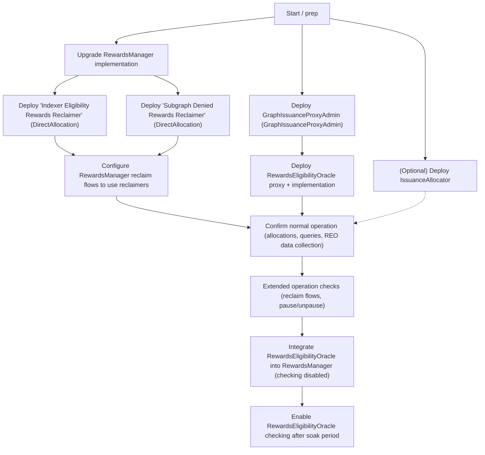

# REO & RewardsManager Rollout Plan

**Status:** Draft rollout plan for REO + RewardsManager, aligned with `issuance-allocator-5`.

This document defines a staged deployment and verification sequence for:

- Upgrading **RewardsManager** (RM) to the `issuance-allocator-5` target
- Deploying **GraphIssuanceProxyAdmin** (contract `GraphIssuanceProxyAdmin`) and
  **RewardsEligibilityOracle** (REO)
- Optionally deploying **IssuanceAllocator** (IA)
- Deploying & integrating **DirectAllocation**-based reclaimers
  (**Indexer Eligibility Rewards Reclaimer**, **Subgraph Denied Rewards
  Reclaimer**)
- Integrating RewardsEligibilityOracle into RewardsManager with checking
  **disabled**, then later **enabled**

---

## Flowchart Overview

**Step → Phase mapping:**

- `S` → **Phase 0 – Pre-deployment Preparation**
- `RM_UP` → **Phase 1 – Upgrade RewardsManager**
- `RECLAIMER_IE`, `RECLAIMER_SD`, `RM_RECLAIM_CFG` → **Phase 1b – Deploy & Integrate Rewards Reclaimers**
- `GIPA`, `REO_DEPLOY` → **Phase 2 – Deploy GraphIssuanceProxyAdmin & RewardsEligibilityOracle**
- `IA_OPT` → **Phase 3 – Optional IssuanceAllocator Deployment**
- `NORMAL_OP` → **Phase 4 – Confirm Normal Operation (RM + REO Independent)**
- `EXT_OP` → **Phase 5 – Extended Operation (Reclaim + Pauses)**
- `REO_INTEGRATE` → **Phase 6 – Integrate REO into RM (Checking Disabled)**
- `REO_ENABLE` → **Phase 7 – Enable REO Checking After Soak**

---

## Phase 0 – Pre-deployment Preparation

**Goal:** Establish configuration, baselines, and tests before any on-chain change.

**Actions:**

- Align on existing docs:
  - `REODeploymentSequence.md`, `GovernanceWorkflow.md`, `VerificationChecklists.md`
  - `INTEGRATION.md`, `DEPLOYMENT.md` in `packages/issuance/`
  - `packages/deploy/test/README.md` (fork tests, esp. `reo-governance-fork.test.ts`)
- Decide per-environment sequencing (dev / testnet / mainnet).
- Ensure tests are green on the target branch (incl. `issuance-allocator-5`):
  - `cd packages/issuance && pnpm test`
  - `cd packages/deploy && pnpm test` (and `pnpm test:fork` where applicable)

---

## Phase 1 – Upgrade RewardsManager

**Goal:** Upgrade RM implementation (targeting `issuance-allocator-5`) with no external behavior change.

**Actions:**

- Prepare and simulate governance proposal to upgrade the RM proxy implementation.
- Keep new configuration safe/inert (no behavioral flags enabled yet).

**Post-upgrade checks:**

- Proxy now points to the new RM implementation; access control unchanged.
- Key issuance parameters identical to pre-upgrade values.
- Indexers can still open/close allocations and claim rewards as before.
- Gateway queries to subgraphs remain healthy (latency, error rates).

---

## Phase 1b – Deploy & Integrate Rewards Reclaimers

**Goal:** Deploy DirectAllocation-based reclaimers and wire RM reclaim flows to
them.

**Actions (high-level):**

- Governance proposal to:
  - Deploy DirectAllocation implementation(s).
  - Deploy two proxy instances using that implementation, named:
    - **Indexer Eligibility Rewards Reclaimer**
    - **Subgraph Denied Rewards Reclaimer**
  - Configure RewardsManager so reclaim flows use these instances as the
    reclaim targets for indexer-eligibility-based reclaim and denied-subgraph
    reclaim respectively.

**Tests / checks:**

- On fork and testnet, deny a test subgraph and trigger RM reclaim:
  - Confirm reclaimed issuance appears in the **Subgraph Denied Rewards
    Reclaimer** instance.
  - Confirm other subgraphs are unaffected.
- If indexer-eligibility-based reclaim is exercised later, confirm reclaimed
  issuance appears in the **Indexer Eligibility Rewards Reclaimer** instance.
- Confirm this path is independent of RewardsEligibilityOracle/eligibility at
  this stage.

---

## Phase 2 – Deploy GraphIssuanceProxyAdmin & RewardsEligibilityOracle

**Goal:** Deploy GraphIssuanceProxyAdmin and RewardsEligibilityOracle, wired
for data collection but not yet used by RewardsManager.

**Actions:**

- Follow `REODeploymentSequence.md` and `Design.md`:
  - Deploy **GraphIssuanceProxyAdmin** (contract `GraphIssuanceProxyAdmin`) as the
    proxy admin for issuance-related proxies.
  - Deploy **RewardsEligibilityOracle** implementation + proxy under
    GraphIssuanceProxyAdmin.
  - Wire dependencies and roles per `APICorrectness.md`.

**Checks:**

- GraphIssuanceProxyAdmin is owned by governance and controls the REO proxy.
- RewardsEligibilityOracle proxy/implementation correctly configured and
  initialized.
- Oracle submissions succeed and update RewardsEligibilityOracle’s internal
  state.
- RewardsManager behavior remains unchanged (no integration yet).

---

## Phase 3 – Optional IssuanceAllocator Deployment

**Goal:** (Optional) Deploy IA and prepare for future integration.

**Actions (if in scope):**

- Follow `IADeploymentGuide.md` for multi-stage IA rollout.
- Deploy IA + proxy admin, wire in read-only / non-enforcing mode.
- Validate IA behavior without affecting existing RM flows.

---

## Phase 4 – Confirm Normal Operation (RM + REO Independent)

**Goal:** Demonstrate protocol operates normally with upgraded RM, DirectAllocation, and deployed REO.

**Checks:**

- Indexers:
  - Open and close allocations across several subgraphs.
  - Rewards and issuance behave as before.
- REO:
  - Continuously collects data via oracle submissions.
  - Eligibility views look sane for sample subgraphs.
- Gateway:
  - Queries via testnet/mainnet gateway succeed; traffic drives REO data.
- Dashboards:
  - Per-environment dashboards show RM, REO, and DirectAllocation metrics.

---

## Phase 5 – Extended Operation (Reclaim + Pauses)

**Goal:** Exercise new capabilities available before REO enforcement.

**Checks:**

- Reclaim from RM to DirectAllocation (denied subgraphs only):
  - Deny a test subgraph, trigger reclaim, verify balances and accounting.
  - Confirm no REO-based reclaim yet; eligibility is not enforced.
- Pause / unpause:
  - Pause REO: oracle submissions stop, but RM external behavior unchanged.
  - Pause RM: allocation actions respect paused state; unpause restores normal ops.
  - Confirm pause state is visible in metrics and logs.

---

## Phase 6 – Integrate REO into RM (Checking Disabled)

**Goal:** Wire RM to REO while keeping REO enforcement off.

**Actions:**

- Governance/config change to:
  - Set REO address in RM or equivalent integration points.
  - Keep enforcement flags disabled (RM logs/reads REO but ignores verdicts).

**Checks:**

- Repeat Phase 4 normal-operation tests: behavior must remain unchanged.
- Compare REO eligibility results vs. RM decisions (RM should ignore REO).
- Update/add fork tests to simulate RM→REO calls under "checking disabled".

---

## Phase 7 – Enable REO Checking After Soak

**Goal:** After sufficient data collection, turn on REO-based eligibility enforcement.

**Preconditions:**

- Testnet: ≥1 week of healthy REO data; mainnet: ≥1 month.
- REO eligibility decisions validated on a representative sample of subgraphs.

**Actions:**

- Governance/config change to enable REO checking in RM.

**Post-enable checks:**

- Targeted subgraphs where REO predicts eligible/ineligible behave as expected:
  - Eligible: allocations and rewards unchanged.
  - Ineligible: allocations fail or rewards withheld per design.
- Regression: repeat normal-operation tests for clearly eligible subgraphs.
- Monitoring: watch error/rejection rates and configure alerts for anomalies.
