# REO Architecture & Deployment Diagrams

**Last Updated:** 2025-11-19

---

## Contract Architecture

### REO Component Relationships

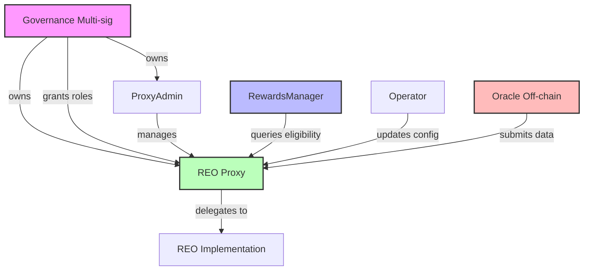

**Key Relationships:**
- **Governance** owns and controls REO proxy
- **ProxyAdmin** manages proxy upgrades (owned by governance)
- **RewardsManager** queries REO for indexer eligibility
- **Operator** updates configuration (role granted by governance)
- **Oracle** submits eligibility data (role granted by governance)

---

## Deployment Sequence

### Phase-by-Phase Deployment Flow

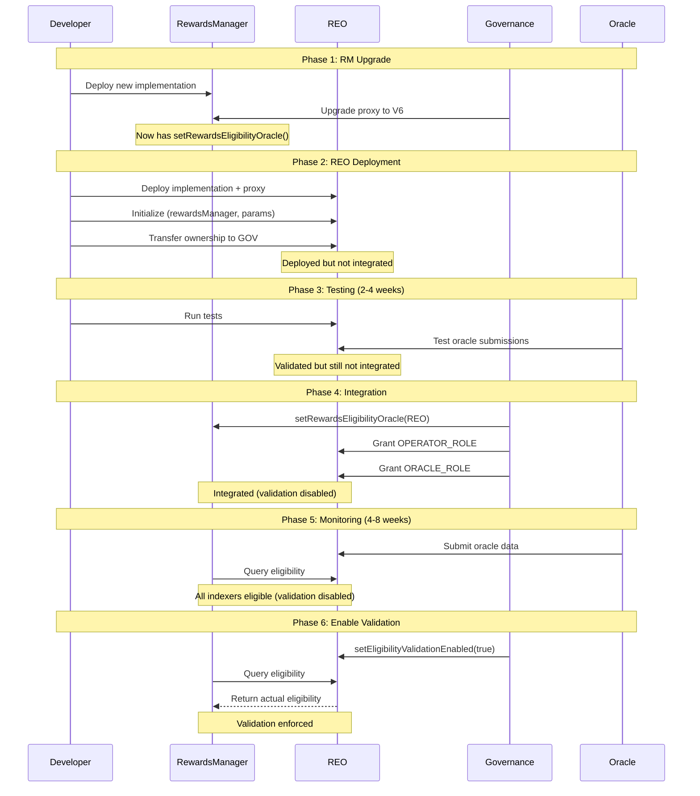

---

## Governance Workflow

### Three-Phase Governance Pattern

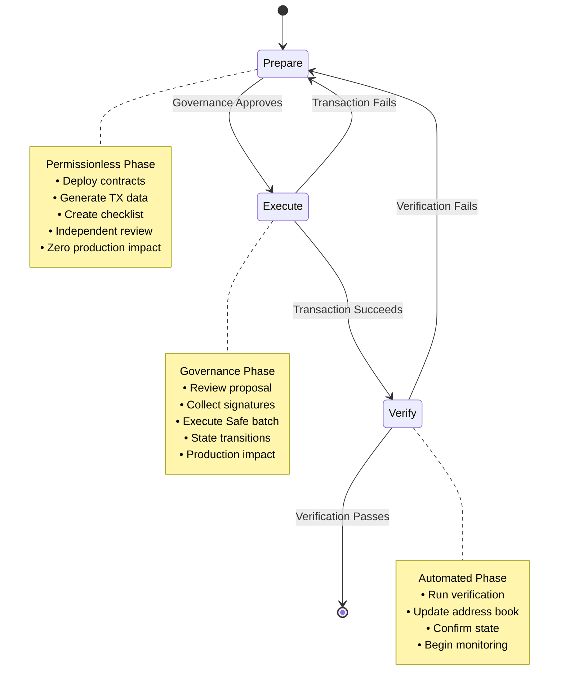

---

## REO Lifecycle States

### State Transitions

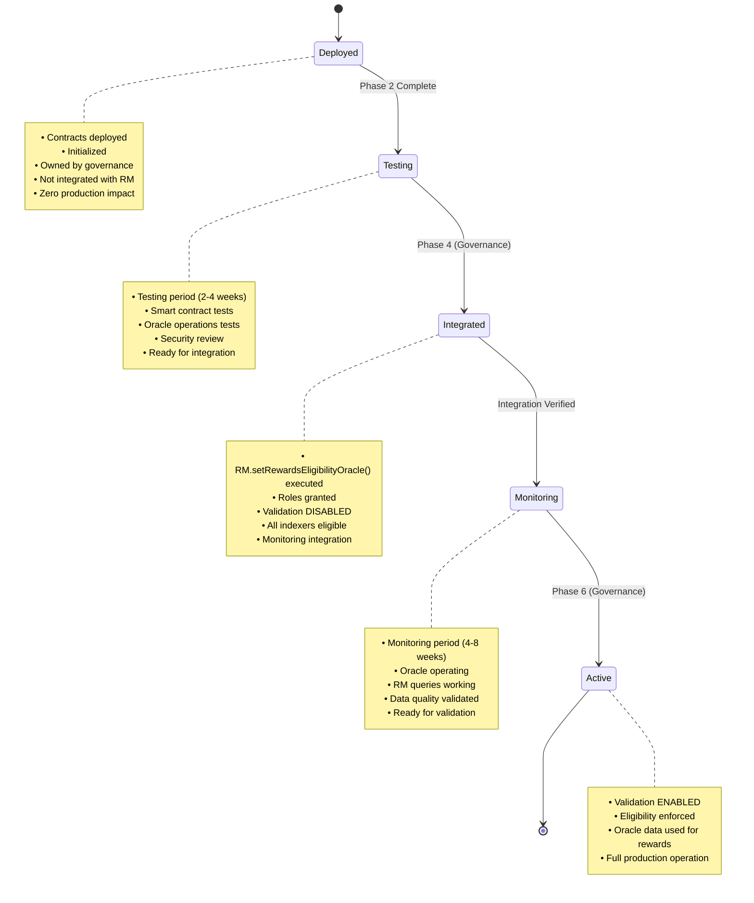

---

## Integration Flow

### RewardsManager + REO Integration

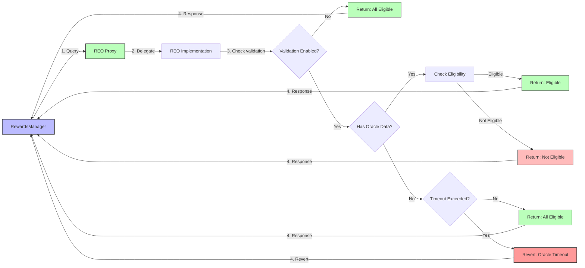

**Flow Description:**
1. RewardsManager queries REO for indexer eligibility
2. REO proxy delegates to implementation
3. Implementation checks if validation enabled
4. If disabled: All indexers eligible (Phase 4-5)
5. If enabled: Check oracle data
6. If no data or within grace period: All eligible
7. If data exists: Return actual eligibility
8. If timeout exceeded: Revert (safety mechanism)

---

## Oracle Operations

### Oracle Data Submission Flow

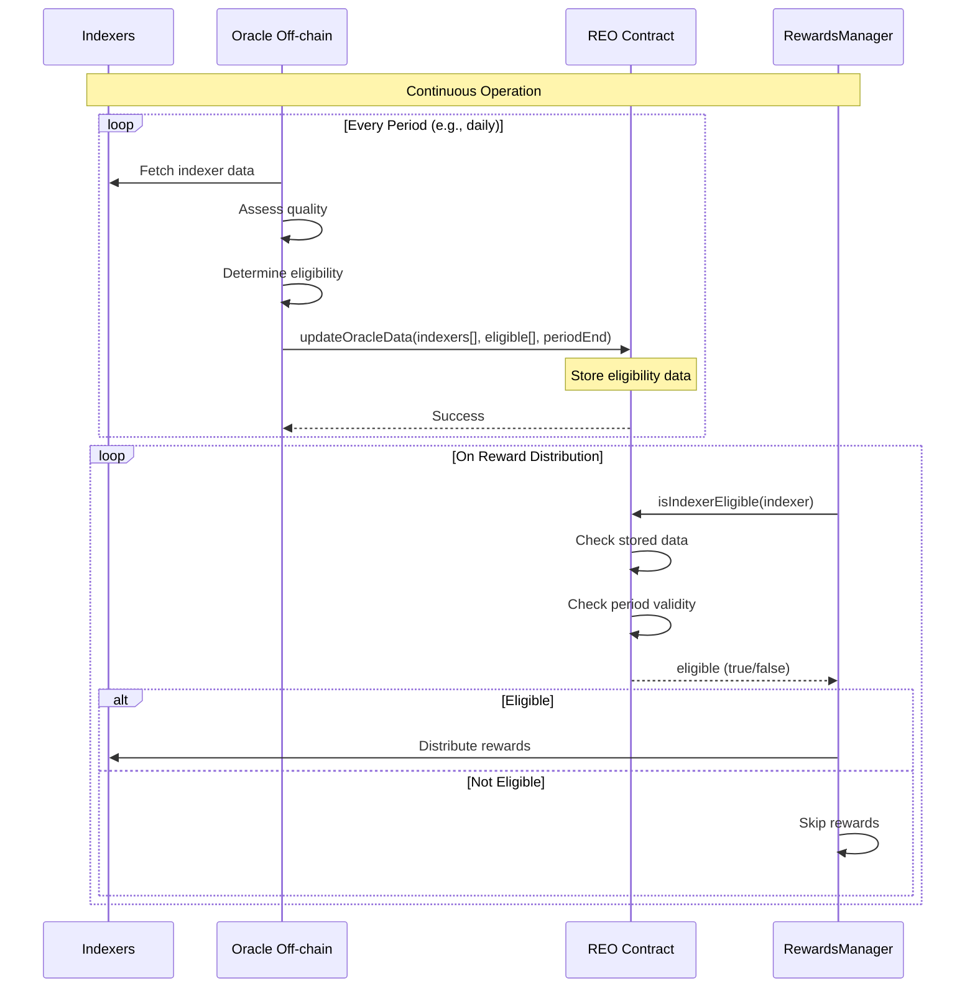

---

## Proxy Administration

### REO Proxy Pattern

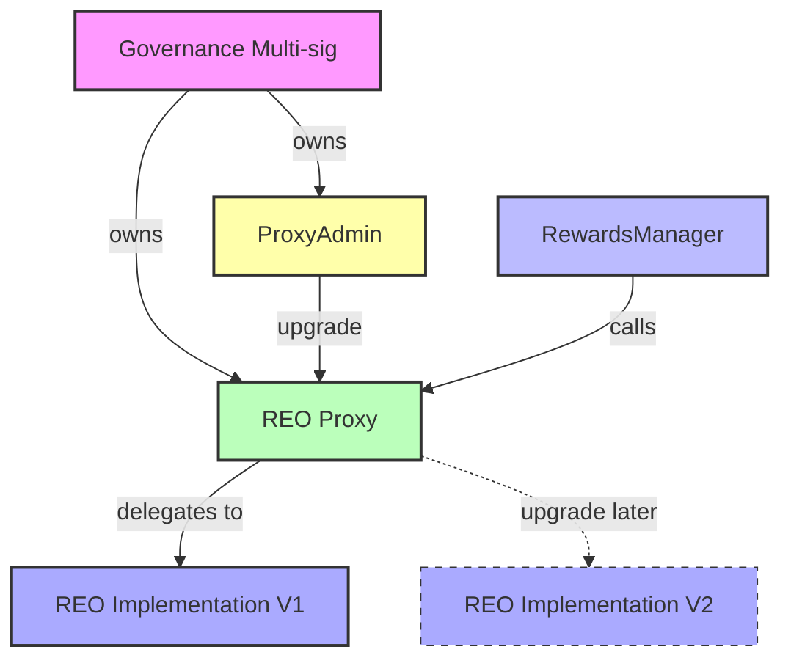

**Upgrade Process:**
1. Deploy new implementation (IMPL_V2)
2. Governance calls `proxyAdmin.upgrade(proxy, impl_v2)`
3. Proxy now delegates to IMPL_V2
4. Storage preserved (proxy storage slot)
5. Users (RM) call same proxy address, get new logic

---

## Deployment Dependencies

### Dependency Graph

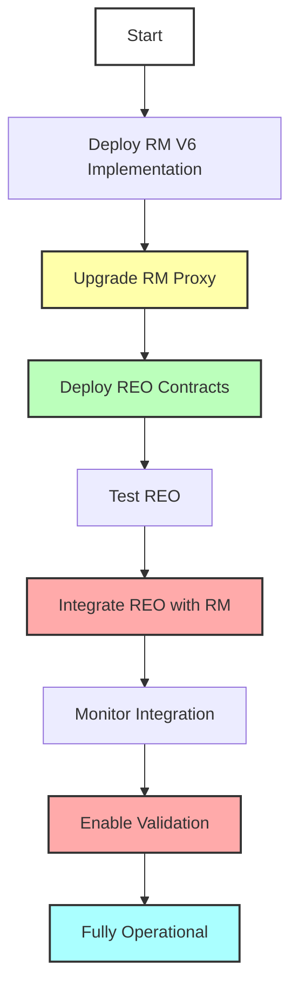

**Critical Path:**
1. RM must be upgraded before REO deployment (provides integration method)
2. REO must be tested before integration
3. Integration requires governance approval
4. Monitoring period before enabling validation
5. Validation enablement requires governance approval

**Governance Gates** (red boxes): Points requiring governance multi-sig execution

---

## Rollback Procedures

### Rollback Flow

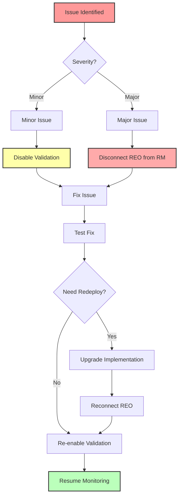

**Rollback Options:**

**Option 1: Disable Validation** (Minor issues, oracle problems)
- Governance: `reo.setEligibilityValidationEnabled(false)`
- Impact: All indexers treated as eligible, rewards continue
- Recovery: Fix oracle, re-enable when ready

**Option 2: Disconnect REO** (Major issues, contract problems)
- Governance: `rm.setRewardsEligibilityOracle(address(0))`
- Impact: RM reverts to previous behavior, no validation
- Recovery: Fix/upgrade REO, reconnect when safe

---

## Monitoring Architecture

### Monitoring Flow

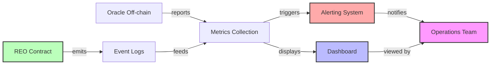

**Key Metrics:**
- Oracle update frequency
- Indexer coverage (% assessed)
- Eligibility percentages
- Query counts and response times
- Error rates
- Gas costs

---

## Access Control

### Role-Based Access Control

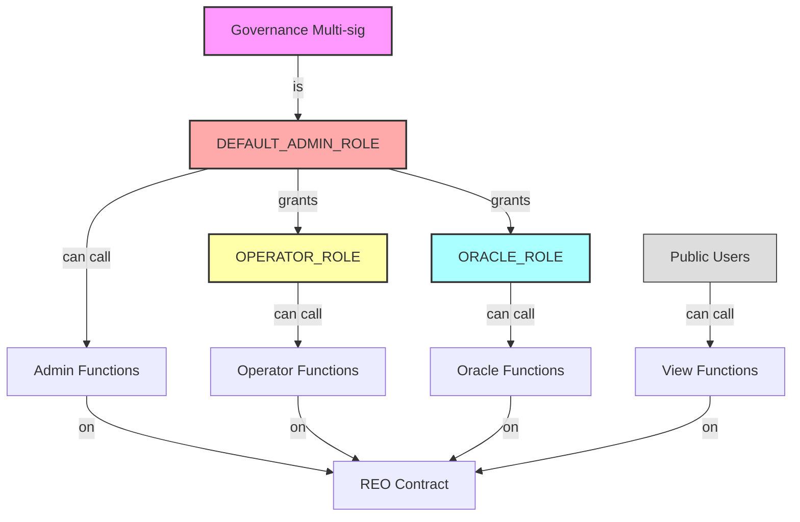

**Role Permissions:**

**DEFAULT_ADMIN_ROLE** (Governance):
- Grant/revoke all roles
- Upgrade implementation
- Transfer ownership
- Pause/unpause (if pausable)

**OPERATOR_ROLE:**
- `setEligibilityPeriod()`
- `setOracleUpdateTimeout()`
- `setEligibilityValidationEnabled()`
- Configuration updates

**ORACLE_ROLE:**
- `updateOracleData()`
- Submit eligibility assessments

**Public:**
- All view functions
- `isIndexerEligible()` (called by RM)

---

## Network Topology

### Multi-Network Deployment

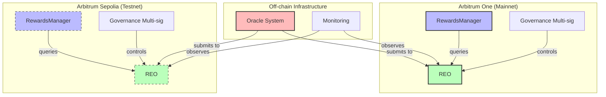

**Deployment Strategy:**
1. Deploy and validate on Arbitrum Sepolia first
2. Complete full lifecycle on testnet
3. Validate procedures and governance workflow
4. Deploy to Arbitrum One with proven process

---

## Future: IssuanceAllocator Integration

### Complete Issuance System

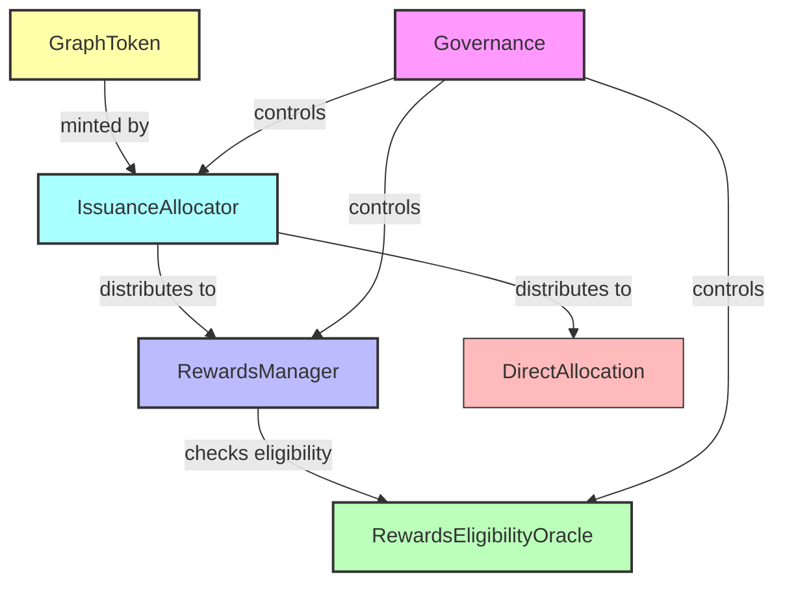

**Future State:**
- IssuanceAllocator mints tokens from GraphToken
- Distributes tokens to multiple targets (RM, DirectAllocation, etc.)
- RewardsManager uses REO for eligibility
- Governance controls all components

**Current State:**
- IA not deployed yet
- RM self-mints (traditional flow)
- REO ready to integrate when IA deploys

---

## Legend

### Diagram Symbols

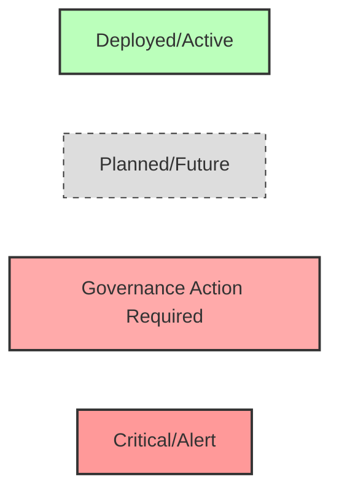

**Colors:**
- 🟢 **Green:** Deployed, active, success
- 🔵 **Blue:** Protocol contracts (RM, GT)
- 🟡 **Yellow:** Administrative (ProxyAdmin, config)
- 🔴 **Red:** Governance actions, critical, alerts
- 🟣 **Purple:** Governance multi-sig
- ⚪ **Gray/Dashed:** Planned, future, not yet deployed

---

## Usage Notes

These diagrams can be:
- Embedded in documentation (GitHub renders Mermaid)
- Exported to images for presentations
- Updated as architecture evolves
- Used for governance proposals
- Included in audit reports

To render locally:
- Use Mermaid Live Editor: https://mermaid.live/
- Use VS Code with Mermaid extension
- Use GitHub/GitLab (renders automatically)

---

## References

- Mermaid Documentation: https://mermaid.js.org/
- Deployment Sequence: `REODeploymentSequence.md`
- Governance Workflow: `GovernanceWorkflow.md`
- Verification Checklists: `VerificationChecklists.md`
